# TechStore — Sơ Đồ Hệ Thống

Tất cả diagram dùng [Mermaid](https://mermaid.js.org/) — render trực tiếp trên GitHub.

> Dựa trực tiếp từ source code: `backend/data/migration_full.sql`, `backend/src/models/index.js`, và các service files. Tên bảng, columns, quan hệ đúng với schema thực tế.

## Mục lục

- [1. Usecase Tổng Quát](#1-usecase-tổng-quát)
- [2. Usecase Phân Rã](#2-usecase-phân-rã)
  - [2.1 Auth & User Management](#21-auth--user-management)
  - [2.2 Catalog & Product](#22-catalog--product)
  - [2.3 Cart & Checkout](#23-cart--checkout)
  - [2.4 Orders & Payment](#24-orders--payment)
  - [2.5 Reviews & Ratings](#25-reviews--ratings)
  - [2.6 Inventory & Warranty](#26-inventory--warranty)
  - [2.7 Loyalty & Rewards](#27-loyalty--rewards)
  - [2.8 AI Chatbot & Search History](#28-ai-chatbot--search-history)
  - [2.9 Content Management](#29-content-management)
  - [2.10 Admin Dashboard](#210-admin-dashboard)
- [3. Sơ Đồ Tuần Tự](#3-sơ-đồ-tuần-tự)
  - [3.1 Đăng ký / Đăng nhập](#31-đăng-ký--đăng-nhập)
  - [3.2 Checkout đầy đủ](#32-checkout-đầy-đủ)
  - [3.3 AI Chatbot (RAG pipeline)](#33-ai-chatbot-rag-pipeline)
  - [3.4 Upload ảnh](#34-upload-ảnh)
  - [3.5 Admin quản lý sản phẩm](#35-admin-quản-lý-sản-phẩm)
  - [3.6 Token refresh](#36-token-refresh)
- [4. ERD — Entity Relationship Diagram](#4-erd--entity-relationship-diagram)
  - [4.1 User & Auth tables](#41-user--auth-tables)
  - [4.2 Product & Catalog tables](#42-product--catalog-tables)
  - [4.3 Order & Payment tables](#43-order--payment-tables)
  - [4.4 Content & Support tables](#44-content--support-tables)
  - [4.5 AI & Log tables](#45-ai--log-tables)
- [5. Kiến Trúc Hệ Thống](#5-kiến-trúc-hệ-thống)
- [6. RAG Pipeline Flow](#6-rag-pipeline-flow)
- [7. State Diagrams](#7-state-diagrams)
  - [7.1 Order states](#71-order-states)
  - [7.2 Payment states](#72-payment-states)
  - [7.3 Product states](#73-product-states)
  - [7.4 User states](#74-user-states)
- [8. Component Diagram](#8-component-diagram)

---

# 1. Usecase Tổng Quát

```mermaid
flowchart TB
    Guest(["Khách vãng lai\n(Guest)"])
    Customer(["Khách hàng\n(Customer)"])
    Admin(["Quản trị viên\n(Admin)"])

    subgraph UC_GUEST["Use cases — Khách vãng lai"]
        direction TB
        G1[Xem danh sách sản phẩm]
        G2[Tìm kiếm và lọc sản phẩm]
        G3[Xem chi tiết sản phẩm]
        G4[Thêm vào giỏ hàng guest]
        G5[Chat với AI Chatbot]
        G6[Xem banner và tin tức]
        G7[Đăng ký tài khoản]
        G8[Đăng nhập / Google OAuth]
    end

    subgraph UC_CUSTOMER["Use cases — Khách hàng (kế thừa từ Guest)"]
        direction TB
        C1[Đặt hàng và thanh toán\nCOD / VNPay / MoMo]
        C2[Theo dõi trạng thái đơn hàng]
        C3[Hủy đơn hàng]
        C4[Xác nhận đã nhận hàng]
        C5[Viết đánh giá sản phẩm]
        C6[Quản lý danh sách yêu thích]
        C7[Tích điểm và đổi điểm Loyalty]
        C8[Quản lý hồ sơ và địa chỉ]
        C9[Chọn gói bảo hành]
        C10[Xem lịch sử tìm kiếm]
    end

    subgraph UC_ADMIN["Use cases — Quản trị viên"]
        direction TB
        A1[Quản lý sản phẩm và biến thể]
        A2[Quản lý đơn hàng và cập nhật trạng thái]
        A3[Quản lý người dùng]
        A4[Quản lý nội dung banner và tin tức]
        A5[Xem thống kê và báo cáo]
        A6[Quản lý mã giảm giá]
        A7[Quản lý tồn kho và nhập hàng]
        A8[Quản lý gói bảo hành]
        A9[Xem audit log]
        A10[Quản lý danh mục và thương hiệu]
        A11[Quản lý chương trình Loyalty]
        A12[Quản lý thuộc tính sản phẩm]
    end

    Guest --> UC_GUEST
    Customer -->|kế thừa| UC_GUEST
    Customer --> UC_CUSTOMER
    Admin --> UC_ADMIN
    Admin --> UC_CUSTOMER
```

---

# 2. Usecase Phân Rã

## 2.1 Auth & User Management

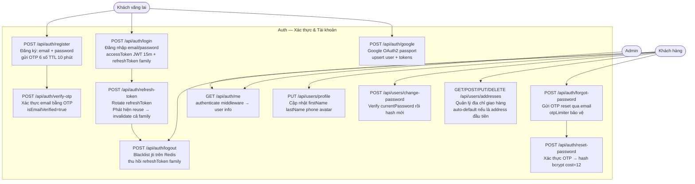

## 2.2 Catalog & Product

```mermaid
flowchart TB
    Guest(["Khách vãng lai"])
    Customer(["Khách hàng"])
    Admin(["Admin"])

    subgraph CATALOG["Catalog — Sản phẩm & Danh mục"]
        direction TB
        B1["GET /api/products\nDanh sách: pagination, sort, filter\nCOALESCE MIN variant.price base_price"]
        B2["GET /api/products/:slug\nChi tiết: variants images specs reviews\nauto increment view_count"]
        B3["GET /api/products/search\nFull-text + semantic AI search\nlưu search_histories"]
        B4["GET /api/products/featured\nSản phẩm nổi bật is_featured=1"]
        B5["GET /api/categories\nCây danh mục: name_vi/name_en + slug"]
        B6["GET /api/brands\nDanh sách thương hiệu + logo_url"]
        B7["GET /api/products/:id/recently-viewed\nSản phẩm xem gần đây (yêu cầu auth)"]
        B8["POST /api/admin/products\nTạo sản phẩm mới\nCRUD + variants + images\nauto-sync vector store afterCreate hook"]
        B9["PUT /api/admin/products/:id\nCập nhật sản phẩm\nauto-sync vector store afterUpdate hook"]
        B10["DELETE /api/admin/products/:id\nSoft delete\nauto-remove vector afterDestroy hook"]
        B11["POST /api/admin/categories\nCRUD danh mục đa cấp"]
        B12["POST /api/admin/brands\nCRUD thương hiệu"]
    end

    Guest --> B1
    Guest --> B2
    Guest --> B3
    Guest --> B4
    Guest --> B5
    Guest --> B6
    Customer --> B7
    Admin --> B8
    Admin --> B9
    Admin --> B10
    Admin --> B11
    Admin --> B12
```

## 2.3 Cart & Checkout

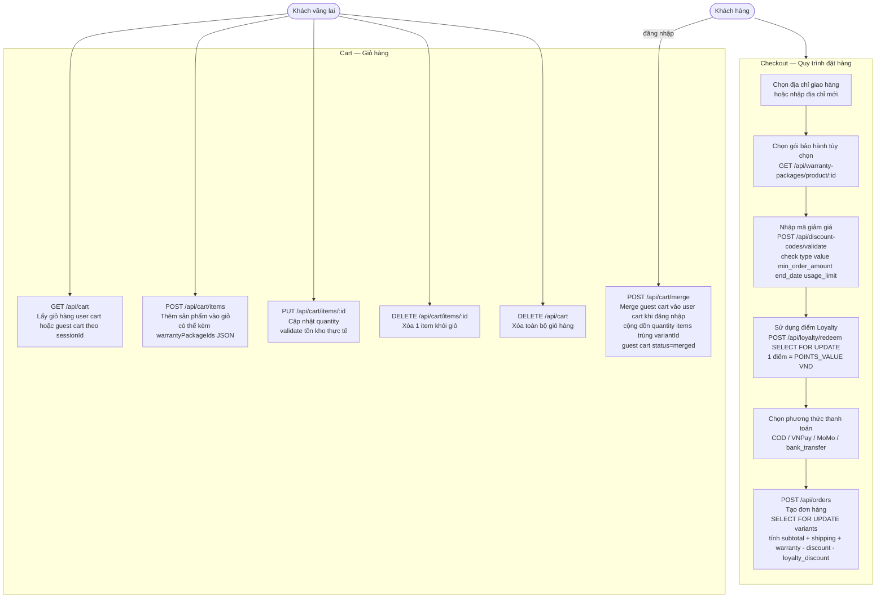

## 2.4 Orders & Payment

```mermaid
flowchart TB
    Customer(["Khách hàng"])
    Admin(["Admin"])

    subgraph ORDERS["Orders — Đơn hàng"]
        direction TB
        O1["GET /api/orders\nLịch sử đơn hàng lọc theo status"]
        O2["GET /api/orders/:id\nChi tiết đơn hàng"]
        O3["GET /api/orders/number/:number\nTra cứu theo mã ORD-YYMM-..."]
        O4["GET /api/orders/track\nTra cứu công khai không cần auth"]
        O5["POST /api/orders/:id/cancel\nHủy đơn khi pending hoặc processing\nhoàn stock về variants"]
        O6["POST /api/orders/:id/receive\nXác nhận đã nhận hàng\ntrigger cộng Loyalty points"]
        O7["POST /api/orders/:id/repay\nThanh toán lại khi pending/failed"]
    end

    subgraph PAYMENT["Payment — Thanh toán"]
        direction TB
        P1["POST /api/payments/vnpay/create-url\nTạo URL HMAC-SHA512\nRedirect đến cổng VNPay"]
        P2["GET /api/payments/vnpay/ipn\nVNPay IPN webhook\nVerify signature cập nhật paymentStatus"]
        P3["GET /api/payments/vnpay/return\nRedirect URL sau VNPay UX only không mutate DB"]
        P4["POST /api/payments/momo/create-url\nTạo request HMAC\nRedirect đến cổng MoMo"]
        P5["POST /api/payments/momo/ipn\nMoMo IPN webhook\nVerify HMAC cập nhật paymentStatus"]
        P6["GET /api/payments/momo/return\nRedirect URL sau MoMo UX only không mutate DB"]
        P7["POST /api/payments/refund\nAdmin xử lý hoàn tiền thủ công"]
    end

    subgraph ADMIN_O["Admin — Quản lý đơn hàng"]
        direction TB
        AO1["GET /api/orders/admin/all\nTất cả đơn hàng lọc status payment date"]
        AO2["PATCH /api/orders/admin/:id/status\nCập nhật pending→processing→shipped→delivered\nTrigger loyalty khi DELIVERED"]
        AO3["GET /api/admin/stats/orders\nThống kê doanh thu groupBy day/month/year"]
    end

    Customer --> ORDERS
    Customer --> PAYMENT
    Admin --> ADMIN_O
    Admin --> P7
```

## 2.5 Reviews & Ratings

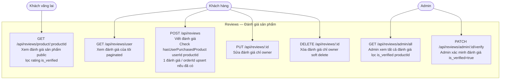

## 2.6 Inventory & Warranty

```mermaid
flowchart TB
    Admin(["Admin"])

    subgraph INVENTORY["Inventory — Tồn kho"]
        direction TB
        I1["EventBus order.created\ninventory deduct stock\nSELECT FOR UPDATE + ghi inventory_logs"]
        I2["EventBus order.cancelled\ninventory restore stock\nghi inventory_logs type=return"]
        I3["POST /api/inventory/products/:id/restock\nAdmin nhập hàng\nghi inventory_logs type=restock"]
        I4["GET /api/inventory/logs\nAdmin xem lịch sử tồn kho\nlọc productId variantId change_type"]
        I5["GET /api/admin/products/:id/stock\nXem tồn kho hiện tại theo variant"]
    end

    subgraph WARRANTY["Warranty — Gói bảo hành"]
        direction TB
        W1["GET /api/warranty-packages\nDanh sách tất cả gói bảo hành"]
        W2["GET /api/warranty-packages/product/:productId\nGói bảo hành của sản phẩm cụ thể\nqua product_warranties junction table"]
        W3["POST /api/warranty-packages\nAdmin tạo gói bảo hành\nname duration_months price terms coverage"]
        W4["PUT /api/warranty-packages/:id\nAdmin cập nhật gói"]
        W5["DELETE /api/warranty-packages/:id\nAdmin xóa gói"]
    end

    Admin --> I3
    Admin --> I4
    Admin --> I5
    Admin --> W3
    Admin --> W4
    Admin --> W5
```

## 2.7 Loyalty & Rewards

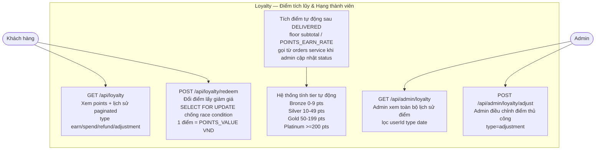

## 2.8 AI Chatbot & Search History

```mermaid
flowchart TB
    Guest(["Khách vãng lai"])
    Customer(["Khách hàng"])

    subgraph AI_CHAT["AI Chatbot — RAG Pipeline"]
        direction TB
        AI1["POST /api/chatbot/message\nchatbotLimiter 20 req/60s dev 200\noptionalAuthenticate\nRAG Validate→Normalize→Retrieve→Generate"]
        AI2["GET /api/chatbot/recommendations\nGợi ý sản phẩm type=deals/featured\noptionalAuthenticate"]
        AI3["POST /api/chatbot/cart/add\nThêm vào giỏ qua chatbot\nauthenticate bắt buộc"]
        AI4["POST /api/chatbot/analytics\nGhi nhận sự kiện analytics\nauthenticate bắt buộc"]
    end

    subgraph SEARCH_H["Search History — Lịch sử tìm kiếm"]
        direction TB
        SH1["POST /api/search-histories\nLưu keyword tìm kiếm\nGuest session_id User user_id"]
        SH2["GET /api/search-histories\nXem lịch sử tìm kiếm\nauthenticate bắt buộc"]
        SH3["DELETE /api/search-histories/:id\nXóa 1 entry lịch sử"]
        SH4["DELETE /api/search-histories\nXóa toàn bộ lịch sử"]
    end

    Guest --> AI1
    Guest --> AI2
    Guest --> SH1
    Customer --> AI1
    Customer --> AI2
    Customer --> AI3
    Customer --> AI4
    Customer --> SH2
    Customer --> SH3
    Customer --> SH4
```

## 2.9 Content Management

```mermaid
flowchart TB
    Guest(["Khách vãng lai"])
    Customer(["Khách hàng"])
    Admin(["Admin"])

    subgraph CONTENT["Content — Nội dung & Liên hệ"]
        direction TB
        CN1["GET /api/banners\nDanh sách banner active HTTP cache 900s\nposition home_hero/home_middle/sidebar"]
        CN2["GET /api/news\nDanh sách tin tức đã publish\nlọc category is_published=true"]
        CN3["GET /api/news/slug/:slug\nChi tiết tin tức auto tăng view_count"]
        CN4["GET /api/news/slug/:slug/related\nTin tức liên quan cùng category"]
        CN5["POST /api/contact/feedback\nGửi feedback/liên hệ\nname email phone subject content\ngửi email admin async"]
        CN6["POST /api/banners\nAdmin tạo banner mới\ntitle_vi title_en image_url link_url position priority"]
        CN7["PATCH /api/banners/:id\nAdmin cập nhật banner"]
        CN8["DELETE /api/banners/:id\nAdmin xóa banner soft delete"]
        CN9["POST /api/news\nAdmin tạo tin tức\ntitle_vi title_en slug content_vi content_en thumbnail"]
        CN10["PUT /api/news/:id\nAdmin cập nhật tin tức"]
        CN11["DELETE /api/news/:id\nAdmin xóa tin tức soft delete"]
    end

    Guest --> CN1
    Guest --> CN2
    Guest --> CN3
    Guest --> CN4
    Guest --> CN5
    Customer --> CN5
    Admin --> CN6
    Admin --> CN7
    Admin --> CN8
    Admin --> CN9
    Admin --> CN10
    Admin --> CN11
```

## 2.10 Admin Dashboard

```mermaid
flowchart TB
    Admin(["Admin"])

    subgraph ADMIN["Admin Dashboard — Quản trị toàn hệ thống"]
        direction TB
        AD1["GET /api/admin/stats/overview\nDoanh thu đơn hàng users sản phẩm\nnhóm theo khoảng thời gian"]
        AD2["GET /api/admin/stats/revenue\nBiểu đồ doanh thu theo ngày/tháng/năm"]
        AD3["GET /api/admin/stats/top-products\nTop sản phẩm bán chạy lọc khoảng thời gian"]
        AD4["GET /api/admin/users\nDanh sách users + loyalty tier lọc role is_active"]
        AD5["PATCH /api/admin/users/:id/toggle-active\nKích hoạt / vô hiệu hóa user"]
        AD6["GET /api/admin/discount-codes\nQuản lý mã giảm giá lọc is_active expired"]
        AD7["POST/PUT/DELETE /api/discount-codes\nCRUD mã giảm giá\ncode type=percent/fixed value min_order_amount usage_limit"]
        AD8["GET /api/admin/audit-logs\nNhật ký thao tác admin\nlọc action entity_type adminId date"]
        AD9["GET /api/attribute-groups\nCRUD attribute groups cho AI filter\nname type=custom is_required"]
        AD10["POST /api/attribute-groups/:id/values\nCRUD attribute values\nname value color_code affects_name"]
    end

    Admin --> AD1
    Admin --> AD2
    Admin --> AD3
    Admin --> AD4
    Admin --> AD5
    Admin --> AD6
    Admin --> AD7
    Admin --> AD8
    Admin --> AD9
    Admin --> AD10
```

---

# 3. Sơ Đồ Tuần Tự

## 3.1 Đăng ký / Đăng nhập

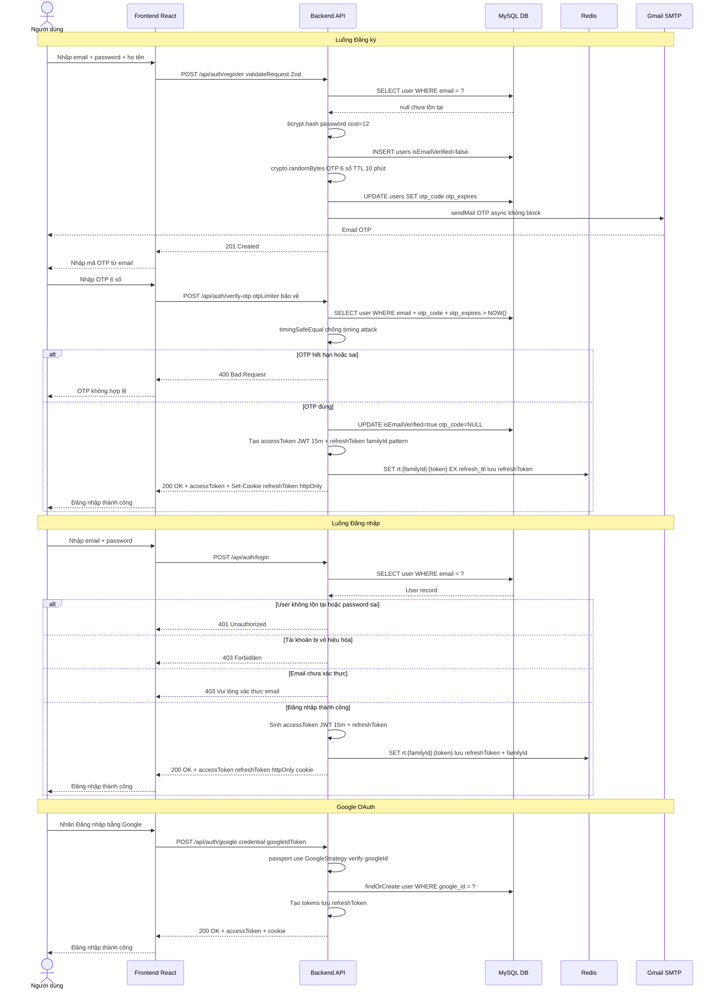

## 3.2 Checkout đầy đủ

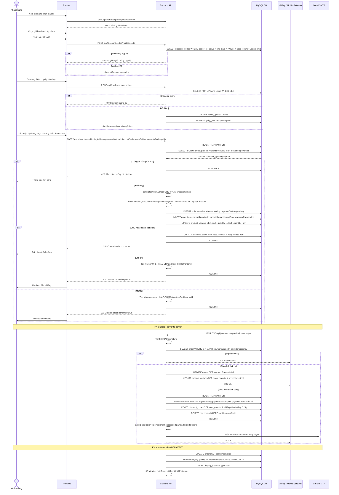

## 3.3 AI Chatbot (RAG pipeline)

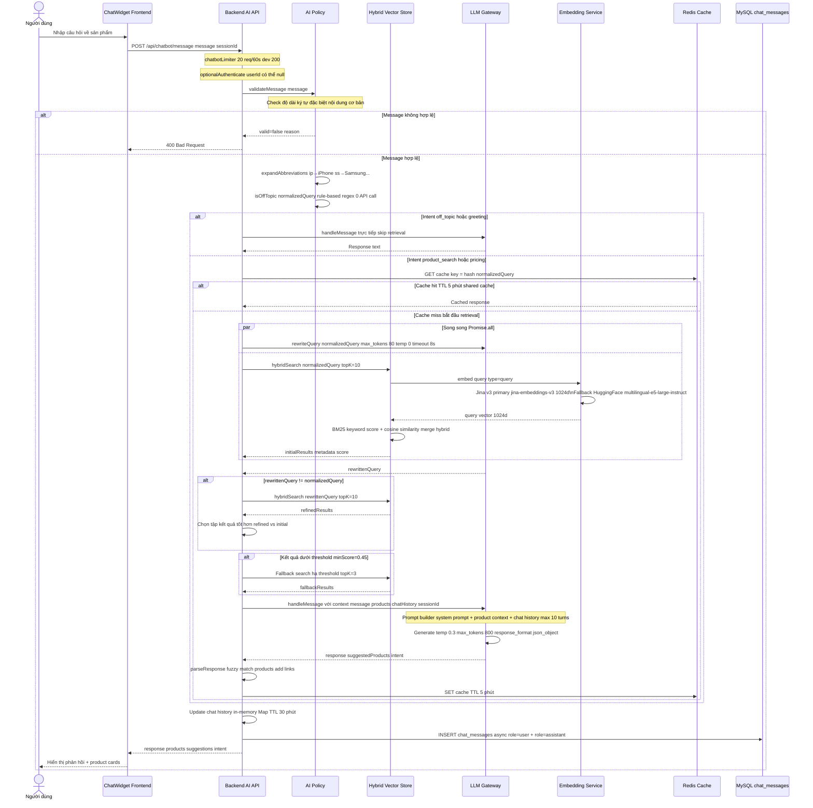

## 3.4 Upload ảnh

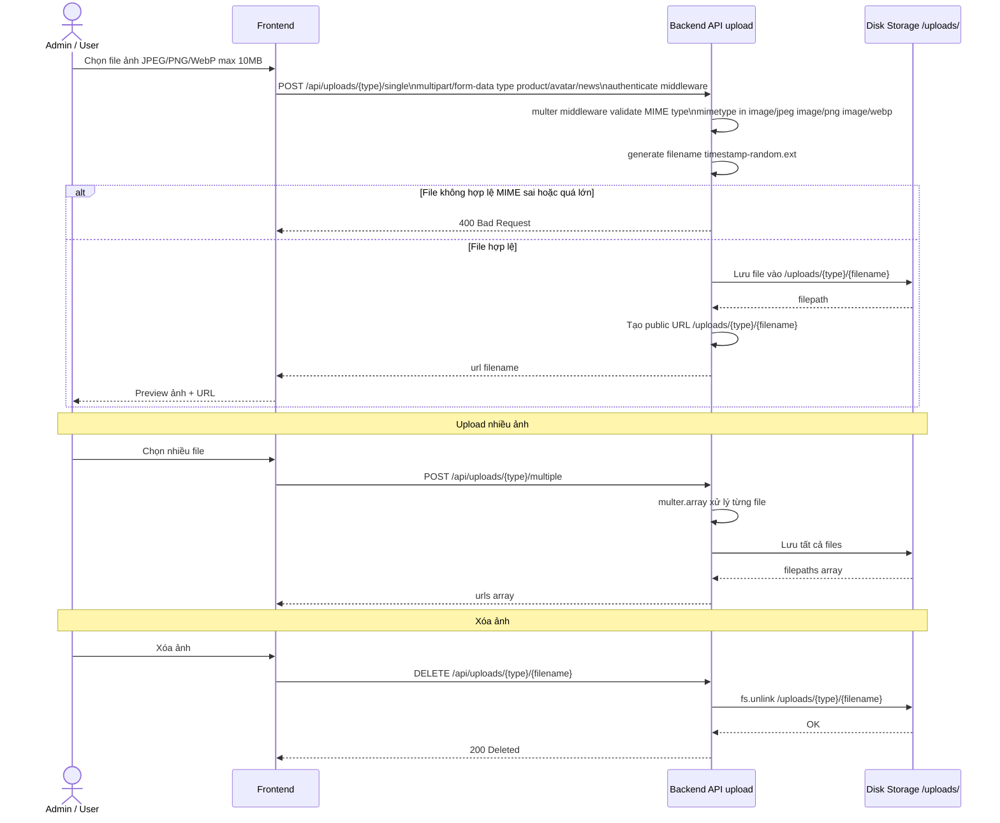

## 3.5 Admin quản lý sản phẩm

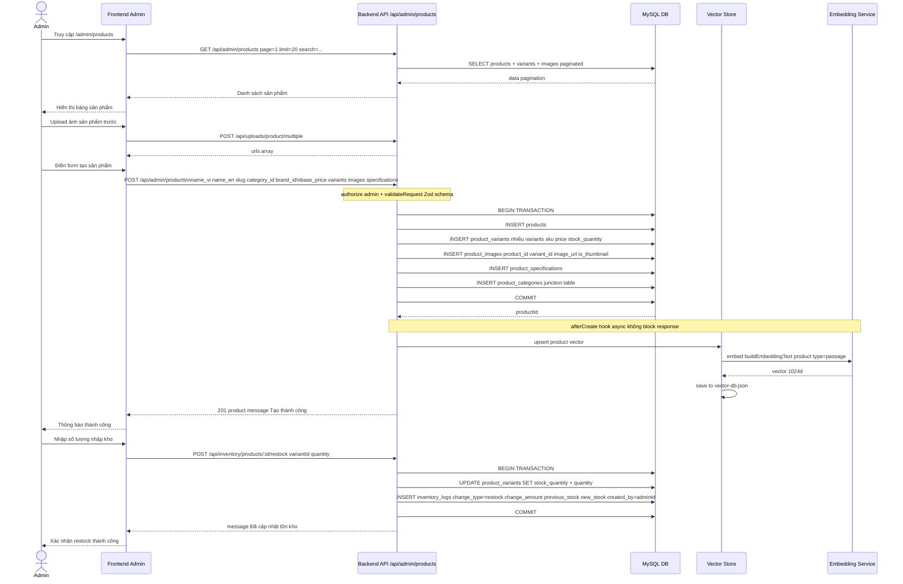

## 3.6 Token refresh

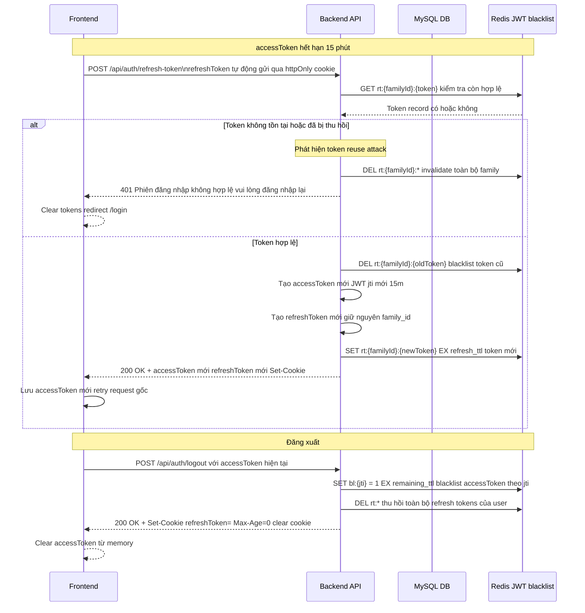

---

# 4. ERD — Entity Relationship Diagram

> Dựa trực tiếp từ `backend/data/migration_full.sql`. Tên cột, kiểu dữ liệu, khóa ngoại đúng 100% với schema thực tế.

## 4.1 User & Auth tables

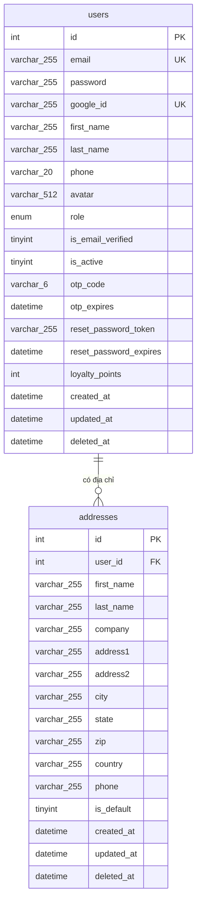

## 4.2 Product & Catalog tables

```mermaid
erDiagram
    categories {
        int id PK
        varchar_100 name_vi UK
        varchar_100 name_en
        varchar_255 slug UK
        text description_vi
        text description_en
        datetime created_at
        datetime updated_at
        datetime deleted_at
    }

    brands {
        int id PK
        varchar_100 name_vi UK
        varchar_100 name_en
        varchar_255 slug UK
        varchar_500 logo_url
        datetime created_at
        datetime updated_at
        datetime deleted_at
    }

    brand_categories {
        int brand_id FK
        int category_id FK
    }

    products {
        int id PK
        int category_id FK
        int brand_id FK
        varchar_200 name_vi
        varchar_200 name_en
        varchar_100 slug UK
        varchar_255 base_name
        varchar_255 model
        decimal_15_2 base_price
        decimal_15_2 compare_at_price
        text short_description_vi
        text short_description_en
        text description_vi
        text description_en
        enum status
        tinyint is_featured
        varchar_20 condition
        int warranty_months
        int sold_count
        int view_count
        decimal_3_2 rating_average
        int stock_quantity
        datetime created_at
        datetime updated_at
        datetime deleted_at
    }

    product_variants {
        int id PK
        int product_id FK
        varchar_100 sku UK
        varchar_255 variant_name
        varchar_255 display_name
        decimal_15_2 price
        decimal_15_2 compare_at_price
        int stock_quantity
        tinyint is_default
        longtext attributes
        decimal_10_3 weight
        longtext dimensions
        int sort_order
        tinyint is_available
        datetime created_at
        datetime updated_at
        datetime deleted_at
    }

    product_images {
        int id PK
        int product_id FK
        int variant_id FK
        varchar_512 image_url
        tinyint is_thumbnail
        varchar_100 color
        datetime created_at
        datetime updated_at
        datetime deleted_at
    }

    product_categories {
        int id PK
        int product_id FK
        int category_id FK
        datetime created_at
        datetime updated_at
    }

    product_attributes {
        int id PK
        int product_id FK
        varchar_255 name
        enum type
        longtext values
        tinyint required
        int sort_order
        datetime created_at
        datetime updated_at
    }

    product_specifications {
        int id PK
        int product_id FK
        varchar_255 name
        text value
        text value_en
        varchar_255 category
        int sort_order
        datetime created_at
        datetime updated_at
    }

    attribute_groups {
        int id PK
        varchar_255 name
        text description
        varchar_255 type
        tinyint is_required
        int sort_order
        tinyint is_active
        datetime created_at
        datetime updated_at
    }

    attribute_values {
        int id PK
        int attribute_group_id FK
        varchar_255 name
        varchar_255 value
        varchar_255 color_code
        varchar_512 image_url
        decimal_15_2 price_adjustment
        int sort_order
        tinyint is_active
        tinyint affects_name
        varchar_255 name_template
        datetime created_at
        datetime updated_at
    }

    product_attribute_groups {
        int id PK
        int product_id FK
        int attribute_group_id FK
        tinyint is_required
        int sort_order
        datetime created_at
        datetime updated_at
    }

    warranty_packages {
        int id PK
        varchar_200 name
        text description
        int duration_months
        decimal_15_2 price
        longtext terms
        longtext coverage
        tinyint is_active
        int sort_order
        datetime created_at
        datetime updated_at
    }

    product_warranties {
        int id PK
        int product_id FK
        int warranty_package_id FK
        tinyint is_default
        datetime created_at
        datetime updated_at
    }

    wishlists {
        int id PK
        int user_id FK
        int product_id FK
        datetime created_at
        datetime updated_at
    }

    recently_viewed {
        int id PK
        int user_id FK
        int product_id FK
        datetime viewed_at
        datetime created_at
        datetime updated_at
    }

    reviews {
        int id PK
        int product_id FK
        int user_id FK
        int variant_id FK
        int rating
        varchar_255 title
        text content
        tinyint is_verified
        int likes
        int dislikes
        longtext images
        datetime created_at
        datetime updated_at
        datetime deleted_at
    }

    product_reviews {
        int id PK
        int product_id FK
        int variant_id FK
        int user_id FK
        int rating
        varchar_255 title
        text content
        tinyint is_verified
        int likes
        int dislikes
        longtext images
        datetime created_at
        datetime updated_at
        datetime deleted_at
    }

    brands ||--o{ brand_categories : "thuộc danh mục"
    categories ||--o{ brand_categories : "có thương hiệu"
    categories ||--o{ products : "chứa sản phẩm"
    brands ||--o{ products : "sở hữu sản phẩm"
    products ||--o{ product_variants : "có biến thể"
    products ||--o{ product_images : "có ảnh"
    products ||--o{ product_categories : "thuộc nhiều danh mục"
    categories ||--o{ product_categories : "chứa nhiều sản phẩm"
    products ||--o{ product_attributes : "có thuộc tính"
    products ||--o{ product_specifications : "có thông số"
    attribute_groups ||--o{ attribute_values : "có giá trị"
    products ||--o{ product_attribute_groups : "liên kết attribute group"
    attribute_groups ||--o{ product_attribute_groups : "liên kết sản phẩm"
    products ||--o{ product_warranties : "có gói bảo hành"
    warranty_packages ||--o{ product_warranties : "áp dụng cho sản phẩm"
    product_variants ||--o{ product_images : "có ảnh riêng"
    products ||--o{ wishlists : "được lưu yêu thích"
    products ||--o{ recently_viewed : "được xem gần đây"
    products ||--o{ reviews : "nhận đánh giá"
    products ||--o{ product_reviews : "nhận đánh giá chi tiết"
```

## 4.3 Order & Payment tables

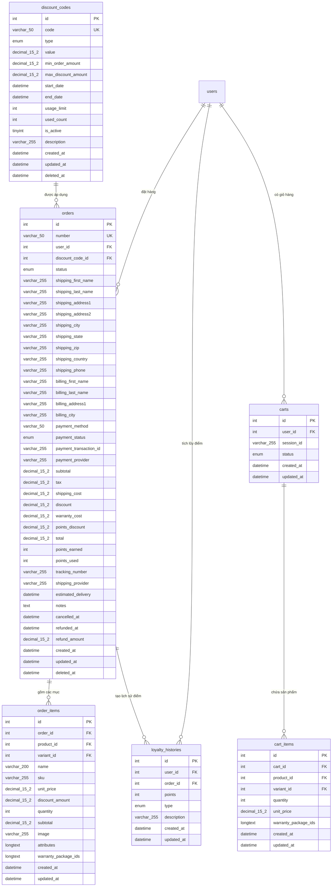

## 4.4 Content & Support tables

```mermaid
erDiagram
    banners {
        int id PK
        varchar_255 title_vi
        varchar_255 title_en
        varchar_512 image_url
        varchar_512 link_url
        enum position
        tinyint is_active
        int priority
        datetime created_at
        datetime updated_at
        datetime deleted_at
    }

    news {
        int id PK
        varchar_200 title_vi
        varchar_200 title_en
        varchar_100 slug UK
        longtext content_vi
        longtext content_en
        varchar_512 thumbnail
        text description_vi
        text description_en
        varchar_100 category_vi
        varchar_100 category_en
        int view_count
        varchar_500 tags
        tinyint is_published
        int user_id FK
        datetime created_at
        datetime updated_at
        datetime deleted_at
    }

    feedbacks {
        int id PK
        varchar_255 name
        varchar_255 email
        varchar_20 phone
        varchar_255 subject
        text content
        enum status
        datetime created_at
        datetime updated_at
    }

    review_feedbacks {
        int id PK
        int review_id FK
        int user_id FK
        tinyint is_helpful
        datetime created_at
        datetime updated_at
    }

    search_histories {
        int id PK
        int user_id FK
        varchar_255 session_id
        varchar_255 keyword
        int results_count
        datetime created_at
    }

    images {
        int id PK
        varchar_255 original_name
        varchar_255 file_name UK
        varchar_500 file_path
        int file_size
        varchar_100 mime_type
        int width
        int height
        enum category
        int product_id FK
        int user_id FK
        tinyint is_active
        datetime created_at
        datetime updated_at
    }

    users ||--o{ news : "viết bài"
    reviews ||--o{ review_feedbacks : "nhận đánh giá hữu ích"
    users ||--o{ review_feedbacks : "đánh giá hữu ích"
    users ||--o{ search_histories : "lịch sử tìm kiếm"
    products ||--o{ images : "ảnh upload"
    users ||--o{ images : "ảnh upload"
```

## 4.5 AI & Log tables

```mermaid
erDiagram
    chat_messages {
        int id PK
        int user_id FK
        varchar_128 session_id
        text content
        enum role
        enum message_type
        varchar_50 intent
        int response_time_ms
        tinyint is_fallback
        tinyint is_archived
        datetime created_at
        datetime updated_at
    }

    inventory_logs {
        int id PK
        int product_id FK
        int variant_id FK
        enum change_type
        int change_amount
        int previous_stock
        int new_stock
        int order_id FK
        varchar_500 note
        int created_by FK
        datetime created_at
    }

    audit_logs {
        int id PK
        int admin_id FK
        varchar_50 action
        varchar_50 entity_type
        int entity_id
        text old_value
        text new_value
        varchar_45 ip
        datetime created_at
        datetime updated_at
    }

    users ||--o{ chat_messages : "gửi tin nhắn"
    products ||--o{ inventory_logs : "theo dõi tồn kho"
    product_variants ||--o{ inventory_logs : "theo dõi variant"
    orders ||--o{ inventory_logs : "ghi nhận bán hàng"
    users ||--o{ inventory_logs : "admin thực hiện"
    users ||--o{ audit_logs : "admin ghi log"
```

---

# 5. Kiến Trúc Hệ Thống

```mermaid
flowchart TB
    subgraph CLIENT["Client Layer port 5175"]
        direction TB
        FE["Frontend\nReact 18 + TypeScript\nVite build tool\nTanStack Query v5\nZustand v5 + Immer\nTailwind CSS + SCSS\n14 features"]
    end

    subgraph BACKEND["Backend Layer port 8888"]
        direction TB
        API["Express 4\nNode.js 20\nModular Monolith\n19 modules"]

        subgraph MODULES["19 Business Modules"]
            direction TB
            M1["auth JWT OTP OAuth"]
            M2["users profile addresses"]
            M3["catalog products variants"]
            M4["cart guest + user"]
            M5["orders checkout status"]
            M6["payment VNPay MoMo COD"]
            M7["reviews đánh giá"]
            M8["wishlist yêu thích"]
            M9["loyalty points tiers"]
            M10["inventory tồn kho"]
            M11["content banner news"]
            M12["ai RAG chatbot"]
            M13["upload file"]
            M14["admin dashboard"]
            M15["discount-code"]
            M16["warranty-package"]
            M17["attribute groups values"]
            M18["search-history"]
            M19["image proxy"]
        end

        subgraph SHARED["Shared Infrastructure"]
            direction TB
            SH1["EventBus in-memory pub/sub\npayment.succeeded → inventory\norder.created → inventory audit"]
            SH2["UnitOfWork runInTransaction + lockRow\nSELECT FOR UPDATE chống oversell"]
            SH3["AppError + errors\nAdminAuditService audit log"]
        end

        subgraph SVC["Shared Services non-DI"]
            direction TB
            SVC1["email.js nodemailer Gmail SMTP\norder confirm + OTP async"]
            SVC2["vector-store.js HybridVectorStore\nBM25 + cosine similarity\nvector-db.json on disk"]
            SVC3["unified-embedding.js Jina v3 primary\nHuggingFace multilingual-e5 fallback\n1024d vectors"]
        end

        subgraph JOBS["Cron Jobs"]
            direction TB
            J1["cleanup.js daily 2AM\nabandoned carts + expired OTP\nsearch history cleanup"]
            J2["weekly 3AM Sunday maintenance"]
        end
    end

    subgraph STORAGE["Storage Layer"]
        direction TB
        DB[("MySQL 8\nSequelize 6 ORM\n32 models\ntransactions + soft deletes")]
        REDIS[("Redis\nbl:jti JWT blacklist\nContent cache banners catalog\nChatbot cache TTL 5m\nIn-memory fallback tự động")]
        DISK[("Disk Storage\n/uploads/ static files\nvector-db.json product vectors\nchat history in-memory Map")]
    end

    subgraph EXTERNAL["External Services"]
        direction TB
        VNPAY["VNPay Gateway\nHMAC-SHA512\nIPN server-to-server"]
        MOMO["MoMo Gateway\nHMAC-SHA256\nIPN server-to-server"]
        JINA["Jina AI\njina-embeddings-v3\n1024d text embedding"]
        HF["HuggingFace\nmultilingual-e5-large-instruct\nFallback embedding"]
        LLM_API["LLM API\nOpenAI-compatible endpoint\nchat completion"]
        GOOGLE_OAUTH["Google OAuth 2.0\npassport-google-oauth20\nSSO login"]
        GMAIL["Gmail SMTP\nnodemailer port 587 TLS\norder confirm + OTP"]
    end

    subgraph DEVOPS["DevOps"]
        direction TB
        CI["GitHub Actions CI\nci.yml Node 22\nBE unit tests 100% coverage\nFE component tests 100% coverage"]
        HOOKS["Husky Git Hooks\npre-commit secret scan + arch audit + lint-staged + tsc\npre-push build + tests + npm audit\ncommit-msg Conventional Commits"]
    end

    FE <-->|"REST API HTTP/JSON Bearer + httpOnly cookie"| API
    API <-->|"Sequelize ORM + transactions"| DB
    API <-->|"ioredis blacklist + cache"| REDIS
    API <-->|"fs read/write"| DISK
    M6 -->|"HMAC sign + IPN receive"| VNPAY
    M6 -->|"HMAC sign + IPN receive"| MOMO
    SVC3 <-->|"HTTP REST primary"| JINA
    SVC3 <-->|"HTTP REST fallback"| HF
    M12 -->|"chat completion API"| LLM_API
    M1 <-->|"OAuth2 passport strategy"| GOOGLE_OAUTH
    SVC1 -->|"SMTP port 587 TLS"| GMAIL
    SH1 -->|"subscribe inventory"| M10
    DEVOPS -.->|"trigger CI on push/PR"| BACKEND
    DEVOPS -.->|"enforce code quality"| CLIENT
```

---

# 6. RAG Pipeline Flow

```mermaid
flowchart TD
    A([User gửi câu hỏi]) --> B["POST /api/chatbot/message\nchatbotLimiter 20 req/60s"]
    B --> C["validateMessage message\nCheck độ dài không rỗng"]
    C -->|Không hợp lệ| ERR1([400 Bad Request])
    C -->|Hợp lệ| D["expandAbbreviations message\nip → iPhone ss → Samsung\nap → Apple ms → Microsoft"]
    D --> E{"isOffTopic normalizedQuery\nRule-based regex 0 API call"}

    E -->|off_topic / greeting| F["llmGateway.handleMessage\ndirect skip retrieval\ntrả về conversational response"]

    E -->|product_search / pricing| G["Kiểm tra Redis cache\nkey=hash normalizedQuery TTL 5 phút"]
    G -->|Cache hit| RESP([Trả cached response])

    G -->|Cache miss| H["Song song - Promise.all"]
    H --> H1["llmGateway.rewriteQuery\nmax_tokens 80 temp 0 timeout 8s\nOptimize query cho vector search"]
    H --> H2["vectorStore.hybridSearch\nnormalizedQuery topK=10"]

    H2 --> H2A["Embed query\nJina v3 primary HTTP api.jina.ai/v1/embeddings\nFallback HuggingFace multilingual-e5"]
    H2A --> H2B["Cosine similarity\nquery_vector · product_vector"]
    H2B --> H2C["BM25 keyword score\nterm frequency + IDF"]
    H2C --> H2D["Merge hybrid scores\nrank + filter minScore=0.45"]

    H1 --> I{"rewrittenQuery != normalizedQuery?"}
    H2D --> I

    I -->|Có - query được cải thiện| J["vectorStore.hybridSearch\nrewrittenQuery topK=10"]
    J --> K["So sánh 2 tập kết quả\nchọn refined nếu tốt hơn"]
    I -->|Không| K

    K --> L{"Số kết quả >= 1?"}
    L -->|Không có kết quả| M["Fallback hạ minScore\nlấy top-3 bất kể score"]
    M --> N
    L -->|Có kết quả| N["Augment context\n= retrieved products + chatHistory max 10 turns"]

    N --> O["llmGateway.generate\nPrompt builder system + products + history + query\ntemp 0.3 max_tokens 800\nresponse_format json_object"]
    O --> P["LLM API OpenAI-compatible\nchat.completions.create"]
    P --> Q["parseResponse\nfuzzy match product names add URLs"]
    Q --> R["SET Redis cache\nTTL 5 phút shared across users"]

    F --> S
    RESP --> S
    R --> S["Cập nhật chat history\nin-memory Map TTL 30 phút"]
    S --> T["INSERT chat_messages\nDB async không block response"]
    T --> U(["{response products suggestions intent}"])
```

---

# 7. State Diagrams

## 7.1 Order states

```mermaid
stateDiagram-v2
    [*] --> pending : POST /api/orders\nTạo đơn hàng\nstock đã lock SELECT FOR UPDATE

    pending --> processing : COD/bank_transfer admin xác nhận thủ công\nVNPay/MoMo IPN webhook thành công\npaymentStatus = paid\nCart được xóa

    pending --> cancelled : User hủy POST /api/orders/:id/cancel\nHoặc thanh toán online thất bại IPN\nStock được hoàn trả

    processing --> shipped : Admin cập nhật\nPATCH /api/orders/admin/:id/status\ntracking_number được gán

    processing --> cancelled : Admin hủy\nHoàn stock\nHoàn tiền nếu đã paid

    shipped --> delivered : Admin xác nhận giao hàng thành công\nHoặc user xác nhận POST /api/orders/:id/receive\nTrigger cộng Loyalty points\nCOD paymentStatus=paid

    delivered --> [*] : Đơn hoàn tất\nĐủ điều kiện viết review\nkhông thể sửa thêm

    cancelled --> [*] : Đơn đã hủy\nkhông thể khôi phục

    note right of pending
        paymentStatus = pending
        Stock locked SELECT FOR UPDATE
        discount.usedCount COD/bank_transfer tăng ngay
        discount.usedCount VNPay/MoMo chờ IPN
    end note

    note right of processing
        paymentStatus = paid online
        paymentStatus = pending COD
        Cart đã xóa online
    end note

    note right of delivered
        paymentStatus = paid mọi phương thức
        loyalty_points đã cộng
        Đủ điều kiện viết review
    end note
```

## 7.2 Payment states

```mermaid
stateDiagram-v2
    [*] --> pending : Tạo đơn hàng\nTất cả phương thức bắt đầu ở pending

    pending --> paid : VNPay IPN vnp_ResponseCode=00\nMoMo IPN resultCode=0\nCOD khi order status = DELIVERED\nBank transfer admin xác nhận thủ công

    pending --> failed : VNPay IPN vnp_ResponseCode != 00\nMoMo IPN resultCode != 0\nTimeout trên cổng thanh toán\nUser hủy trên cổng thanh toán

    paid --> refunded : Admin xử lý hoàn tiền\nPOST /api/payments/refund admin only\nThao tác thủ công ngoài hệ thống

    failed --> [*] : Stock được hoàn trả\nĐơn hàng bị hủy

    paid --> [*] : Thanh toán hoàn tất\nEmail xác nhận đã gửi

    refunded --> [*] : Đã hoàn tiền\nrefunded_at + refund_amount ghi nhận

    note right of pending
        COD giữ pending cho đến DELIVERED
        VNPay/MoMo chờ IPN server-to-server
        returnUrl chỉ phục vụ UX redirect
        KHÔNG mutate DB từ returnUrl
    end note

    note right of paid
        Trigger xóa cart online
        Trigger gửi email xác nhận
        Trigger discount.usedCount + 1\nVNPay/MoMo tăng trong IPN\nCOD/bank_transfer tăng khi tạo đơn
    end note
```

## 7.3 Product states

```mermaid
stateDiagram-v2
    [*] --> draft : Admin tạo sản phẩm mới\nCHUA hiển thị frontend\nstock_quantity có thể = 0

    draft --> active : Admin publish\nstatus = active\nHiển thị trên frontend\nVector store auto-sync afterUpdate hook

    active --> inactive : Admin ẩn sản phẩm\nKhông hiển thị trên listing\nVẫn có thể truy cập qua URL trực tiếp

    inactive --> active : Admin kích hoạt lại\nHiển thị trở lại

    active --> archived : Admin lưu trữ\nSoft delete deleted_at != NULL\nVector auto-remove afterDestroy hook

    inactive --> archived : Admin lưu trữ

    draft --> archived : Admin hủy sản phẩm nháp

    archived --> [*] : Sản phẩm đã lưu trữ\nkhông hiển thị\ncó thể restore về active admin

    note right of active
        Hiển thị trên catalog
        Có thể thêm vào giỏ hàng
        Có thể review sau khi mua
        Vector trong vector-db.json
    end note

    note right of archived
        deleted_at IS NOT NULL
        Sequelize paranoid=true soft delete
        catalog queries tự động lọc ra
        Vector đã xóa khỏi vector-db.json
    end note
```

## 7.4 User states

```mermaid
stateDiagram-v2
    [*] --> unverified : POST /api/auth/register\nTạo tài khoản\nisEmailVerified = false\nisActive = true

    unverified --> active : POST /api/auth/verify-otp\nOTP đúng và còn hiệu lực\nisEmailVerified = true

    unverified --> unverified : POST /api/auth/resend-verification\nGửi lại OTP otpLimiter

    active --> inactive : Admin deactivate\nPATCH /api/admin/users/:id/toggle-active\nisActive = false

    inactive --> active : Admin reactivate\nisActive = true

    active --> deleted : Admin soft delete\ndeleted_at != NULL\nsoft delete dữ liệu giữ lại

    deleted --> [*] : Tài khoản đã xóa\nkhông thể đăng nhập

    note right of unverified
        OTP TTL 10 phút
        Google OAuth bypass bước này
    end note

    note right of active
        role customer/admin/manager
        loyalty_tier Bronze/Silver/Gold/Platinum
        Đặt hàng review tích điểm
    end note

    note right of inactive
        isActive = false
        Login trả 403 Forbidden
        Dữ liệu đơn hàng giữ nguyên
    end note
```

---

# 8. Component Diagram

```mermaid
flowchart TB
    subgraph FE_LAYER["Frontend React 18 + TypeScript Vite port 5175"]
        direction TB

        subgraph FE_FEATURES["14 Features src/features/"]
            FF1["auth đăng nhập/đăng ký/OAuth"]
            FF2["catalog sản phẩm danh mục lọc"]
            FF3["cart giỏ hàng guest + user"]
            FF4["checkout quy trình đặt hàng"]
            FF5["orders lịch sử + tracking"]
            FF6["payment VNPay/MoMo redirect"]
            FF7["reviews đánh giá sản phẩm"]
            FF8["wishlist danh sách yêu thích"]
            FF9["loyalty điểm + hạng thành viên"]
            FF10["users profile địa chỉ"]
            FF11["content banner tin tức"]
            FF12["ai chatbot widget + RAG UI"]
            FF13["upload file upload"]
            FF14["admin dashboard quản trị"]
        end

        subgraph FE_SHARED["Shared src/"]
            FS1["api-client.ts axios instance\nbaseURL interceptors auth header"]
            FS2["query-client.ts TanStack Query\nstaleTime retry config"]
            FS3["Zustand Stores x6\nauthStore cartStore wishlistStore\nchatbotStore uiStore searchStore"]
            FS4["components/ x30+\nButton Modal Layout Icons Sections"]
            FS5["hooks/ x8 global hooks\nuseDebounce useIntersection"]
            FS6["utils/ x14 files\nformatCurrency formatDate"]
            FS7["routes/ AppRoutes.tsx\npaths.ts lazy loading"]
            FS8["i18n vi.json + en.json\nuseTranslation hook"]
        end

        FF1 --> FS1
        FF2 --> FS1
        FF3 --> FS1
        FF3 --> FS3
        FF4 --> FS3
        FF12 --> FS3
        FF14 --> FS1
        FS1 --> FS2
    end

    subgraph BE_LAYER["Backend Node.js 20 + Express 4 port 8888"]
        direction TB

        subgraph BE_MODULES["19 Business Modules src/modules/"]
            BM1["auth\nDI User eventBus emailService redisClient\nJWT + OTP + Google OAuth"]
            BM2["users\nDI User Address eventBus\nProfile + địa chỉ"]
            BM3["catalog\nDI Category Brand Product ProductVariant\nProductAttribute Review RecentlyViewed\nRedis cache cho listing"]
            BM4["cart\nDI Cart CartItem Product ProductVariant WarrantyPackage\nGuest + user cart + merge"]
            BM5["orders\nDI Order OrderItem Cart Product DiscountCode\nLoyaltyHistory InventoryLog WarrantyPackage\nSELECT FOR UPDATE email confirm"]
            BM6["payment\nDI Order DiscountCode Cart momoService vnpayService\nIPN webhook + idempotency"]
            BM7["reviews\nDI Review Product User Order OrderItem\nhasUserPurchased check"]
            BM8["wishlist\nDI Wishlist Product"]
            BM9["loyalty\nDI User LoyaltyHistory sequelize\nSELECT FOR UPDATE redeem"]
            BM10["inventory\nDI Product ProductVariant InventoryLog\nEventBus subscriber"]
            BM11["content\nDI Banner News Feedback emailService redisClient\nHTTP cache 900s banners"]
            BM12["ai\nDI Product ProductVariant Category chatbotService\nRAG pipeline orchestration"]
            BM13["upload\nMulter file handling\n/uploads/type/ static"]
            BM14["admin\nSingleton dashboard analytics + audit log\nCRUD delegates + stats"]
            BM15["discount-code\nSingleton validate + apply codes"]
            BM16["warranty-package\nSingleton CRUD gói bảo hành"]
            BM17["attribute\nSingleton attribute groups + values cho AI"]
            BM18["search-history\nSingleton lưu + lấy lịch sử tìm kiếm"]
            BM19["image\nSingleton image proxy middleware"]
        end

        subgraph BE_SHARED["Shared Infrastructure src/shared/"]
            BS1["EventBus in-memory pub/sub singleton\nevent payment.succeeded → inventory\nevent order.created → inventory audit\nevent order.cancelled → inventory restore"]
            BS2["UnitOfWork runInTransaction + lockRow\nSELECT FOR UPDATE chống race condition"]
            BS3["AppError + errors.js HTTP error hierarchy\nAdminAuditService ghi audit_logs"]
        end

        subgraph BE_SERVICES["Shared Services src/services/"]
            BSV1["email.js nodemailer Gmail SMTP\norder confirm + OTP emails async"]
            BSV2["vector-store.js HybridVectorStore\nBM25 + cosine similarity\nvector-db.json persistence\nauto-rebuild khi lệch 5%"]
            BSV3["unified-embedding.js Jina v3 primary\nHuggingFace multilingual-e5 fallback\n1024d vectors"]
        end

        subgraph BE_MODELS["32 Sequelize Models src/models/"]
            MOD["users addresses categories brands\nproducts product_variants product_images\nproduct_categories product_attributes\nproduct_specifications product_attribute_groups\nattribute_groups attribute_values\norders order_items carts cart_items\ndiscount_codes reviews product_reviews\nwishlists warranty_packages product_warranties\nloyalty_histories recently_viewed chat_messages\nsearch_histories inventory_logs audit_logs\nnews banners feedbacks"]
        end

        BM5 -->|"publish order.created"| BS1
        BM6 -->|"publish payment.succeeded"| BS1
        BS1 -->|"subscribe"| BM10
        BM5 --> BS2
        BM6 --> BS2
        BM9 --> BS2
        BM12 --> BSV2
        BSV2 --> BSV3
        BM1 --> BSV1
        BM5 --> BSV1
        BM11 --> BSV1
        BE_MODULES --> MOD
    end

    subgraph STORAGE_LAYER["Storage"]
        direction TB
        DB[("MySQL 8\nSequelize 6 ORM\ntransactions + paranoid soft delete")]
        REDIS[("Redis\nJWT blacklist bl:jti\nContent + catalog cache\nChatbot response cache TTL 5m")]
        DISK[("Disk /uploads/\nvector-db.json\nchat history Map")]
    end

    subgraph EXT_SERVICES["External Services"]
        direction TB
        EXT1["VNPay HMAC-SHA512\nIPN server-to-server"]
        EXT2["MoMo HMAC-SHA256\nIPN server-to-server"]
        EXT3["Jina AI jina-embeddings-v3\n1024d text embedding"]
        EXT4["HuggingFace multilingual-e5\nFallback embedding"]
        EXT5["LLM API OpenAI-compatible\nChat completion"]
        EXT6["Google OAuth 2.0\nSSO login"]
        EXT7["Gmail SMTP port 587\nOrder confirm + OTP"]
    end

    FE_LAYER <-->|"REST API Bearer + Cookie"| BE_LAYER
    MOD <-->|"Sequelize ORM"| DB
    BM1 <-->|"ioredis blacklist"| REDIS
    BM3 <-->|"ioredis cache"| REDIS
    BM11 <-->|"ioredis cache"| REDIS
    BM12 <-->|"Redis chatbot cache"| REDIS
    BSV2 <-->|"fs read/write"| DISK
    BM13 <-->|"multer disk"| DISK
    BM6 --> EXT1
    BM6 --> EXT2
    BSV3 --> EXT3
    BSV3 --> EXT4
    BM12 --> EXT5
    BM1 --> EXT6
    BSV1 --> EXT7
```
