# TechStore — Sơ Đồ Hệ Thống

Tất cả diagram dùng [Mermaid](https://mermaid.js.org/) — render trực tiếp trên GitHub.

> Dựa trực tiếp từ source code: `backend/data/migration.sql`, `backend/src/models/index.js`, và các service files. Tên bảng, columns, quan hệ đúng với schema thực tế.

## Mục lục

- [1. Usecase Tổng Quát](#1-usecase-tổng-quát)
  - [1.1 Khách vãng lai (Guest)](#11-khách-vãng-lai-guest)
  - [1.2 Khách hàng (Customer)](#12-khách-hàng-customer)
  - [1.3 Quản trị viên (Admin)](#13-quản-trị-viên-admin)
- [2. Usecase Phân Rã](#2-usecase-phân-rã)
  - [2.1a Auth — Xác thực](#21a-auth--xác-thực)
  - [2.1b User — Tài khoản](#21b-user--tài-khoản)
  - [2.2a Catalog — Duyệt sản phẩm](#22a-catalog--duyệt-sản-phẩm)
  - [2.2b Catalog — Chi tiết & Lọc](#22b-catalog--chi-tiết--lọc)
  - [2.2c Catalog — Danh mục & Thương hiệu](#22c-catalog--danh-mục--thương-hiệu)
  - [2.2d Catalog — Admin CRUD](#22d-catalog--admin-crud)
  - [2.3a Cart — Giỏ hàng](#23a-cart--giỏ-hàng)
  - [2.3b Checkout — Đặt hàng](#23b-checkout--đặt-hàng)
  - [2.4a Orders — Khách hàng](#24a-orders--khách-hàng)
  - [2.4b Payment — Thanh toán](#24b-payment--thanh-toán)
  - [2.4c Orders — Admin](#24c-orders--admin)
  - [2.5 Reviews & Ratings](#25-reviews--ratings)
  - [2.6 Inventory](#26-inventory)
  - [2.7 AI Chatbot & Search History](#27-ai-chatbot--search-history)
  - [2.8 Wishlist, Upload & Discount Code](#28-wishlist-upload--discount-code)
  - [2.9 Content Management](#29-content-management)
  - [2.10a Admin Dashboard — Analytics](#210a-admin-dashboard--analytics)
  - [2.10b Admin — Users](#210b-admin--users)
  - [2.10c Admin — Products](#210c-admin--products)
  - [2.10d Admin — Import, Discount, Reviews](#210d-admin--import-discount-reviews)
- [3. Sơ Đồ Tuần Tự](#3-sơ-đồ-tuần-tự)
  - [3.1 Đăng ký / Đăng nhập](#31-đăng-ký--đăng-nhập)
  - [3.2 Checkout đầy đủ](#32-checkout-đầy-đủ)
  - [3.3 AI Chatbot (RAG pipeline)](#33-ai-chatbot-rag-pipeline)
  - [3.4 Upload ảnh](#34-upload-ảnh)
  - [3.5 Admin quản lý sản phẩm](#35-admin-quản-lý-sản-phẩm)
  - [3.6 Token refresh](#36-token-refresh)
- [4. ERD — Entity Relationship Diagram](#4-erd--entity-relationship-diagram)
  - [4.1 User & Auth tables](#41-user--auth-tables)
  - [4.2 Product & Catalog tables](#42-product--catalog-tables)
  - [4.3 Order & Payment tables](#43-order--payment-tables)
  - [4.4 Content & Support tables](#44-content--support-tables)
  - [4.5 AI & Log tables](#45-ai--log-tables)
- [5. Kiến Trúc Hệ Thống](#5-kiến-trúc-hệ-thống)
- [6. RAG Pipeline Flow](#6-rag-pipeline-flow)
  - [6a Input Processing](#6a-input-processing)
  - [6b Retrieval + Generation](#6b-retrieval--generation)
- [7. State Diagrams](#7-state-diagrams)
  - [7.1 Order states](#71-order-states)
  - [7.2 Payment states](#72-payment-states)
  - [7.3 Product states](#73-product-states)
  - [7.4 User states](#74-user-states)
- [8. Component Diagram](#8-component-diagram)

---

# 1. Usecase Tổng Quát

## 1.1 Khách vãng lai (Guest)

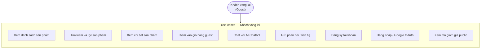

## 1.2 Khách hàng (Customer)

> Kế thừa toàn bộ use cases của Guest, cộng thêm:

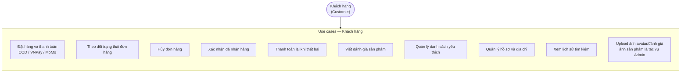

## 1.3 Quản trị viên (Admin)

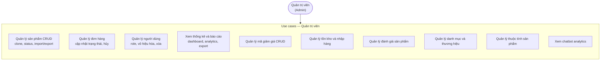

---

# 2. Usecase Phân Rã

## 2.1a Auth — Xác thực

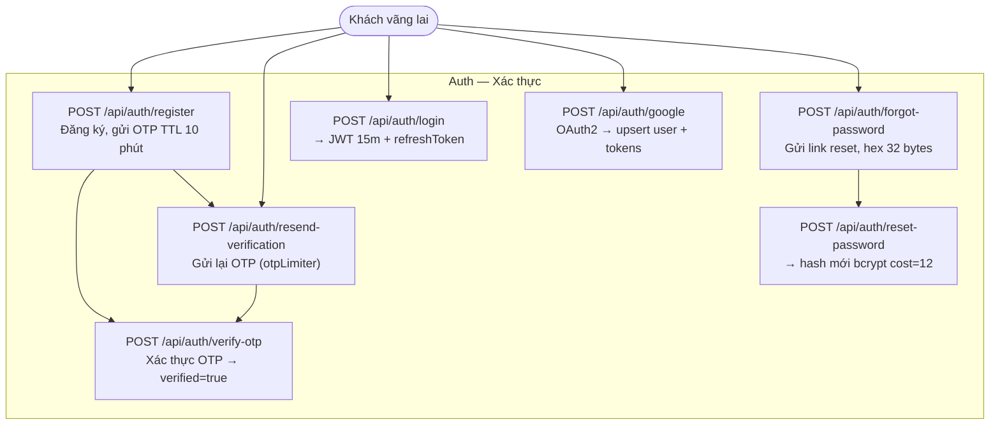

## 2.1b User — Tài khoản

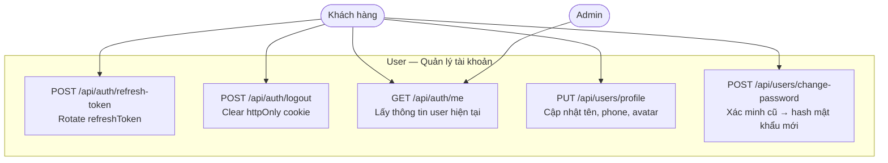

**Địa chỉ giao hàng** (`/api/users/addresses`):

| Method | Endpoint | Mô tả |
|--------|----------|-------|
| GET | `/api/users/addresses` | Danh sách địa chỉ |
| POST | `/api/users/addresses` | Thêm địa chỉ mới (auto-default nếu đầu tiên) |
| PUT | `/api/users/addresses/:id` | Cập nhật địa chỉ |
| DELETE | `/api/users/addresses/:id` | Xóa địa chỉ |
| PATCH | `/api/users/addresses/:id/default` | Đặt làm địa chỉ mặc định |

## 2.2a Catalog — Duyệt sản phẩm

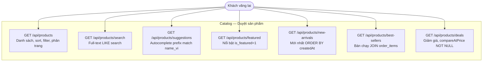

## 2.2b Catalog — Chi tiết & Lọc

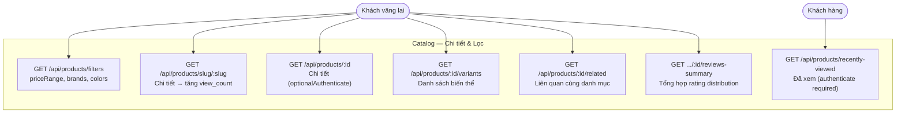

## 2.2c Catalog — Danh mục & Thương hiệu

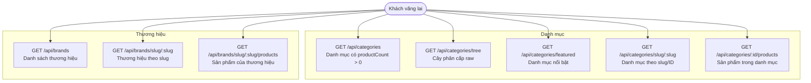

## 2.2d Catalog — Admin CRUD

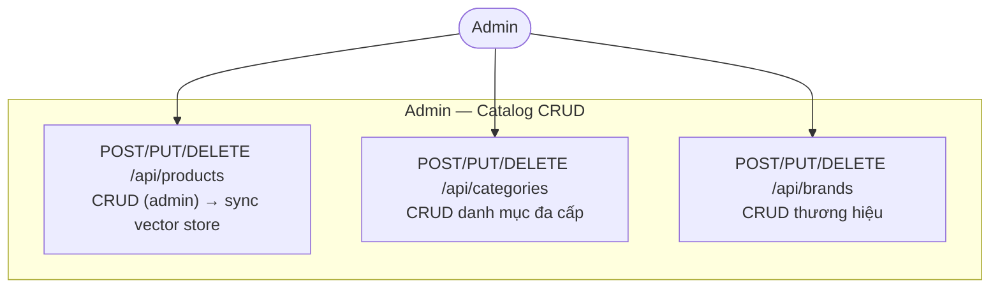

## 2.3a Cart — Giỏ hàng

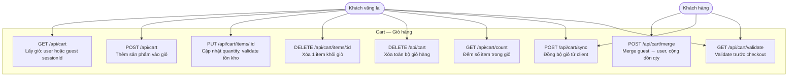

## 2.3b Checkout — Đặt hàng

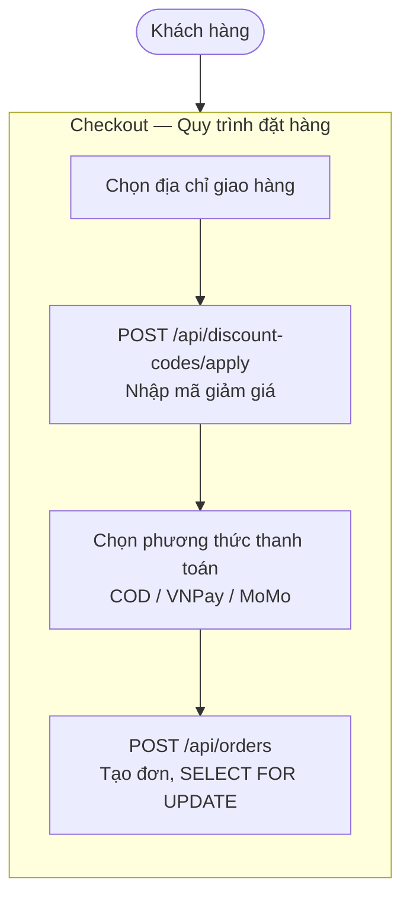

**Cart endpoints:**

| Method | Endpoint | Mô tả |
|--------|----------|-------|
| GET | `/api/cart` | Lấy giỏ (user hoặc guest sessionId) |
| POST | `/api/cart` | Thêm sản phẩm |
| PUT | `/api/cart/items/:id` | Cập nhật quantity |
| DELETE | `/api/cart/items/:id` | Xóa 1 item |
| DELETE | `/api/cart` | Xóa toàn bộ giỏ |
| POST | `/api/cart/merge` | Merge guest → user (authenticate) |
| GET | `/api/cart/count` | Đếm số items |
| POST | `/api/cart/sync` | Đồng bộ từ client |
| GET | `/api/cart/validate` | Validate trước checkout |

## 2.4a Orders — Khách hàng

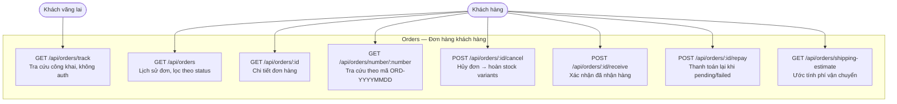

## 2.4b Payment — Thanh toán

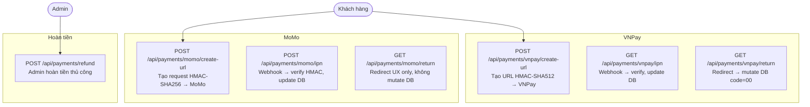

## 2.4c Orders — Admin

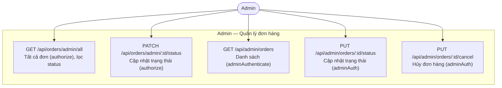

## 2.5 Reviews & Ratings

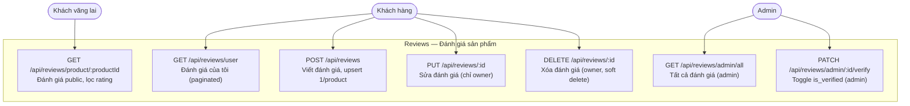

## 2.6 Inventory

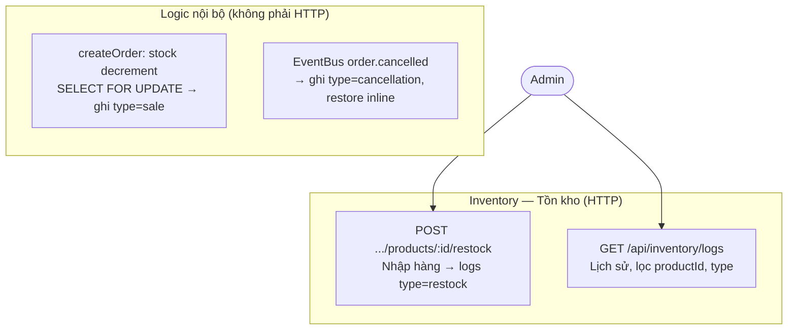

## 2.7 AI Chatbot & Search History

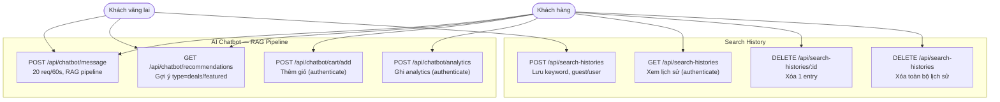

## 2.8 Wishlist, Upload & Discount Code

```mermaid
flowchart TB
    Customer(["Khách hàng"])
    Guest(["Khách vãng lai"])

    subgraph WISHLIST["Wishlist — Yêu thích"]
        direction TB
        W1["GET /api/wishlists<br/>Danh sách yêu thích (authenticate)"]
        W2["POST /api/wishlists<br/>Thêm sản phẩm vào wishlist"]
        W3["GET /api/wishlists/check/:productId<br/>Kiểm tra đã yêu thích chưa"]
        W4["DELETE /api/wishlists/:productId<br/>Xóa 1 sản phẩm"]
        W5["DELETE /api/wishlists<br/>Xóa toàn bộ wishlist"]
    end

    subgraph UPLOAD["Upload — Tải file"]
        direction TB
        U1["POST /api/uploads/:type/single<br/>Upload 1 ảnh max 5MB, magic bytes"]
        U2["POST /api/uploads/:type/multiple<br/>Upload nhiều ảnh max 10 files"]
        U3["DELETE /api/uploads/:type/:filename<br/>Xóa file đã upload (Admin only)"]
    end

    subgraph DISCOUNT["Discount Code (user)"]
        direction TB
        DC1["GET /api/discount-codes<br/>Danh sách mã public"]
        DC2["POST /api/discount-codes/apply<br/>Áp dụng, check type/value/min_order"]
    end

    Customer --> W1
    Customer --> W2
    Customer --> W3
    Customer --> W4
    Customer --> W5
    Customer --> U1
    Customer --> U2
    Customer --> U3
    Guest --> DC1
    Customer --> DC2
```

## 2.8b Attribute — Nhóm thuộc tính (Admin)

> Không có diagram riêng — module `/api/attributes` gồm 13 endpoints: GET/POST/PUT/DELETE `/api/attributes/groups`, `/api/attributes/groups/:id/values`, `/api/attributes/values/:id`, `/api/attributes/products/:productId/groups`, và utilities `preview-name`, `generate-name-realtime`, `name-affecting`, `batch-generate-names`. Tất cả write endpoints require `authenticate + authorize('admin')`.

## 2.9 Content Management

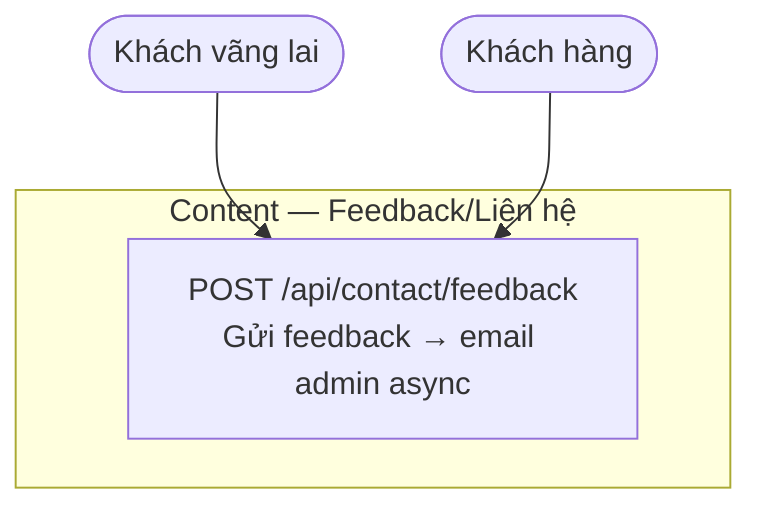

## 2.10a Admin Dashboard — Analytics

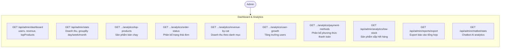

## 2.10b Admin — Users

```mermaid
flowchart TB
    Admin(["Admin"])

    subgraph ADMIN_USER["Admin — Quản lý Users"]
        direction TB
        AU1["GET /api/admin/users<br/>Danh sách, lọc role, is_active"]
        AU2["GET /api/admin/users/:id<br/>Chi tiết kèm addresses, orders"]
        AU3["PUT /api/admin/users/:id<br/>Cập nhật role, isActive"]
        AU4["DELETE /api/admin/users/:id<br/>Soft delete user"]
    end

    Admin --> AU1
    Admin --> AU2
    Admin --> AU3
    Admin --> AU4
```

## 2.10c Admin — Products

```mermaid
flowchart TB
    Admin(["Admin"])

    subgraph ADMIN_PROD["Admin — Quản lý Products"]
        direction TB
        AP1["GET /api/admin/products<br/>Danh sách phân trang, search"]
        AP2["GET /api/admin/products/:id<br/>Chi tiết, variants, attributes"]
        AP3["POST /api/admin/products<br/>Tạo mới → sync vector store"]
        AP4["PUT /api/admin/products/:id<br/>Cập nhật → sync vector store"]
        AP5["DELETE /api/admin/products/:id<br/>Soft delete → remove vector"]
        AP6["POST /api/admin/products/:id/clone<br/>Clone → status=draft"]
        AP7["PATCH .../products/:id/status<br/>Toggle active/inactive/draft"]
        AP8["PATCH /api/admin/products/:id/stock<br/>Cập nhật stock trực tiếp"]
        AP9["POST .../products/:id/restock<br/>Nhập hàng → inventory_logs"]
    end

    Admin --> AP1
    Admin --> AP2
    Admin --> AP3
    Admin --> AP4
    Admin --> AP5
    Admin --> AP6
    Admin --> AP7
    Admin --> AP8
    Admin --> AP9
```

## 2.10d Admin — Import, Discount, Reviews

```mermaid
flowchart TB
    Admin(["Admin"])

    subgraph ADMIN_IMPORT["Import/Export Products"]
        direction TB
        AI1["GET .../products/import-template<br/>Download CSV template 16 cols"]
        AI2["POST /api/admin/products/import<br/>Import CSV/JSON max 5MB"]
        AI3["GET /api/admin/products/export<br/>Export CSV/JSON ?format=json"]
    end

    subgraph ADMIN_DC["Quản lý Discount Codes"]
        direction TB
        DC1["GET /api/admin/discount-codes<br/>Danh sách, lọc is_active/expired"]
        DC2["GET /api/admin/discount-codes/:id<br/>Chi tiết mã giảm giá"]
        DC3["POST /api/admin/discount-codes<br/>Tạo mã giảm giá mới"]
        DC4["PUT /api/admin/discount-codes/:id<br/>Cập nhật mã giảm giá"]
        DC5["DELETE .../admin/discount-codes/:id<br/>Xóa mã giảm giá"]
    end

    subgraph ADMIN_REVIEW["Quản lý Reviews"]
        direction TB
        AR1["GET /api/admin/reviews<br/>Tất cả reviews phân trang"]
        AR2["DELETE /api/admin/reviews/:id<br/>Xóa review vi phạm"]
    end

    Admin --> ADMIN_IMPORT
    Admin --> ADMIN_DC
    Admin --> ADMIN_REVIEW
```

---

# 3. Sơ Đồ Tuần Tự

## 3.1 Đăng ký / Đăng nhập

```mermaid
sequenceDiagram
    actor User as Người dùng
    participant FE as Frontend React
    participant API as Backend API
    participant DB as MySQL DB
    participant Mail as Gmail SMTP

    Note over User,Mail: Luồng Đăng ký

    User->>FE: Nhập email + password + họ tên
    FE->>API: POST /api/auth/register validateRequest Zod
    API->>DB: SELECT user WHERE email = ?
    DB-->>API: null chưa tồn tại
    API->>DB: INSERT users isEmailVerified=false<br/>password hash bcrypt cost=12 (beforeCreate hook)<br/>otp_code otp_expires cùng lúc
    API->>Mail: await sendOtpEmail trong try/catch<br/>lỗi gửi mail bị catch+log, KHÔNG block register
    Mail-->>User: Email OTP
    API-->>FE: 201 Created
    FE-->>User: Nhập mã OTP từ email

    User->>FE: Nhập OTP 6 số
    FE->>API: POST /api/auth/verify-otp otpLimiter
    API->>DB: SELECT user WHERE email
    API->>API: timingSafeEqual chống timing attack
    alt OTP sai
        API-->>FE: 400 auth.otpInvalidOrExpired
    else OTP hết hạn
        API-->>FE: 400 auth.otpExpired
    else OTP đúng
        API->>DB: UPDATE isEmailVerified=true otp_code=NULL
        API-->>FE: 200 OK auth.emailVerified
        FE-->>User: Xác thực thành công — đăng nhập
    end

    Note over User,Mail: Luồng Đăng nhập

    User->>FE: Nhập email + password
    FE->>API: POST /api/auth/login validateRequest
    API->>DB: SELECT user WHERE email = ?

    alt User không tồn tại hoặc password sai
        API-->>FE: 401 Unauthorized
    else Email chưa xác thực
        API-->>FE: 401 auth.emailNotVerified
    else Tài khoản bị vô hiệu hóa
        API-->>FE: 401 auth.accountDisabled
    else Đăng nhập thành công
        API->>API: Sinh accessToken JWT (TTL theo env JWT_EXPIRES_IN) + refreshToken
        API-->>FE: 200 OK + token + refreshToken httpOnly cookie
    end

    Note over User,Mail: Google OAuth

    User->>FE: Nhấn Đăng nhập bằng Google
    FE->>API: POST /api/auth/google token googleIdToken
    API->>API: google-auth-library verifyIdToken
    API->>DB: SELECT user WHERE google_id = ? OR email = ?
    alt Tìm thấy user theo email
        API->>DB: Merge (cập nhật googleId/avatar/isEmailVerified) rồi save
    else Không có
        API->>DB: createUser
    end
    alt Tài khoản bị vô hiệu hóa
        API-->>FE: 401 auth.accountDisabled
    else Thành công
        API->>API: Sign accessToken + refreshToken (stateless JWT)
        API-->>FE: 200 OK + accessToken + cookie
    end
```

## 3.2 Checkout đầy đủ

```mermaid
sequenceDiagram
    actor Customer as Khách hàng
    participant FE as Frontend
    participant API as Backend API
    participant DB as MySQL DB
    participant GW as VNPay / MoMo Gateway
    participant Mail as Gmail SMTP

    Customer->>FE: Xem giỏ hàng chọn địa chỉ
    Customer->>FE: Nhập mã giảm giá
    FE->>API: POST /api/discount-codes/apply code
    API->>DB: SELECT discount_codes WHERE code + is_active
    API->>API: validate JS: startDate/endDate + usageLimit + minOrder
    alt Mã không hợp lệ
        API-->>FE: 400 Mã giảm giá không hợp lệ
    else Mã hợp lệ
        API-->>FE: discountAmount + discountCodeId + code
    end

    Customer->>FE: Xác nhận đặt hàng
    FE->>API: POST /api/orders items shippingAddress paymentMethod discountCode
    API->>DB: BEGIN TRANSACTION
    API->>DB: SELECT FOR UPDATE product_variants lock chống oversell

    alt Không đủ hàng tồn kho
        API->>DB: ROLLBACK
        API-->>FE: 400 Sản phẩm không đủ tồn kho
    else Đủ hàng
        API->>API: _generateOrderNumber ORD-YYYYMMDD-random4digit
        API->>API: Tính subtotal + shipping - discountAmount
        API->>DB: Hủy pending orders cũ của user (cancelPendingOrdersByUser)
        API->>DB: INSERT orders status=pending paymentStatus=pending
        API->>DB: INSERT order_items orderId productId variantId
        API->>DB: UPDATE product_variants stock_quantity - qty
        API->>DB: INSERT inventory_logs change_type=sale

        alt COD / bank_transfer / installment
            API->>DB: UPDATE discount_codes used_count + 1
            API->>DB: UPDATE carts SET status=converted
            API->>DB: DELETE cart_items
            API->>DB: COMMIT
        else VNPay / MoMo (online)
            API->>DB: COMMIT
            Note over API,DB: KHÔNG tăng used_count KHÔNG clear cart<br/>KHÔNG tạo URL trong luồng tạo đơn
        end
        API->>Mail: Email xác nhận đơn hàng async
        API-->>FE: 201 Created orderId number
        Note over API,Mail: createOrder gửi email ngay cho mọi method<br/>online payment nhận thêm 1 email sau IPN success
    end

    opt Online payment (VNPay / MoMo) — bước riêng sau khi tạo đơn
        FE->>API: POST /api/payments/{vnpay|momo}/create-url orderId
        API->>API: Tạo VNPay URL HMAC-SHA512 / MoMo request HMAC-SHA256
        API-->>FE: vnpayUrl / momoPayUrl
        FE->>Customer: Redirect đến VNPay / MoMo
    end

    Note over Customer,Mail: IPN Callback server-to-server

    GW->>API: IPN GET /vnpay/ipn hoặc POST /momo/ipn
    API->>API: Verify HMAC signature
    API->>DB: VNPay findOrderByNumber+lockOrder · MoMo lockOrder(orderId từ extraData) — SELECT FOR UPDATE
    API->>API: Validate amount diff(total,vnp_Amount) > 0.01 → RspCode 04

    alt Signature sai
        API-->>GW: VNPay RspCode 97 Checksum failed · MoMo valid=false
    else Giao dịch thất bại (VNPay / MoMo)
        API->>DB: UPDATE orders SET paymentStatus=failed
        Note over API,DB: VNPay IPN failure và MoMo IPN failure đều set paymentStatus=failed (skip nếu đã paid)<br/>KHÔNG cancel order KHÔNG restore stock
        API-->>GW: 200 OK
    else Giao dịch thành công
        API->>DB: BEGIN TRANSACTION
        API->>DB: UPDATE orders status=processing paymentStatus=paid
        API->>DB: COMMIT
        Note over API,DB: Các bước sau NGOÀI transaction<br/>fire-and-forget không block IPN response
        API->>DB: UPDATE discount_codes used_count + 1
        API->>DB: UPDATE carts SET status=converted
        API->>DB: DELETE cart_items WHERE cartId = userCartId
        API->>Mail: Email xác nhận đơn hàng async
        API-->>GW: 200 OK
    end
```

## 3.3 AI Chatbot (RAG pipeline)

```mermaid
sequenceDiagram
    actor User as Người dùng
    participant CW as ChatWidget Frontend
    participant API as Backend AI API
    participant Policy as AI Policy
    participant VS as Hybrid Vector Store
    participant LLM as LLM Gateway
    participant Embed as Embedding Service
    participant DB as MySQL chat_messages

    User->>CW: Nhập câu hỏi về sản phẩm
    CW->>API: POST /api/chatbot/message message sessionId
    Note over API: chatbotLimiter 20 req/60s<br/>optionalAuthenticate<br/>validateRequest Zod schema

    API->>Policy: validateMessage message
    Note over Policy: không rỗng <=500 ký tự<br/>phải có chữ hoặc số

    alt Message không hợp lệ
        Policy-->>API: valid=false reason
        API-->>CW: 400 Bad Request
    else Message hợp lệ
        Policy->>Policy: expandAbbreviations<br/>ip→iPhone pm→Pro Max ss→Samsung<br/>mb→MacBook op→OPPO rl→realme<br/>r5→AMD Ryzen 5 r7→AMD Ryzen 7<br/>bnh→bao nhiêu bh→bảo hành
        Policy->>Policy: classifyIntent(normalizedQuery) → off_topic<br/>isPromptInjection(message)

        alt prompt injection (guard 1 — check TRƯỚC off_topic)
            API->>DB: _persistMessages isFallback async (vẫn log)
            API-->>CW: 🛡️ "Chỉ hỗ trợ tư vấn SP" — return, không gọi LLM
        else off_topic (guard 2 — intent==='off_topic')
            API->>DB: _persistMessages isFallback async (vẫn log)
            API-->>CW: ℹ️ "Ngoài phạm vi" — return, không gọi LLM
        else Tất cả intents khác
            API->>API: load session history + _enrichQueryFromHistory<br/>(append tên SP từ history khi query có đại từ đó/này/kia/nó<br/>hoặc follow-up ≤50 ký tự) → enrichedQuery
            API->>API: _retrieveProducts: strip mệnh đề phủ định<br/>(không cần/không muốn X) → queryForRetrieval
            par Song song Promise.all
                API->>LLM: rewriteQuery(queryForRetrieval) max_tokens 80<br/>temp 0 timeout 8s<br/>.catch → null nếu fail
            and
                API->>VS: hybridSearch queryForRetrieval topK=10
                VS->>Embed: embed query type=query
                Note over Embed: Jina v3 primary 1024d<br/>Fallback HF e5-large-instruct<br/>Fallback HF e5-large
                Embed-->>VS: query vector 1024d
                VS->>VS: Cosine + keyword scoring<br/>name x3 text x1<br/>merge + overlap boost +0.05
                VS-->>API: initialResults metadata score
            end

            LLM-->>API: rewrittenQuery hoặc null

            alt rewrittenQuery != normalizedQuery (case-insensitive)
                API->>VS: hybridSearch rewrittenQuery topK=10
                VS-->>API: refinedResults
                API->>API: Dùng refined nếu non-empty
            end

            alt Không có kết quả
                API->>VS: Fallback hạ minScore=0 topK=3
                VS-->>API: fallbackResults lowConfidence
            end

            API->>LLM: handleMessage context + products + history
            Note over LLM: system prompt + catalog cache 5min<br/>temp 0.3 max_tokens 800 timeout 30s<br/>response_format json_object
            Note over LLM: Provider rotation retry<br/>on 402/429/500/503 + network errors<br/>400/401 → stop immediately

            alt LLM thành công
                API->>API: parseResponse 4-step matching<br/>exact → version check → number check<br/>→ 80% word overlap
            else Tất cả providers fail
                API->>API: simpleKeywordMatch fallback<br/>name +10 desc +5<br/>top-5 text top-3 cards
            end

            API->>API: Update chat history Map<br/>TTL 30 phút MAX_SESSIONS 500<br/>LRU eviction khi vượt 500
            API->>DB: INSERT chat_messages async
            API-->>CW: response products suggestions intent
        end
    end
```

## 3.4 Upload ảnh

```mermaid
sequenceDiagram
    actor Admin as Admin / User
    participant FE as Frontend
    participant API as Backend API upload
    participant Disk as Disk Storage /uploads/

    Admin->>FE: Chọn file ảnh JPEG/PNG/WebP max 5MB
    FE->>API: POST /api/uploads/{type}/single<br/>multipart/form-data authenticate

    API->>API: multer middleware validate MIME type
    API->>API: generate filename uuid-v4.ext

    alt MIME type không hợp lệ
        API-->>FE: 400 Bad Request
    else File quá lớn (>5MB)
        API-->>FE: 413 Payload Too Large
    else MIME hợp lệ
        API->>Disk: Lưu file vào /uploads/{type}/{filename}
        API->>API: validateMagicBytes 12 bytes header
        alt Magic bytes không hợp lệ
            API->>Disk: fs.unlink xóa file đã lưu
            API-->>FE: 400 file type không hợp lệ
        else Magic bytes hợp lệ
            API-->>FE: url filename originalName size type
        end
    end

    Note over Admin,Disk: Upload nhiều ảnh

    Admin->>FE: Chọn nhiều file
    FE->>API: POST /api/uploads/{type}/multiple
    API->>API: multer.array xử lý từng file
    API->>Disk: Lưu tất cả files
    API->>API: validateMagicBytes từng file<br/>xóa file invalid giữ file valid
    alt Không có file hợp lệ
        API-->>FE: 400 Bad Request
    else Có file hợp lệ
        API-->>FE: urls array
    end

    Note over Admin,Disk: Xóa ảnh

    Admin->>FE: Xóa ảnh
    FE->>API: DELETE /api/uploads/{type}/{filename}
    API->>Disk: fs.unlink
    API-->>FE: 200 Deleted
```

## 3.5 Admin quản lý sản phẩm

```mermaid
sequenceDiagram
    actor Admin
    participant FE as Frontend Admin
    participant API as Backend /api/admin/products
    participant DB as MySQL DB
    participant VS as Vector Store
    participant Embed as Embedding Service

    Admin->>FE: Truy cập /admin/products
    FE->>API: GET /api/admin/products page=1 limit=20
    API->>DB: SELECT products + variants + images paginated
    API-->>FE: Danh sách sản phẩm

    Admin->>FE: Upload ảnh sản phẩm trước
    FE->>API: POST /api/uploads/products/multiple
    API-->>FE: urls array

    Admin->>FE: Điền form tạo sản phẩm
    FE->>API: POST /api/admin/products<br/>adminAuthenticate middleware
    API->>DB: INSERT products
    API->>DB: INSERT product_categories junction table
    API->>DB: INSERT product_variants nhiều variants
    API->>DB: INSERT product_images
    API->>DB: INSERT product_specifications

    alt Product status = active
        Note over API,VS: Direct await với try/catch<br/>Chỉ sync khi status=active
        API->>VS: upsert product vector
        VS->>Embed: embed buildEmbeddingText 1024d
        VS->>VS: save to vector-db.json
    end

    API-->>FE: 201 product message Tạo thành công

    Admin->>FE: Nhập số lượng nhập kho
    FE->>API: POST /api/admin/products/:productId/restock<br/>adminAuthenticate
    API->>DB: UPDATE product_variants stock + quantity
    API->>DB: INSERT inventory_logs change_type=restock
    API-->>FE: Đã cập nhật tồn kho
```

## 3.6 Token refresh

```mermaid
sequenceDiagram
    participant FE as Frontend
    participant API as Backend API
    participant DB as MySQL DB

    Note over FE,DB: accessToken hết hạn

    FE->>API: POST /api/auth/refresh-token<br/>refreshToken qua httpOnly cookie
    API->>API: tokenSigner.verifyRefreshToken<br/>Decode JWT stateless

    alt Token không hợp lệ hoặc hết hạn
        API-->>FE: 401 Unauthorized
        FE-->>FE: Clear tokens redirect /login
    else Token hợp lệ
        API->>DB: SELECT user WHERE id = decoded.id

        alt User không tồn tại hoặc isActive=false
            API-->>FE: 401 Unauthorized
        else User hợp lệ
            API->>API: Sign accessToken + refreshToken mới
            API-->>FE: 200 { token } + refreshToken cookie
            FE->>FE: Lưu accessToken mới (updateAccessToken); request đang chờ trong queue proceed với token mới
        end
    end

    Note over FE,DB: Đăng xuất

    FE->>API: POST /api/auth/logout authenticate
    Note over API: Server-side no-op<br/>Không có token blacklist/revocation
    API->>API: Clear refreshToken cookie Max-Age=0
    API-->>FE: 204 No Content
    FE-->>FE: Clear token từ memory
```

---

# 4. ERD — Entity Relationship Diagram

> Dựa trực tiếp từ `backend/data/migration.sql`. Tên cột, kiểu dữ liệu, khóa ngoại đúng 100% với schema thực tế.

## 4.1 User & Auth tables

```mermaid
erDiagram
    users {
        int id PK
        varchar_255 email UK
        varchar_255 password
        varchar_255 google_id UK
        varchar_255 first_name
        varchar_255 last_name
        varchar_20 phone
        varchar_512 avatar
        enum_customer_admin role
        tinyint is_email_verified
        tinyint is_active
        varchar_6 otp_code
        datetime otp_expires
        varchar_255 reset_password_token
        datetime reset_password_expires
        datetime created_at
        datetime updated_at
        datetime deleted_at
    }

    addresses {
        int id PK
        int user_id FK
        varchar_255 name
        varchar_255 first_name
        varchar_255 last_name
        varchar_255 company
        varchar_255 address1
        varchar_255 address2
        varchar_255 city
        varchar_255 state
        varchar_255 zip
        varchar_255 country
        varchar_255 phone
        tinyint is_default
        datetime created_at
        datetime updated_at
        datetime deleted_at
    }

    users ||--o{ addresses : "có địa chỉ"
```

## 4.2 Product & Catalog tables

> 16 bảng — tách thành 3 sơ đồ: **4.2a** Core Product, **4.2b** Attributes & Specs, **4.2c** Relations & Media.

### 4.2a Core Product (6 bảng)

> Xem thêm: relationships tới `product_attributes`, `product_specifications`, `product_attribute_groups` → [4.2b](#42b-attributes--specs-5-bảng); relationships tới `wishlists`, `recently_viewed`, `product_reviews`, `images` → [4.2c](#42c-relations--media-5-bảng).

```mermaid
erDiagram
    categories {
        int id PK
        varchar_100 name_vi UK
        varchar_100 name_en
        varchar_255 slug UK
        text description_vi
        text description_en
        varchar_500 image
        tinyint is_active
        int sort_order
        int parent_id FK
        datetime created_at
        datetime updated_at
        datetime deleted_at
    }

    brands {
        int id PK
        varchar_100 name_vi UK
        varchar_100 name_en
        varchar_255 slug UK
        varchar_500 logo_url
        text description_vi
        text description_en
        varchar_255 website
        tinyint is_active
        datetime created_at
        datetime updated_at
        datetime deleted_at
    }

    products {
        int id PK
        int category_id FK
        int brand_id FK
        varchar_200 name_vi
        varchar_200 name_en
        varchar_100 slug UK
        varchar_255 base_name
        varchar_255 model
        decimal_15_2 base_price
        decimal_15_2 compare_at_price
        text short_description_vi
        text short_description_en
        text description_vi
        text description_en
        enum status
        tinyint is_featured
        varchar_20 condition
        varchar_20 visibility
        longtext tags
        longtext specifications
        longtext attributes
        longtext shipping_info
        int sold_count
        int view_count
        decimal_3_2 rating_average
        int stock_quantity
        varchar_500 seo_title_vi
        varchar_500 seo_title_en
        text seo_description_vi
        text seo_description_en
        longtext seo_keywords
        text faqs
        datetime created_at
        datetime updated_at
        datetime deleted_at
    }

    product_variants {
        int id PK
        int product_id FK
        varchar_100 sku UK
        varchar_255 variant_name
        varchar_255 display_name
        decimal_15_2 price
        decimal_15_2 compare_at_price
        int stock_quantity
        tinyint is_default
        longtext attributes
        longtext attributes_en
        decimal_10_3 weight
        longtext dimensions
        int sort_order
        tinyint is_available
        datetime created_at
        datetime updated_at
        datetime deleted_at
    }

    product_images {
        int id PK
        int product_id FK
        int variant_id FK
        varchar_512 image_url
        tinyint is_thumbnail
        varchar_100 color
        datetime created_at
        datetime updated_at
        datetime deleted_at
    }

    product_categories {
        int id PK
        int product_id FK
        int category_id FK
        datetime created_at
        datetime updated_at
    }

    categories ||--o{ categories : "parent_id tự tham chiếu"
    categories ||--o{ products : "chứa sản phẩm"
    brands ||--o{ products : "sở hữu sản phẩm"
    products ||--o{ product_variants : "có biến thể"
    products ||--o{ product_images : "có ảnh"
    product_variants ||--o{ product_images : "có ảnh riêng"
    products ||--o{ product_categories : "thuộc nhiều danh mục"
    categories ||--o{ product_categories : "chứa nhiều sản phẩm"
```

### 4.2b Attributes & Specs (5 bảng)

> Xem thêm: `products` (nguồn FK) nằm ở [4.2a](#42a-core-product-6-bảng).

```mermaid
erDiagram
    products {
        int id PK
        varchar_200 name_vi
        varchar_100 slug UK
    }

    product_attributes {
        int id PK
        int product_id FK
        varchar_255 name
        enum type
        longtext values
        tinyint required
        int sort_order
        datetime created_at
        datetime updated_at
    }

    product_specifications {
        int id PK
        int product_id FK
        varchar_255 name
        text value
        text value_en
        varchar_255 category
        int sort_order
        datetime created_at
        datetime updated_at
    }

    attribute_groups {
        int id PK
        varchar_255 name
        text description
        varchar_255 type
        tinyint is_required
        int sort_order
        tinyint is_active
        datetime created_at
        datetime updated_at
    }

    attribute_values {
        int id PK
        int attribute_group_id FK
        varchar_255 name
        varchar_255 value
        varchar_255 color_code
        varchar_512 image_url
        decimal_15_2 price_adjustment
        int sort_order
        tinyint is_active
        tinyint affects_name
        varchar_255 name_template
        datetime created_at
        datetime updated_at
    }

    product_attribute_groups {
        int id PK
        int product_id FK
        int attribute_group_id FK
        tinyint is_required
        int sort_order
        datetime created_at
        datetime updated_at
    }

    products ||--o{ product_attributes : "có thuộc tính"
    products ||--o{ product_specifications : "có thông số"
    products ||--o{ product_attribute_groups : "liên kết attribute group"
    attribute_groups ||--o{ attribute_values : "có giá trị"
    attribute_groups ||--o{ product_attribute_groups : "liên kết sản phẩm"
```

### 4.2c Relations & Media (5 bảng)

> Xem thêm: `products`, `brands`, `categories` nằm ở [4.2a](#42a-core-product-6-bảng); `users` nằm ở [4.1](#41-user--auth-tables); `product_variants` nằm ở [4.2a](#42a-core-product-6-bảng).

```mermaid
erDiagram
    wishlists {
        int id PK
        int user_id FK
        int product_id FK
        datetime created_at
        datetime updated_at
    }

    recently_viewed {
        int id PK
        int user_id FK
        int product_id FK
        datetime viewed_at
        datetime created_at
        datetime updated_at
    }

    product_reviews {
        int id PK
        int product_id FK
        int variant_id FK
        int user_id FK
        int rating
        varchar_255 title
        text content
        tinyint is_verified
        int likes
        int dislikes
        longtext images
        datetime created_at
        datetime updated_at
        datetime deleted_at
    }

    products ||--o{ wishlists : "được lưu yêu thích"
    products ||--o{ recently_viewed : "được xem gần đây"
    products ||--o{ product_reviews : "nhận đánh giá"
    users ||--o{ product_reviews : "viết đánh giá"
    product_variants ||--o{ product_reviews : "đánh giá theo variant"
    users ||--o{ wishlists : "lưu yêu thích"
    users ||--o{ recently_viewed : "xem gần đây"
```

## 4.3 Order & Payment tables

```mermaid
erDiagram
    discount_codes {
        int id PK
        varchar_50 code UK
        enum type
        decimal_15_2 value
        decimal_15_2 min_order_amount
        decimal_15_2 max_discount_amount
        datetime start_date
        datetime end_date
        int usage_limit
        int used_count
        tinyint is_active
        varchar_255 description
        datetime created_at
        datetime updated_at
        datetime deleted_at
    }

    orders {
        int id PK
        varchar_50 number UK
        int user_id FK
        int discount_code_id FK
        enum status
        varchar_255 shipping_first_name
        varchar_255 shipping_last_name
        varchar_255 shipping_company
        varchar_255 shipping_address1
        varchar_255 shipping_address2
        varchar_255 shipping_city
        varchar_255 shipping_state
        varchar_255 shipping_zip
        varchar_255 shipping_country
        varchar_255 shipping_phone
        varchar_255 billing_first_name
        varchar_255 billing_last_name
        varchar_255 billing_company
        varchar_255 billing_address1
        varchar_255 billing_address2
        varchar_255 billing_city
        varchar_255 billing_state
        varchar_255 billing_zip
        varchar_255 billing_country
        varchar_255 billing_phone
        varchar_50 payment_method
        enum payment_status
        varchar_255 payment_transaction_id
        varchar_255 payment_provider
        decimal_15_2 subtotal
        decimal_15_2 tax
        decimal_15_2 shipping_cost
        decimal_15_2 discount
        decimal_15_2 total
        varchar_255 tracking_number
        varchar_255 shipping_provider
        datetime estimated_delivery
        text notes
        datetime cancelled_at
        datetime refunded_at
        decimal_15_2 refund_amount
        datetime created_at
        datetime updated_at
        datetime deleted_at
    }

    order_items {
        int id PK
        int order_id FK
        int product_id FK
        int variant_id FK
        varchar_200 name
        varchar_255 sku
        decimal_15_2 unit_price
        decimal_15_2 discount_amount
        int quantity
        decimal_15_2 subtotal
        varchar_255 image
        longtext attributes
        datetime created_at
        datetime updated_at
    }

    carts {
        int id PK
        int user_id FK
        varchar_255 session_id
        enum status
        datetime created_at
        datetime updated_at
    }

    cart_items {
        int id PK
        int cart_id FK
        int product_id FK
        int variant_id FK
        int quantity
        decimal_15_2 unit_price
        datetime created_at
        datetime updated_at
    }

    users ||--o{ orders : "đặt hàng"
    discount_codes ||--o{ orders : "được áp dụng"
    orders ||--o{ order_items : "gồm các mục"
    users ||--o{ carts : "có giỏ hàng"
    carts ||--o{ cart_items : "chứa sản phẩm"
```

## 4.4 Content & Support tables

```mermaid
erDiagram
    feedbacks {
        int id PK
        varchar_255 name
        varchar_255 email
        varchar_20 phone
        varchar_255 subject
        text content
        enum status
        datetime created_at
        datetime updated_at
    }

    search_histories {
        int id PK
        int user_id FK
        varchar_255 session_id
        varchar_255 keyword
        int results_count
        datetime created_at
    }

    users ||--o{ search_histories : "lịch sử tìm kiếm"
```

## 4.5 AI & Log tables

```mermaid
erDiagram
    chat_messages {
        int id PK
        int user_id FK
        varchar_128 session_id
        text content
        enum role
        enum message_type
        varchar_50 intent
        int response_time_ms
        tinyint is_fallback
        tinyint is_archived
        datetime created_at
        datetime updated_at
    }

    inventory_logs {
        int id PK
        int product_id FK
        int variant_id FK
        enum change_type
        int change_amount
        int previous_stock
        int new_stock
        int order_id FK
        varchar_500 note
        int created_by FK
        datetime created_at
    }

    users ||--o{ chat_messages : "gửi tin nhắn"
    products ||--o{ inventory_logs : "theo dõi tồn kho"
    product_variants ||--o{ inventory_logs : "theo dõi variant"
    orders ||--o{ inventory_logs : "ghi nhận bán hàng"
    users ||--o{ inventory_logs : "admin thực hiện"
```

---

# 5. Kiến Trúc Hệ Thống

```mermaid
flowchart TB
    FE["FE — React 19 + TS + Vite 8<br/>port 5175 · 13 features"]
    API["API — Express 4 + Node.js 20<br/>port 8888 · 17 modules"]
    DB[("DB — MySQL 8<br/>Sequelize 6 · 25 models")]
    DISK[("DISK — /uploads/<br/>vector-db.json")]
    PAYMENT["PAYMENT<br/>VNPay + MoMo · IPN"]
    AI_EMBED["AI_EMBED<br/>Jina v3 + HF fallback<br/>1024d vectors"]
    EXT["EXT<br/>Google OAuth · Gmail SMTP<br/>LLM API"]

    FE <-->|"REST / Bearer + Cookie"| API
    API <-->|"Sequelize ORM"| DB
    API <-->|"fs read/write"| DISK
    API <-->|"HMAC sign + IPN callback"| PAYMENT
    API <-->|"HTTP embedding"| AI_EMBED
    API <-->|"OAuth · SMTP · chat completion"| EXT
```

**Backend — 17 modules**

| Module | Type | Chức năng chính |
|---|---|---|
| auth | Full DI | JWT · OTP · Google OAuth |
| users | Full DI | Profile · địa chỉ |
| catalog | Full DI | Sản phẩm · danh mục · thương hiệu |
| cart | Full DI | Giỏ hàng guest + user · merge |
| orders | Full DI | Checkout · trạng thái · email confirm |
| payment | Full DI | VNPay · MoMo · COD · IPN idempotency |
| reviews | Full DI | Đánh giá · hasUserPurchased check |
| wishlist | Full DI | Danh sách yêu thích |
| inventory | Full DI | Tồn kho · EventBus subscriber |
| content | Full DI | Feedback/contact only |
| ai | Full DI | RAG chatbot · vector search |
| upload | Full DI | Multer · magic bytes · /uploads/ |
| admin | Singleton | Dashboard · CRUD · analytics |
| discount-code | Singleton | Validate · apply mã giảm giá |
| attribute | Singleton | Attribute groups + values |
| search-history | Singleton | Lịch sử tìm kiếm |
| image | Thin wrapper | Image proxy · CDN bypass |

**Frontend — 13 features**

| Feature | Chức năng chính |
|---|---|
| auth | Đăng nhập · đăng ký · Google OAuth |
| catalog | Shop · product detail · lọc sản phẩm |
| cart | Giỏ hàng · guest + user |
| checkout | Quy trình đặt hàng |
| orders | Lịch sử · tracking |
| payment | VNPay/MoMo redirect · QR |
| reviews | Đánh giá sản phẩm |
| wishlist | Danh sách yêu thích |
| users | Profile · địa chỉ |
| content | Feedback/contact form |
| ai | Chatbot widget · RAG UI |
| upload | File upload |
| admin | Dashboard quản trị |

---

# 6. RAG Pipeline Flow

## 6a Input Processing

```mermaid
flowchart TD
    A([User gửi câu hỏi]) --> B["POST /api/chatbot/message<br/>chatbotLimiter 20 req/60s<br/>optionalAuthenticate"]
    B --> C["validateMessage<br/>≤500 ký tự, phải có chữ/số"]
    C -->|Không hợp lệ| D([400 Bad Request])
    C -->|Hợp lệ| E["expandAbbreviations<br/>12 mục brand/hội thoại tiêu biểu (xem bảng) — ABBREV_MAP còn section EN→VI và VI không dấu→có dấu"]
    E --> F{"Guard 1: isPromptInjection (check TRƯỚC)<br/>Guard 2: classifyIntent === off_topic<br/>Rule-based regex, 0 API call"}
    F -->|"injection → 🛡️ / off_topic → ℹ️ (text khác)"| G["Fixed response<br/>_persistMessages isFallback async<br/>KHÔNG update chat history"]
    G --> H([Trả kết quả])
    F -->|pass| I([Sang sơ đồ 6b: Retrieval])
```

**Bảng expandAbbreviations — mapping đầy đủ:**

| Viết tắt | Expand | Ghi chú |
|---|---|---|
| `ip` + digit | `iPhone ` | `ip14` → `iPhone 14` |
| `ip` standalone | `iPhone` | |
| `pm` | `Pro Max` | |
| `ss` + digit | `Samsung S` | `ss24` → `Samsung S24` |
| `ss` standalone | `Samsung` | không có `S` |
| `mb` | `MacBook` | |
| `op` | `OPPO` | negative lookbehind tiếng Việt |
| `rl` | `realme` | |
| `r5` | `AMD Ryzen 5` | |
| `r7` | `AMD Ryzen 7` | |
| `bnh` | `bao nhiêu` | |
| `bh` | `bảo hành` | |

## 6b Retrieval + Generation

```mermaid
flowchart TD
    A([Từ 6a: normalizedQuery → _enrichQueryFromHistory<br/>→ strip negation → queryForRetrieval]) --> B["Promise.all: hybridSearch queryForRetrieval<br/>+ rewriteQuery(queryForRetrieval) LLM max_tokens=80 timeout=8s"]
    B --> C{"rewrittenQuery != normalizedQuery?<br/>(case-insensitive)"}
    C -->|Có| D["hybridSearch rewrittenQuery topK=10<br/>dùng nếu non-empty, ngược lại dùng initial"]
    C -->|Không/null| E
    D --> E{"Kết quả >= 1?<br/>minScore=0.45 Cosine+BM25"}
    E -->|Không| F["Fallback minScore=0 topK=3<br/>lowConfidence=true"]
    E -->|Có| G["LLM generate<br/>temp=0.3 max=800 timeout=30s<br/>json_object, provider rotation"]
    F --> G
    G -->|Thành công| H["parseResponse<br/>exact→version→number→80% overlap<br/>→ update history TTL 30m + DB log"]
    G -->|Tất cả providers fail| I["simpleKeywordMatch name+10 desc+5<br/>top-5 text, top-3 products cards<br/>→ update history + DB log"]
    H --> J(["{response products suggestions}"])
    I --> J
```

---

# 7. State Diagrams

## 7.1 Order states

```mermaid
stateDiagram-v2
    direction TB
    [*] --> pending : Tạo đơn, lock stock

    pending --> processing : VNPay/MoMo IPN paid

    pending --> cancelled : User cancel, hoàn stock

    processing --> shipped : Admin: gán tracking

    processing --> cancelled : Admin: cancel order

    processing --> delivered : User xác nhận nhận

    processing --> pending : repay (paymentStatus=failed)

    shipped --> pending : repay (paymentStatus=failed)

    shipped --> delivered : Admin/user xác nhận

    shipped --> cancelled : Admin: cancel order

    delivered --> [*] : Hoàn tất

    cancelled --> pending : POST /orders/:id/repay

    pending --> pending : repay, tạo payment URL

    note right of pending
        paymentStatus=pending, stock locked
        Manual: discount tăng trong tx
        Online: discount chờ IPN paid
    end note

    note right of processing
        paymentStatus=paid (online)
        Cart status=converted
    end note

    note right of cancelled
        Stock restored inline trong tx
        Guard: delivered không cancelable
    end note
```

## 7.2 Payment states

```mermaid
stateDiagram-v2
    direction TB
    [*] --> pending : Tạo đơn hàng

    pending --> paid : Online IPN ok

    pending --> paid : COD delivered (orders-service)

    pending --> failed : IPN code lỗi (MoMo & VNPay)

    failed --> pending : POST /orders/:id/repay

    paid --> refunded : Admin POST /payments/refund

    paid --> [*]

    refunded --> [*]

    note right of pending
        COD pending→paid khi delivered
        VNPay return CÓ mutate DB
        MoMo return chỉ UX; MoMo/VNPay IPN fail set paymentStatus=failed
    end note

    note right of paid
        Xóa cart, email xác nhận
        discount usedCount+1 (ngoài tx)
    end note

    note right of failed
        Stock/order KHÔNG đổi
        User có thể repay
    end note
```

## 7.3 Product states

```mermaid
stateDiagram-v2
    direction TB
    [*] --> active : Admin tạo mới

    [*] --> draft : Admin clone

    draft --> active : Admin toggle to active

    draft --> inactive : Toggle với status=inactive

    active --> inactive : Admin toggle

    inactive --> active : Admin toggle

    active --> draft : Admin toggle status=draft

    inactive --> draft : Admin toggle status=draft

    active --> soft_deleted : Admin xóa (paranoid)

    inactive --> soft_deleted : Admin xóa (paranoid)

    draft --> soft_deleted : Admin xóa (paranoid)

    note right of active
        Hiển thị trên catalog
        Vector sync qua model hooks
    end note

    note right of soft_deleted
        deleted_at IS NOT NULL
        Vector đã xóa khỏi vector-db
    end note

    note right of inactive
        archived: enum hợp lệ, set được qua
        POST/PUT /api/products (catalog) và
        PUT /admin/products/:id (updateProduct);
        KHÔNG có node/transition trong diagram,
        không có toggle UI chuyên dụng
        (toggleProductStatus chỉ active/inactive/draft)
    end note
```

## 7.4 User states

```mermaid
stateDiagram-v2
    direction TB
    [*] --> unverified : register, isActive=true

    [*] --> active : Google OAuth bypass

    unverified --> active : verify-otp OTP đúng

    unverified --> unverified : resend-verification

    active --> inactive : Admin isActive=false

    inactive --> active : Admin isActive=true

    active --> deleted : Admin soft delete

    inactive --> deleted : Admin soft delete

    unverified --> deleted : Admin soft delete

    deleted --> [*]

    note right of unverified
        OTP TTL 10 phút
        isEmailVerified=false
        isActive=true
    end note

    note right of inactive
        isActive=false
        Login trả 401 accountDisabled
    end note
```

---

# 8. Component Diagram

## 8a. Backend Core Flow — Orders · Payment · Inventory

```mermaid
flowchart TB
    ORDS_R["orders.routes<br/>POST /api/orders"]
    ORDS_C["orders.controller"]
    ORDS_S["orders.service<br/>createOrder · getOrders"]
    UOW["UnitOfWork<br/>runInTransaction · lockRow<br/>SELECT FOR UPDATE"]
    EBUS["EventBus<br/>pub/sub singleton"]
    INV_S["inventory.service<br/>EventBus subscriber"]
    PAY_S["payment.service<br/>IPN · idempotency"]
    DB[("MySQL 8")]

    ORDS_R --> ORDS_C
    ORDS_C --> ORDS_S
    ORDS_S --> UOW
    UOW --> DB
    ORDS_S -->|"publish order.cancelled"| EBUS
    EBUS -->|"subscribe"| INV_S
    INV_S --> UOW
    PAY_S --> UOW
```

## 8b. AI Pipeline Component

```mermaid
flowchart TB
    AI_R["ai.routes<br/>POST /api/chatbot/message"]
    AI_C["chatbot.controller<br/>chatbotLimiter 20req/60s"]
    AI_S["ai-service.js<br/>orchestrator"]
    CHAT_S["chatbot-service.js<br/>validate · normalize · retrieve<br/>LLM generation · LRU sessions"]
    VS["vector-store.js<br/>HybridVectorStore<br/>BM25 + cosine · topK=10"]
    EMBED["unified-embedding.js<br/>Jina v3 primary<br/>HF fallback x2 · 1024d"]
    EXT_AI["AI Providers<br/>Jina AI (primary)<br/>HuggingFace (fallback x2)"]
    LLM["LLM API<br/>OpenAI-compatible<br/>chat completion"]
    DISK[("vector-db.json<br/>disk persistence")]

    AI_R --> AI_C
    AI_C --> AI_S
    AI_S --> CHAT_S
    CHAT_S --> VS
    VS --> EMBED
    EMBED -->|"HTTP"| EXT_AI
    VS <-->|"fs read/write"| DISK
    CHAT_S --> LLM
```

## 8c. Auth · Users · Admin Component

```mermaid
flowchart TB
    AUTH_R["auth.routes<br/>/api/auth"]
    AUTH_S["auth.service<br/>JWT · OTP · bcrypt"]
    EMAIL_S["email.js<br/>nodemailer async"]
    GMAIL["Gmail SMTP<br/>port 587 TLS"]
    GOAUTH["Google OAuth 2.0<br/>google-auth-library"]
    ADM_R["admin.routes<br/>/api/admin"]
    ADM_S["admin.service<br/>Singleton · delegates"]
    DEPS["catalog · orders<br/>users · reviews · inventory<br/>discount-code"]

    AUTH_R --> AUTH_S
    AUTH_S --> EMAIL_S
    EMAIL_S --> GMAIL
    AUTH_S -->|"OAuth2"| GOAUTH
    ADM_R --> ADM_S
    ADM_S --> DEPS
```

## 8d. Shared Infrastructure

```mermaid
flowchart TB
    MODS["Business Modules<br/>orders · payment · inventory<br/>cart · reviews · users"]
    EBUS["EventBus<br/>pub/sub singleton<br/>order.cancelled → inventory"]
    UOW["UnitOfWork<br/>runInTransaction · lockRow<br/>SELECT FOR UPDATE"]
    ERR["AppError hierarchy<br/>ValidationError · NotFoundError<br/>BusinessError · DomainError"]
    MW["authenticate middleware<br/>verifyToken · authorize<br/>dùng bởi tất cả modules"]
    DB[("MySQL 8<br/>transactions")]

    MODS -->|"publish/subscribe"| EBUS
    MODS -->|"wrap transaction"| UOW
    UOW --> DB
    MODS -->|"throw"| ERR
    MW -->|"inject req.user"| MODS
```

**Backend — DI dependencies đầy đủ**

| Module | Models inject | Shared services |
|---|---|---|
| auth | User | emailService · eventBus · GoogleOAuth |
| users | User · Address | eventBus |
| catalog | Category · Brand · Product · Variant · ProductAttribute · ProductImage · ProductSpecification · Review · RecentlyViewed | — |
| cart | Cart · CartItem · Product · Variant | — |
| orders | Order · OrderItem · Cart · CartItem · Product · ProductVariant · User · DiscountCode · InventoryLog | emailService · UnitOfWork |
| payment | Order · OrderItem · User · CartItem · DiscountCode | emailService · UnitOfWork |
| reviews | Review · Product · User · Order | — |
| wishlist | Wishlist · Product | — |
| inventory | Product · Variant · InventoryLog | EventBus · UnitOfWork |
| content | Feedback | emailService |
| ai | Product · Variant · Category | vectorStore · embeddingService |
| upload | — | multer |
| admin | Singleton — delegates to other modules | — |
| discount-code | Singleton | — |
| attribute | Singleton | — |
| search-history | Singleton | — |
| image | Thin wrapper | — |
