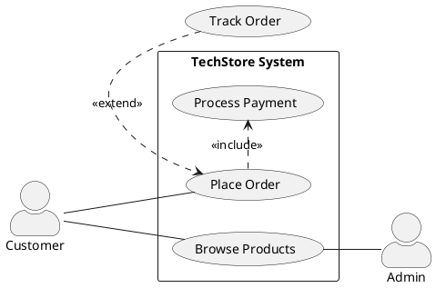
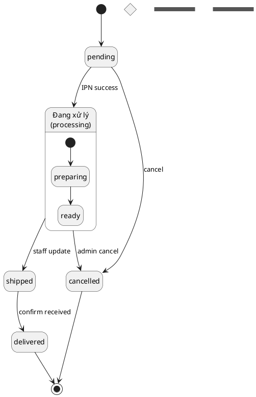
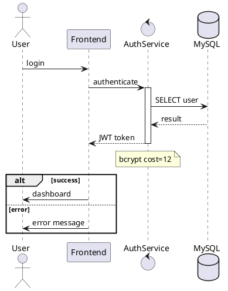
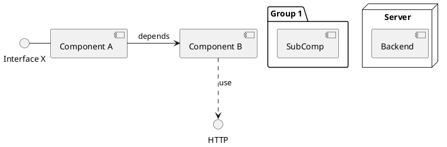
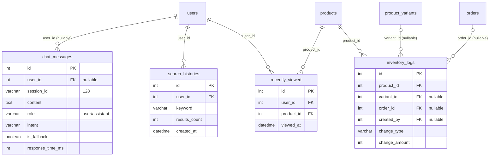

# THESIS_PLAN.md — Kế hoạch viết lại báo cáo KLTN TechStore

> Mục tiêu: làm cho báo cáo đầy đủ, chính xác, chỉn chu theo phản hồi hội đồng.
> Ground-truth: codebase thực tế + đọc c1–c4 trực tiếp.
> Cập nhật: 2026-06-07 (session viết lại C1+C2); 2026-06-07 session 2 (D1–D9 + reorder C3 + text alignment)

---

## MỤC LỤC NHANH

| Tìm gì | Grep trong file |
|---|---|
| Số liệu đúng (test count, JWT TTL...) | `SỐ LIỆU CHUẨN` |
| Quy tắc vẽ diagram + ký pháp | `QUY TẮC CHUNG` |
| Màu sắc + skinparam chuẩn | `Màu sắc chuẩn` |
| Task list C3 (grep patterns) | `Chương 3 (c3_chapter` |
| Task list C4 (grep patterns) | `Chương 4 (c4_chapter` |
| 10 diagrams cần vẽ (D1–D10) | `KẾ HOẠCH VẼ 10 DIAGRAMS` |
| Thứ tự làm việc C3/C4 | `THỨ TỰ THỰC THI` |
| Section "xong" khi nào | `ACCEPTANCE CRITERIA` |
| Hướng dẫn viết từng section | `HƯỚNG DẪN VIẾT` |
| Nhất quán C2→C3→C4 | `NHẤT QUÁN C2` |
| PHASE 1–11 chi tiết + LaTeX snippets | `## PHASE` |
| Checklist tổng | `CHECKLIST TỔNG` |

---

## ĐÃ HOÀN TẤT NGOÀI PLAN (session 2026-06-07)

> Các việc làm xong nhưng không nằm trong PHASE 1–11 gốc.

**Abstract (abtract_vi.tex + abtract_en.tex):** Viết lại hoàn toàn theo format chuẩn (bối cảnh+gap → phương pháp → kết quả định lượng → ý nghĩa). Có ~90% semantic accuracy, 100% off-topic rejection, ~7.303 tests, 99% coverage.

**c1_introduction.tex — ngoài PHASE 9a:**
- Viết lại hoàn toàn §1 Bối cảnh với data 2025 (vecom2024, economy\_sea\_2025, datareportal\_2025)
- Thêm §Câu hỏi nghiên cứu (3 câu hỏi tường minh)
- Thêm §Phương pháp nghiên cứu (design science research 4 giai đoạn)
- Reframe objectives thành mục tiêu nghiên cứu thay vì feature list
- Thêm định vị prior work (lewis2020rag, gao2023retrieval)

**c2_chapter.tex — ngoài PHASE 9a** *(JWT TTL fix là trong PHASE 9a đã mark ✅; phần dưới là extra work)*:
- §1 TMĐT: analytical paragraph kết nối sang Modular Monolith
- §3 RAG: thêm taxonomy Naive/Advanced/Modular + định vị TechStore là Advanced RAG
- §3 Vietnamese NLP: section mới với VnCoreNLP citation (NAACL 2018), 3 thách thức + kết nối word segmentation → RAG retrieval
- §3 Vector store: discussion JSON vs dedicated DB, moved từ §6 vào §3
- Justify mọi lựa chọn công nghệ: Express/NestJS, Sequelize/Prisma, Zustand/Redux, bcrypt/Argon2, Vite/webpack, React Router/TanStack, i18next/react-intl
- Mutation testing (Stryker 70%) + Property-based testing (fast-check) → §8
- Tách Nodemailer/Winston thành 2 subsection riêng
- Rename §"Công nghệ backend bổ sung" → "Xác thực, xử lý media và công cụ vận hành"
- Tech stack table: thêm Stryker + fast-check
- BM25-inspired acknowledgment

**c4_chapter.tex:**
- Tab:dev\_environment: sửa version `.x` → chính xác (React 19.2.6, TypeScript 5.8.0, Express 4.18.2, Sequelize 6.37.7, Jest 29.7.0, Vite 8.0.14)
- Tab:dev\_environment: thêm 4 dòng thiếu (React Router 7.15.1, TanStack Query 5.100.10, Zustand 5.0.13, Tailwind CSS 4.3.0)

**references.bib:** Thêm 9 entries mới (vecom2024, economy\_sea\_2025, datareportal\_2025, statista\_vn\_electronics, glassix2024, marketsandmarkets\_rag2025, stryker\_docs, fastcheck\_docs, nguyen2018vncorenlp). Fix @report → @techreport/@misc.

**thesis.tex:** Fix `pdfTeX warning destination duplicate` bằng `\pagenumbering{roman}` + `\hypersetup{pageanchor=false/true}`.

**VS Code settings.json:** Thêm LaTeX recipe `pdflatex × 2 + bibtex` để LaTeX Workshop chạy đủ compile cycle.

**LaTeX fix:** `JSON/YAML` → `JSON\slash YAML` (tránh khoảng trắng thừa cuối dòng).

**Session 2026-06-07 (session 2) — D1–D9 + text alignment + reorder:**
- **D1 system_architecture.pdf**: PlantUML deployment diagram, text §Kiến trúc tổng quan viết lại khớp 100%
- **D2 modular_architecture.pdf**: PlantUML component diagram (2 cột), text §Kiến trúc backend Modular Monolith viết lại khớp 100%
- **D3+D4 rag_pipeline_flow.pdf**: Mermaid flowchart (gộp 1 file), §3.4 toàn bộ viết lại khớp code + diagram
- **D5 erd_ai_log.pdf**: Mermaid erDiagram, text §Bảng phục vụ AI Chatbot viết lại khớp 100%
- **D8 frontend_architecture.pdf**: PlantUML 4-tầng block diagram, text §Kiến trúc frontend viết lại khớp
- **D9 seq_cart_merge.pdf**: PlantUML sequence diagram (2 strategy), §Luồng merge giỏ hàng viết lại khớp code
- **C3 reorder**: DB+State chuyển lên trước Flows (§3.3→DB, §3.4→State, §3.5→Flows, §3.6→RAG) — THESIS_PLAN gốc không có task này
- **C3 §3.3 reorder**: Luồng merge giỏ hàng → §3.3.2 (ngay sau auth, trước checkout) — THESIS_PLAN gốc không có task này
- **C2 reorder**: Bảng tổng quan tech stack chuyển lên trước Công nghệ backend — THESIS_PLAN gốc không có task này
- **Lưu ý cấu trúc c3 mới**: §3.3 DB, §3.4 State diagrams, §3.5 Flows (auth/cart-merge/checkout/token-refresh), §3.6 RAG
- **thesis.tex**: microtype, emergencystretch=3em, hfuzz=16pt — giảm overfull từ 14 xuống 3
- **RAG pipeline diagram**: verify 9 files chatbot code, đã đúng 100% logic + endpoint

---

## SỐ LIỆU CHUẨN (dùng xuyên suốt — KHÔNG đặt số khác)

| Đại lượng | Giá trị đúng | Nguồn |
|---|---|---|
| Tổng test | ~7.303 | CLAUDE.md §8 (cập nhật 2026-06-07) |
| BE Unit | 215 suites / 5.381 tests / ~12s | CLAUDE.md §8 |
| BE Integration | 38 suites / 210 tests / ~57s | CLAUDE.md §8 |
| BE API HTTP | 39 suites / 675 tests / ~160s | CLAUDE.md §8 |
| BE E2E | 5 suites / 100 tests / ~22s | CLAUDE.md §8 |
| FE Component | 28 suites / 937 tests / ~14s | CLAUDE.md §8 |
| Số model Sequelize | 25 | đếm src/models/ (trừ image.js ngoài index.js) |
| Số migration | 62 | đếm src/migrations/ |
| Số module backend | 17 | code |
| Số feature frontend | 13 | code |
| Role ENUM | customer / staff / admin | migration 2026060201 |
| 4 actor | guest / customer / staff / admin | RBAC code |
| Ngưỡng cosine RAG | 0.45 | vector-store.js `DEFAULT_MIN_SCORE` |
| Overlap boost | 0.05 | vector-store.js `OVERLAP_BOOST` |
| KW inject max | 0.05 | vector-store.js `KEYWORD_INJECTION_MAX_BOOST` |
| MAX_SESSIONS | 500 | chatbot-service.js |
| Session TTL | 30 phút | chatbot-service.js `SESSION_TTL_MS` |
| MAX_HISTORY_TURNS | 10 | chatbot-service.js |
| bcrypt cost | 12 | models/user.js `bcrypt.hash(..., 12)` |
| Access token TTL | 7 ngày | backend/.env `JWT_EXPIRES_IN=7d` |
| Refresh token TTL | 30 ngày | backend/.env `JWT_REFRESH_EXPIRES_IN=30d` |
| Vector dims | 1024 | vector-store.js + unified-embedding.js |
| Chatbot rate limit | 20 req/60s | rate-limiter.js |

---

## QUY TẮC CHÈN HÌNH VÀO LATEX (đúc kết từ lỗi thực tế — ĐỌC TRƯỚC KHI THÊM FIGURE)

### Macro — KHÔNG dùng `\includegraphics` trần

```latex
% Định nghĩa trong thesis.tex preamble:
\fitfig[0.85]{path}   % full text width, capped height 85% (default)
\fitfigc[0.65]{path}  % compact: 82% text width, capped height 65% (default)
```

### Placement specifier: `[H]` vs `[htbp]`

| Loại figure | Specifier | Lý do |
|---|---|---|
| Usecase / sequence dẫn chiếu trực tiếp ("Hình X.Y mô tả...") | **`[H]`** | Phải xuất hiện ngay sau đoạn text, không float |
| State diagrams, ERD, RAG, figure kỹ thuật | **`[htbp]`** | LaTeX sắp xếp hợp lý trong section |
| Screenshots | **`[htbp]`** | Float tốt hơn |
| Sidewaysfigure (landscape) | giữ nguyên | Không đổi |

> ⚠️ Dùng `[htbp]` cho figure dẫn chiếu trực tiếp → LaTeX accumulate floats → hình xuất hiện SAI vị trí (sau section khác).

### `pdfcrop` — bắt buộc trước khi chèn .pdf mới

```bash
pdfcrop input.pdf input.pdf   # crop whitespace thừa, replace in-place
```

Chạy ngay sau khi copy file `.pdf` vào `docs/figures/`. Bỏ qua → figure có khoảng trống lớn bên dưới trong PDF output (đã gặp ở Hình 3.15 erd_core).

### Mapping loại diagram → macro + frac

| Loại | Macro | Frac | Specifier |
|---|---|---|---|
| Usecase (left to right) | `\fitfig` | `0.88` | `[H]` |
| Sequence diagram | `\fitfig` | `0.85` (default) | `[H]` |
| RAG pipeline flowchart | `\fitfig` | `0.82` | `[htbp]` |
| ERD | `\fitfig` | `0.85` | `[htbp]` |
| State machine | `\fitfigc` | `0.65` | `[htbp]` |
| Screenshots | `\fitfig` | `0.85` | `[htbp]` |
| Sidewaysfigure | `\includegraphics[width=\textheight]` | N/A | trong `sidewaysfigure` |

### Package bắt buộc

```latex
\usepackage[section]{placeins}  % Ngăn float qua ranh giới \section
```

---

## QUY TẮC CHUNG CHO MỌI DIAGRAM (đọc TRƯỚC khi làm PHASE 1–7)

### Dùng .pdf thay .png trong LaTeX
Tất cả `\includegraphics` trong thesis dùng `.pdf` (vector, không vỡ khi in A4/A3).  
File `.pdf` đã có sẵn trong `diagrams/` cho mọi diagram hiện tại.

> ⚠️ **File `.puml`/`.dbml`/`.mmd` và code chỉ là cơ sở tham chiếu để hiểu nội dung — KHÔNG trích dẫn hay chèn chúng vào báo cáo. Báo cáo chỉ chứa hình `.pdf` và văn bản mô tả viết tay.**

### Quy trình chuẩn khi copy hoặc vẽ diagram
1. **Đọc file nguồn** `.puml` / `.dbml` / `.mmd` (để hiểu cấu trúc diagram)
2. **Đọc code** liên quan (để verify nội dung đúng với thực tế — chỉ để tham chiếu)
3. **Vẽ/sửa diagram** — vẽ mới từ hiểu biết trên (KHÔNG dùng file _legacy)
4. **Copy `.pdf`** vào `docs/figures/`
5. **Chèn LaTeX** dùng `\includegraphics{figures/.../filename.pdf}`
6. **Viết text section** dựa trên hiểu biết từ bước 1–2 — nội dung phải khớp diagram, KHÔNG copy code hay cú pháp diagram vào báo cáo. **Văn phong:** đúng chuẩn KLTN sinh viên giỏi — câu rõ ràng, mạch lạc, hội đồng đọc xong hiểu ngay; tránh thuật ngữ học thuật nặng nề đến mức tối nghĩa. **Hình thức:** viết thành các đoạn văn liền mạch, KHÔNG dùng bullet hay danh sách rời rạc để diễn đạt nội dung kỹ thuật.

### Chuẩn ký pháp theo từng loại diagram

> ⚠️ **Mọi diagram phải đúng chuẩn của công cụ tương ứng.** Nguồn: docs chính thức mermaid.js.org + plantuml.com (đọc trực tiếp 2026-06-07).
>
> 🔁 **QUY TẮC KHI VẼ:** Nếu gặp syntax nào chưa chắc chắn hoặc không có trong plan này → **WebFetch docs tương ứng trước** rồi mới vẽ. Thứ tự: WebFetch → đọc ví dụ verbatim → vẽ → verify render. KHÔNG đoán syntax.

#### UML Use Case (PlantUML) — đang dùng trong project

- **Actor:** `:Name:` (shorthand) hoặc `actor "Name" as A`
- **Use case:** `(Name)` hoặc `usecase "Name" as UC1`
- **Actor:** `:Name:` hoặc `actor Name` hoặc `actor "Name" as A`
- **Use case:** `(Name)` hoặc `usecase "Name" as UC1`
- **Actor:** `:Name:` hoặc `actor Name` hoặc `actor "Name" as A`; style: `skinparam actorStyle awesome`
- **Use case:** `(Name)` hoặc `usecase "Name" as UC1`
- **Association** (actor↔use case): `customer -- (checkout)` = UML chuẩn (không mũi tên) | `User --> (Use)` cũng hợp lệ (có mũi tên) — cả hai đều dùng trong docs
- **Include** (bắt buộc): `(checkout) .> (payment) : include` — `.>` với label "include"
- **Extend** (tuỳ chọn): `(help) .> (checkout) : extends` — docs canonical example dùng `.>` với label "extends" (cùng ký hiệu với include, phân biệt bằng label)
- **System boundary:** `rectangle "Name" { ... }` hoặc `package "Name" { ... }`
- **Direction control:** `:user: -left-> (dummy)`, `-right->`, `-up->`, `-down->`
- **Note:** `note right of Actor : text` (one-liner) hoặc `note right of Actor\n  multiline\nend note`
- ⚠️ Include vs Extend: include = base LUÔN gọi sub; extend = sub thêm vào base khi có điều kiện
- ⚠️ Docs dùng `--` (UML chuẩn, không mũi tên) cho association trong example chuẩn nhất

#### UML State (PlantUML) — đang dùng trong project

- **Initial:** `[*] --> State` — **KHÔNG có trigger** trên `[*]` transition
- **Final:** `State --> [*]`
- **Transition:** `State1 --> State2 : trigger` — dấu `:` bắt buộc
- **Compound state:** `state Name { [*] --> Sub }` — nested với `{}`
- **Choice:** `state "Name" <<choice>>` → `Name --> StateA : [condition]`
- **Fork/Join:** `state "Fork" <<fork>>` và `state "Join" <<join>>`
- **History** (từ docs example chính xác):
  - `State2 --> [H]: Resume` — shallow history (bên trong compound state)
  - `State2 --> State3[H*]: DeepResume` — deep history của State3
- **Concurrent regions:** dùng `--` (horizontal) hoặc `||` (vertical) bên trong compound state
- **Direction:** `-down->`, `-right->`, `-up->`, `-left->` để control layout
- `hide empty description` — bỏ label trống trên state
- ⚠️ Hay quên `:` trong transition → sẽ lấy tên state thay vì label
- ⚠️ `[*]` không trigger là quy tắc UML — sai là hội đồng bắt ngay

#### UML Sequence (PlantUML) — đang dùng trong project

**Participant types** (từ docs — mỗi type có icon riêng):
`participant`, `actor`, `boundary`, `control`, `entity`, `database`, `collections`, `queue`

**Arrow types** (từ docs chính thức):

| Syntax | Meaning |
|---|---|
| `->` | Solid, normal arrowhead |
| `-->` | Dotted, normal arrowhead |
| `->>` | Solid, **thin** arrowhead |
| `-->>` | Dotted, thin arrowhead |
| `-\` | Bottom half of arrow |
| `-/` | Top half of arrow |
| `-\\` | Double bottom |
| `-//` | Double top |
| `->x` | Lost message (cross at end) |
| `->o` | Circle at end |
| `<->` | Bidirectional |

**Activation shorthand** (từ docs):
- `alice -> bob ++: hello` — activate bob
- `bob -> alice --: reply` — deactivate bob
- `alice -> bob **: create` — create instance
- `alice -> bob !!: destroy` — destroy instance

**Note types:** `note left`, `note right`, `note over A,B` (span), `hnote` (hexagonal), `rnote` (rectangle), multi-line cần `end note`

**Grouping keywords:** `alt/else`, `opt`, `loop`, `par`, `break`, `critical`, `group`

⚠️ `->` vs `->>`: normal vs thin arrowhead — trong project dùng `->` cho sync, `-->` cho response
- **`return`**: shorthand kết thúc activation và gửi response về — `return message`
- **`create`**: tạo participant mới — `create Other\nAlice -> Other : new`
- **`box`**: nhóm participants — `box "Label" #LightBlue\n  participant A\n  participant B\nend box`
- **Self-message:** `Alice -> Alice: internal action`
- **Color arrow:** `Bob -[#red]> Alice : hello` — tô màu arrow
⚠️ `activate/deactivate` PHẢI balance — hay bị quên `deactivate`
⚠️ Dùng `return` thay vì `-->` để deactivate + reply trong một bước

#### Mermaid stateDiagram-v2 — ⚠️ KHÔNG DÙNG trong project này (state diagrams dùng PlantUML)
```
stateDiagram-v2
    [*] --> Idle
    Idle --> Processing : start
    Processing --> [*]
    state Processing {
        [*] --> Working
        Working --> Done
    }
    state ChoiceNode <<choice>>
    Idle --> ChoiceNode
    ChoiceNode --> Active : [is_verified]
    ChoiceNode --> Inactive : [else]
    state Fork <<fork>>
    state Join <<join>>
    Fork --> ConcurrentA
    Fork --> ConcurrentB
    ConcurrentA --> Join
    ConcurrentB --> Join
```
- Dùng `stateDiagram-v2` (không phải `stateDiagram`)
- Transition label: `State1 --> State2 : label` (bắt buộc `:`)
- **Choice** (Mermaid): `state "Name" <<choice>>` — ký hiệu `<<choice>>` cũng dùng trong cả Mermaid v2
- **Fork/Join** (Mermaid): `state "Name" <<fork>>` và `state "Name" <<join>>`
- Compound/nested: `state Name { [*] --> Sub }` với curly braces
- **Note** (Mermaid chỉ có multiline): `note right of StateName\n  text\nend note` hoặc `note left of StateName\n  text\nend note`
- ⚠️ Mermaid state KHÔNG có one-liner note với `:` — đó là syntax của PlantUML
- ⚠️ Quên `:` trong transition label → parse sai
- ⚠️ Mermaid dùng `<<choice>>` (KHÁC với `{{choice}}` trong một số tài liệu cũ)

#### ERD (Mermaid erDiagram)
```
erDiagram
    PROPERTY ||--|{ ROOM : contains
    users ||--o{ orders : "places"
    users |o..o{ chat_messages : "writes"
    users {
        int id PK
        varchar email UK
        enum role
    }
    orders {
        int id PK
        int user_id FK
        decimal(15-2) total
    }
```
**Cardinality table** (từ docs chính thức):

| Left side | Right side | Meaning |
|---|---|---|
| `\|o` | `o\|` | Zero or one |
| `\|\|` | `\|\|` | Exactly one |
| `}o` | `o{` | Zero or more |
| `}\|` | `\|{` | One or more |

- **Relationship line:** `--` solid = identifying (FK NOT NULL) | `..` dashed = non-identifying (FK nullable)
- **Ví dụ:** `PROPERTY ||--|{ ROOM : contains` — 1 property chứa 1+ rooms (docs example)
- **Ví dụ:** `users ||--o{ orders : "places"` — 1 user có 0+ orders, order phải có user (FK NOT NULL)
- **Ví dụ:** `users |o..o{ chat_messages : "writes"` — user nullable FK (dashed), 0+ messages
- **Attribute:** `int id PK`, `varchar email UK`, `int user_id FK` — multiple: `int id PK, FK`
- Relationship label: động từ rõ nghĩa — **KHÔNG** dùng "has", "related"
- ⚠️ `||--o{` ≠ `}o--||` — thứ tự đọc từ trái sang phải có nghĩa khác nhau

#### Mermaid Flowchart
```
flowchart TD
    A([Start]) --> B[Rectangle]
    B --> C(Rounded)
    C --> D{Decision}
    D -->|Yes| E[[Subroutine]]
    D -->|No| F[(Database)]
    E --> G((Circle))
    F --> H([End])
```
**Node shapes** (từ docs chính thức):

| Syntax | Shape | Dùng cho |
|---|---|---|
| `A[text]` | Rectangle (default) | Process, action |
| `A(text)` | Rounded edges | Start/end thay thế |
| `A([text])` | Stadium/terminal | **Start/End** ← dùng cái này |
| `A[[text]]` | Subroutine | Sub-process |
| `A[(text)]` | Cylindrical | **Database/Storage** ← QUAN TRỌNG |
| `A((text))` | Circle | Connector |
| `A{text}` | Rhombus/diamond | **Decision** |
| `A{{text}}` | Hexagon | Preparation |

**Arrows** (từ docs chính thức):

| Syntax | Meaning |
|---|---|
| `-->` | Arrow (solid, có arrowhead) |
| `---` | Open link (không arrowhead) |
| `-.->`| Dotted arrow |
| `==>` | Thick arrow |
| `o--o` | Circle edge (cả hai đầu) |
| `x--x` | Cross edge (cả hai đầu) |
| `<-->` | Bidirectional |

**Direction values:** `TB`/`TD` (top-bottom), `BT` (bottom-top), `LR` (left-right), `RL` (right-left)
**Decision labels:** `C -->|Yes| D` — **bắt buộc label** trên mọi nhánh từ `{}`
**Subgraph:** `subgraph id [title]` → `direction LR` → nodes/edges → `end`
⚠️ `A[(DB)]` cho database/storage — hay nhầm với `A[DB]` (rectangle) hoặc `A((DB))` (circle)
⚠️ Quên label trên decision branch → không rõ flow logic

#### Mermaid sequenceDiagram
```
sequenceDiagram
    actor User
    participant Browser
    database DB

    User->>Browser: submit form
    activate Browser
    Browser->>+DB: INSERT query
    DB-->>-Browser: OK
    deactivate Browser
    Note over Browser,DB: Transaction complete
    loop 3 retries
        Browser-)DB: async notify
    end
    alt success
        Browser->>User: show result
    else error
        Browser->>User: show error
    end
```
**Arrow types** (từ docs chính thức — quan trọng, HAY NHẦM):

| Syntax | Ý nghĩa |
|---|---|
| `->` | Solid line, **không** arrowhead |
| `-->` | Dotted line, **không** arrowhead |
| `->>` | Solid line, **có** arrowhead ← call |
| `-->>` | Dotted line, có arrowhead ← response |
| `-)` | Solid async, open arrow (no head) |
| `--)` | Dotted async, open arrow |
| `-x` | Solid với cross (lost message) |
| `--x` | Dotted với cross |

- **Activation:** `activate B`/`deactivate B` hoặc shorthand `->>+` (activate) / `-->>-` (deactivate)
- **Note:** `Note over A,B: text` (span) | `Note right of A: text`
- **Escape "end":** docs ghi: dùng `(end)`, `[end]`, `{end}` — nếu vẫn lỗi thì dùng `"end"`
- **Participant types:** `participant`, `actor`, `boundary`, `control`, `entity`, `database`, `collections`, `queue`
- ⚠️ `->>` = call (solid+arrowhead), `-->>` = response (dashed+arrowhead) — hay bị đảo
- ⚠️ `activate` không `deactivate` → lifeline kéo vô tận

#### PlantUML Component

- **Component:** `[Name]` hoặc `component Name`
- **Interface:** `() "Name"` hoặc `interface Name` — lollipop notation
- **Interface ↔ Component:** dùng `-` (single dash): `DA - [Component]` — **KHÔNG** phải `--`
- **Dependency:** `[A] --> [B]` solid arrow | `[A] ..> [B] : use` dotted | `[A] -right-> [B]` hướng cụ thể
- **Direction arrows:** `-left->`, `-right->`, `-up->`, `-down->` (hoặc `-l->`, `-r->`, `-u->`, `-d->`)
- **Grouping** (6 loại từ docs): `package`, `node`, `folder`, `frame`, `cloud`, `database`
- `skinparam componentStyle` nhận: `uml2` (default, có component icon), `rectangle` (no UML), `uml1` (legacy)
- ⚠️ `()` interface ≠ `(text)` use case oval — KHÔNG nhầm lẫn
- ⚠️ Chỉ `package` có `{` khép — `node`, `folder`, etc. cũng cần `{}`

#### Block Diagram / Architecture (draw.io)
- Hình chữ nhật bo tròn cho services/modules, hình trụ cho database, hình người cho actors
- Mũi tên có nhãn: giao tiếp gì (HTTP REST, SQL, pub/sub, HMAC...)
- Màu nhất quán: dùng **blue palette** như mọi diagram khác (xem §Màu sắc chuẩn dưới)
- Font ≥ 11pt để đọc được khi in A4, không để text bị cắt
- `Export → PDF` trực tiếp từ draw.io (không cần qua Inkscape)

---

### Màu sắc chuẩn — nhất quán với mọi diagram đã vẽ

> Verify trực tiếp từ file nguồn: `usecase-01-overview-guest.puml`, `state-01-order.puml`, `sequence-01a-register.puml`, `erd-overview.mmd` — **tất cả dùng blue palette**.

| Mục | Giá trị | Hex |
|---|---|---|
| Background chính (node/actor/participant) | Light blue | `#DAE8FC` |
| Border | Medium blue | `#6C8EBF` |
| Font/text | Black | `#000000` |
| Arrow/line | Dark gray | `#4D4D4D` |
| Note background | Light yellow | `#fffde7` |
| Note border | Same as main border | `#6C8EBF` |
| Page background | White | `#FFFFFF` |
| ERD primary | Light blue | `#bfdbfe` |
| ERD text | Dark blue | `#1e3a8a` |
| ERD border line | Blue | `#3b82f6` |
| ERD attribute even row | Very light blue | `#eff6ff` |

#### Skinparam chuẩn cho PlantUML (copy nguyên cho diagram mới)
```plantuml
skinparam dpi 300
skinparam backgroundColor #FFFFFF
skinparam shadowing false
skinparam usecase {
  BackgroundColor #DAE8FC
  BorderColor #6C8EBF
}
skinparam state {
  BackgroundColor #DAE8FC
  BorderColor #6C8EBF
  FontColor #000000
  ArrowColor #4D4D4D
}
skinparam sequenceParticipant {
  BorderColor #6C8EBF
  BackgroundColor #DAE8FC
}
skinparam sequenceActor {
  BackgroundColor #f5f5f5
  BorderColor #6C8EBF
}
skinparam noteBorderColor #6C8EBF
skinparam noteBackgroundColor #fffde7
skinparam actorStyle awesome
```

#### Init config chuẩn cho Mermaid (copy nguyên cho diagram mới)
```
%%{init: {
  'theme': 'base',
  'themeVariables': {
    'primaryColor': '#DAE8FC',
    'primaryTextColor': '#000000',
    'primaryBorderColor': '#6C8EBF',
    'lineColor': '#4D4D4D',
    'secondaryColor': '#eff6ff',
    'noteBkgColor': '#fffde7',
    'noteBorderColor': '#6C8EBF',
    'actorBkg': '#DAE8FC',
    'actorBorder': '#6C8EBF',
    'activationBkgColor': '#f0f4ff'
  }
}}%%
```

#### Màu cho draw.io (D8 — Frontend Architecture)
- Node background: `#DAE8FC` (light blue) — modules/features
- Node border: `#6C8EBF`
- Database/storage: `#f5f5f5` (light gray) với border `#999999`
- Actor (người dùng): `#fff2cc` (light yellow) với border `#d6b656`
- Arrow line color: `#4D4D4D`
- Text: `#000000`, font Helvetica 11pt

---

### Mapping nguồn tham chiếu → section cần cập nhật

| Diagram | Nguồn tham chiếu | Section cần cập nhật |
|---|---|---|
| seq_auth (01a/b/c) | `sequence-01*.puml` + `auth-service.js` | c3.tex §"Luồng xác thực người dùng" |
| seq_checkout (02a/b/c) | `sequence-02*.puml` + `orders-service.js`, `payment-service.js` | c3.tex §"Luồng đặt hàng và thanh toán" |
| seq_chatbot (03a/b/c) | `sequence-03*.puml` + `chatbot-service.js` | c4.tex §"Cài đặt RAG Pipeline và ChatbotService" |
| seq_token_refresh (06) | `sequence-06-token-refresh.puml` + `token-manager.ts`, `api-client.ts` | c3.tex §"Luồng làm mới access token" (mới thêm) |
| usecase overview (01/02/03) | `usecase-0[123]*.puml` + routes.js | c3.tex §"Biểu đồ ca sử dụng tổng quan" |
| state_order | `state-01-order.puml` + `orders-service.js` | c3.tex §"Thiết kế trạng thái đơn hàng" |
| state_payment | `state-02-payment.puml` + `payment-service.js` | c3.tex §"Thiết kế trạng thái thanh toán" |
| state_product | `state-03-product.puml` + `product.js` | c3.tex §"Thiết kế trạng thái sản phẩm" (mới thêm) |
| state_user | `state-04-user.puml` + `user.js`, `auth-service.js` | c3.tex §"Vòng đời tài khoản người dùng" (mới thêm) |
| erd_core | `erd-overview.dbml` + `models/index.js` | c3.tex §"Thiết kế bảng cốt lõi" |
| RAG flowchart | `chatbot-service.js` + `RAG_CHATBOT_PIPELINE.md` | c3.tex §"Các bước trong pipeline RAG" |

---

## QUICK-REF: CÔNG VIỆC CÒN LẠI THEO CHƯƠNG

> Tổng hợp từ PHASE 1–11. Tick khi xong để track progress.
> **KHÔNG dùng line number** — dùng grep pattern để tìm đúng vị trí bất kể file thay đổi.

### Chương 3 (c3_chapter.tex)

**Sửa nội dung stale (PHASE 9a) — grep pattern để tìm:**
- [x] grep `ba nhóm tác nhân chính` → §"Xác định tác nhân" → "bốn nhóm" + thêm staff
- [x] grep `ba nhóm chức năng chính tương ứng` → "bốn nhóm"
- [x] grep `Nhóm chức năng quản trị` → tách mô tả: staff=CRUD nghiệp vụ, admin=xem+users+analytics
- [x] grep `access token ngắn hạn (15 phút)` → "7 ngày" *(trong §NFR)*
- [x] grep `ba tác nhân chính` → "bốn tác nhân" *(trong text use case overview)*
- [x] grep `access token.*15 phút.*chứa userId` → "7 ngày" *(trong §Luồng xác thực)*
- [x] grep `refresh token.*JWT.*7 ngày` → "30 ngày"
- [x] grep `61 migration files` → "62"
- [x] grep `14 bảng cốt lõi` → "10 bảng cốt lõi" *(2 chỗ: §Tổng quan cấu trúc và §Tóm tắt bảng)*
- [x] grep `admin thực hiện hoàn tiền` → "admin hoặc staff"
- [x] grep `26 bảng` *(trong system_architecture figure caption/text)* → "25 model" *(đã xử lý trong D1)*
- > ⚠️ grep `ba nhóm.*nhà cung cấp LLM` — **ĐÚNG, không sửa** (3 nhóm dịch vụ ngoài)

**Hình ảnh — 11 figures, TẤT CẢ .png cần xử lý:**

| Grep pattern (tìm trong c3.tex) | Action | PHASE | Status |
|---|---|---|---|
| `usecase_overview.png` | Thay bằng 3 figures .pdf | PHASE 4 | ✅ DONE |
| `system_architecture.png` | Vẽ mới + thay bằng .pdf | PHASE 7-D1 | ✅ DONE |
| `modular_architecture.png` | Vẽ mới + thay bằng .pdf | PHASE 7-D2 | ✅ DONE |
| `seq_auth.png` | Thay bằng 3 figures .pdf | PHASE 2 | ✅ DONE |
| `seq_checkout.png` | Thay bằng 3 figures .pdf | PHASE 3 | ✅ DONE |
| `rag_pipeline_flow_part1/2.png` | **Gộp 1 file** rag_pipeline_flow.pdf | PHASE 7-D3+D4 | ✅ DONE |
| `erd_core.png` | cp erd-overview.pdf → .pdf | PHASE 1 | ✅ DONE |
| `erd_ai_log.png` | Vẽ mới + thay bằng .pdf | PHASE 7-D5 | ✅ DONE |
| `order_states.png` | cp state-01-order.pdf → .pdf | PHASE 1 | ✅ DONE |
| `payment_states.png` | cp state-02-payment.pdf → .pdf | PHASE 1 | ✅ DONE |
| *(mới thêm)* | frontend_architecture.pdf | PHASE 7-D8 | ✅ DONE |
| *(mới thêm)* | seq_cart_merge.pdf | PHASE 7-D9 | ✅ DONE |
| *(còn lại)* | embedding_fallback.pdf | PHASE 7-D10 | ⬜ TODO |

**Tasks theo phase:**
- [x] PHASE 1: cp 3 figures → grep `erd_core.png`, `order_states.png`, `payment_states.png` → đổi sang .pdf
- [x] PHASE 2: Split seq_auth (grep `seq_auth.png`) → 3 figures, viết lại text §"Luồng xác thực người dùng"
- [x] PHASE 3: Split seq_checkout (grep `seq_checkout.png`) → 3 figures, viết lại text §"Luồng đặt hàng"
- [x] PHASE 4: Split usecase_overview (grep `usecase_overview.png`) → 3 figures, viết lại text §"Biểu đồ ca sử dụng tổng quan"
- [x] PHASE 6a: Thêm section sau `\label{sec:c3_payment_states}` → §Trạng thái sản phẩm + copy state-03-product.pdf
- [x] PHASE 6b: Thêm section sau PHASE 6a → §Vòng đời tài khoản người dùng + copy state-04-user.pdf
- [x] PHASE 6c: Thêm subsection sau `\subsection{Luồng đặt hàng và thanh toán trực tuyến}` → §Token Refresh + copy seq-06-token-refresh.pdf
- [x] PHASE 6d: grep `14 bảng cốt lõi` → sửa text + cập nhật longtable `\label{tab:core_tables}` (xóa 5 dòng + thêm chat_messages)
- [x] PHASE 7-D1: Vẽ system_architecture.pdf → thay grep `system_architecture.png` ✅ text khớp
- [x] PHASE 7-D2: Vẽ modular_architecture.pdf → thay grep `modular_architecture.png` ✅ text khớp
- [x] PHASE 7-D3+D4: Vẽ rag_pipeline_flow.pdf (gộp 1 file) → thay 2 .png cũ ✅ §3.4 rewrite hoàn chỉnh
- [x] PHASE 7-D5: Vẽ erd_ai_log.pdf → thay grep `erd_ai_log.png` ✅ text §3.5.4 khớp
- [x] PHASE 7-D8: Vẽ frontend_architecture.pdf (PlantUML) → thêm vào §Kiến trúc frontend ✅ text khớp
- [x] PHASE 7-D9: Vẽ seq_cart_merge.pdf → thêm vào §Luồng merge giỏ hàng (moved to §3.3.2) ✅
- [ ] PHASE 7-D10: Vẽ embedding_fallback.pdf (Mermaid flowchart) → thêm vào `\subsection{Thiết kế embedding chain fallback}`
- [ ] PHASE 8b: Thêm longtable UC sau `\label{sec:c3_requirements}` §"Yêu cầu chức năng"
- [ ] PHASE 8c: Thêm longtable NFR sau `\label{sec:c3_requirements}` §"Yêu cầu phi chức năng"
- [ ] PHASE 8d: Thêm `\subsection{Phân quyền 4 tác nhân (RBAC)}` trong `\label{sec:c3_architecture}`
- [x] Thêm bảng attribute system (`tab:attribute_tables`) vào `\subsection{Thiết kế hệ thống sản phẩm và biến thể}` ✅ verify từ code, field value/value_en đúng
- [ ] PHASE 9b: grep `Chatbot`/`hybrid search`/`back-end`/`front-end` → chuẩn hóa thuật ngữ
- [x] PHASE 9c: grep `\[H\]` → đổi `[htbp]` — **19 occurrences** trong c3.tex (tăng do thêm figures mới)
- [ ] **Sau khi hoàn thành TẤT CẢ bước trên:** Cập nhật `\section{Tóm tắt chương}` cuối c3.tex — viết lại summary phản ánh đủ các section mới (trạng thái sản phẩm, vòng đời tài khoản, token refresh, RBAC 4 actor, longtable UC/NFR)

---

### Chương 4 (c4_chapter.tex)

**Sửa nội dung stale (PHASE 9a) — grep pattern:**
- [x] grep `158 & 3\.745` *(bảng tab:test_results)* → `215 & 5.381 & $\sim$12s`
- [x] grep `36 & 184` → `38 & 210 & $\sim$57s`
- [x] grep `39 & 700` → `39 & 675 & $\sim$160s`
- [x] grep `5 & 100.*25s` → `5 & 100 & $\sim$22s`
- [x] grep `21 & 758` → `28 & 937 & $\sim$14s`
- [x] grep `259.*5\.487` *(Tổng cộng trong bảng + 2 chỗ trong text)* → `325 & \textbf{~7.303}`
- [x] grep `\times 0\.15` *(equation eq:hybrid_score)* → `\times 0.05`
- [x] grep `0\.45 + 0\.15 = 0\.60` *(text sau equation)* → `0.45 + 0.05 = 0.50`
- [x] grep `role không phải.*admin` *(§AdminRoute)* → thêm staff (BACKOFFICE_ROLES)
- [x] grep `Quản trị viên.*hoặc.*Khách hàng` *(screenshot users description)* → thêm "Nhân viên"

**Hình ảnh — 18 figures:**

| Grep pattern | Action | PHASE |
|---|---|---|
| `seq_chatbot.png` | Thay bằng 3 figures .pdf | PHASE 5 |
| `screenshot_*.png` (17 files) | **GIỮ .png** — ảnh chụp màn hình | — |

> ⚠️ **17 screenshots** (screenshot_home, screenshot_shop, v.v.) **giữ nguyên .png** — raster, không convert.

**Tasks theo phase:**
- [x] PHASE 5: Split seq_chatbot (grep `seq_chatbot.png`) → 3 figures, viết lại text §"Cài đặt RAG Pipeline và ChatbotService"
- [ ] PHASE 8e: Cập nhật `\label{tab:test_results}` — grep `tab:test_results` → thay toàn bộ bảng
- [ ] PHASE 8f: Thêm `\subsection{Kiểm thử hiệu năng}` sau `\label{sec:c4_testing}` §"Kết quả coverage" (cần autocannon data)
- [ ] PHASE 8g: Vẽ testing_pyramid.pdf → thêm vào `\section{Kiểm thử hệ thống}`
- [ ] PHASE 10: Tạo appendix.tex; grep `label={lst:` trong c4.tex → chuyển 4 listings; wire `\input{chapters/appendix}` vào thesis.tex
- [ ] PHASE 9b: grep `Chatbot`/`hybrid search`/`back-end`/`front-end` → chuẩn hóa
- [x] PHASE 9c: grep `\[H\]` → đổi `[htbp]` — **23 occurrences** trong c4.tex
- [ ] **Chụp lại** `screenshot_admin_users.png` sau khi frontend hiển thị đủ badge "Nhân viên (Staff)" — thay thế file cũ
- [ ] **Sau khi hoàn thành TẤT CẢ bước trên:** Cập nhật `\section{Tóm tắt chương}` cuối c4.tex — viết lại summary phản ánh số liệu đúng (~7.303 tests), 4-actor RBAC, mutation/property testing, và seq_chatbot split thành 3 sub-diagram

---

## KẾ HOẠCH VẼ 10 DIAGRAMS MỚI

> **Quy trình chung:** vẽ → export SVG → Inkscape convert SVG→PDF → copy vào `docs/figures/`

### Mapping D1–D10 → PHASE (tra cứu nhanh)

| Diagram | PHASE | Output file | Ưu tiên |
|---|---|---|---|
| **D1** System Architecture | PHASE 7-D1 | `c3/system_architecture.pdf` | 🟠 |
| **D2** Modular Architecture | PHASE 7-D2 | `c3/modular_architecture.pdf` | 🟠 |
| **D3** RAG Pipeline Part 1 | PHASE 7-D3 | `c3/rag_pipeline_flow_part1.pdf` | 🔴 |
| **D4** RAG Pipeline Part 2 | PHASE 7-D4 | `c3/rag_pipeline_flow_part2.pdf` | 🔴 |
| **D5** ERD AI/Log | PHASE 7-D5 | `c3/erd_ai_log.pdf` | 🟡 |
| **D6** Testing Pyramid | **PHASE 8g** | `c4/testing_pyramid.pdf` | 🟡 |
| **D7** RAG Overview (C2) | **PHASE 8a** | `c2/RAG.pdf` | 🟡 |
| **D8** Frontend Architecture | **ngoài PHASE gốc** | `c3/frontend_architecture.pdf` | 🟡 |
| **D9** Cart Merge Sequence | **ngoài PHASE gốc** | `c3/seq_cart_merge.pdf` | 🟠 |
| **D10** Embedding Fallback | **ngoài PHASE gốc** | `c3/embedding_fallback.pdf` | 🟡 |

> ⚠️ D8/D9/D10 không có trong PHASE 1–11 gốc — thực hiện xen kẽ vào PHASE 6 (D8, D9) và PHASE 7 (D10) theo THỨ TỰ THỰC THI.

---

### D3 — RAG Pipeline Part 1 🔴 ƯU TIÊN CAO NHẤT

**Output:** `docs/figures/c3/rag_pipeline_flow_part1.pdf`
**Tool:** Mermaid `flowchart TD`
**Đọc trước:** `RAG_CHATBOT_PIPELINE.md`, `backend/src/modules/ai/services/chatbot/chatbot-service.js` (hàm `handleMessage`, `expandAbbreviations`, `isPromptInjection`, `isOffTopic`, `classifyIntent`), `backend/src/modules/ai/services/core/ai-policy.js`

**Nội dung (7 node chính):**
```
User message
  → [1] validateMessage: độ dài ≤500 ký tự, có chữ/số
  → [2] expandAbbreviations (73 regex patterns) + classifyIntent (6 intents) [song song]
  → [3] isPromptInjection? → [YES] trả lời từ chối ngay
        isOffTopic?        → [YES] trả lời lịch sự từ chối ngay
  → [4] loadSession: lấy lịch sử từ Map<sessionId, {messages, lastAccess}>
                     (MAX_HISTORY_TURNS=10, MAX_SESSIONS=500, TTL=30 phút)
  → [5] Promise.all([
           rewriteQuery → LLM cải thiện query,
           hybridSearch(enrichedQuery, topK=10) → cosine≥0.45 + BM25-inspired
        ])
        → nếu rewrite khác → hybridSearch lần 2 với query mới
        → nếu 0 kết quả → hybridSearch(query, 3, minScore=0) → lowConfidence=true
  → Sang Part 2
```

**Lưu ý vẽ:** Hai nhánh "Từ chối" tại bước 3 kết thúc sớm (exit node riêng). Bước 5 có hình thoi phân nhánh cho 3 trường hợp kết quả.

---

### D4 — RAG Pipeline Part 2 🔴 ƯU TIÊN CAO NHẤT

**Output:** `docs/figures/c3/rag_pipeline_flow_part2.pdf`
**Tool:** Mermaid `flowchart TD` (tiếp theo D3)
**Đọc trước:** `chatbot-service.js` (hàm `_augmentAndGenerate`, `parseLLMOutput`, `_persistConversation`), `backend/src/modules/ai/services/chatbot/keyword-fallback.js`

**Nội dung:**
```
(Kết quả từ Part 1: products[], finalQuery, session history)
  → [6] buildAugmentedPrompt: system prompt + history (≤10 turns) + products + user message
        → Promise.race([LLM.generate(30s timeout), timeoutError])
        → [6a] LLM thành công → parseLLMOutput: extract message + products[]
                                → match product names với catalog cache (TTL 5 phút)
        → [6b] LLM timeout/lỗi → simpleKeywordMatch(query) → fallback response
  → [7] Persist (fire-and-forget, KHÔNG block response):
        → session Map update: thêm {user, assistant} messages, LRU eviction nếu >500
        → ChatMessage.bulkCreate vào MySQL (async)
  → Output: {message, products, intent, sessionId}
```

**Lưu ý vẽ:** Bước 6a/6b là hai nhánh từ kết quả Promise.race. Bước 7 có mũi tên "async" đến DB.

---

### D1 — System Architecture 🟠 ƯU TIÊN CAO

**Output:** `docs/figures/c3/system_architecture.pdf`
**Tool:** PlantUML `@startuml` deployment diagram
**Đọc trước:** `backend/src/server.js`, `backend/src/app.js`, `STRUCTURE.md`

**Nội dung — 3 tầng + external:**
```
[Tầng Client]
  - Browser: React 19 SPA
  - TanStack Query (cache 5p), 6 Zustand stores
  - Floating Chat Widget (mọi trang)

[Tầng API Server: Node.js 22 + Express 4]
  - Middleware chain: CORS → Rate Limit → JWT Auth → Zod Validate
  - 17 Modules (Modular Monolith)
  - EventBus (pub/sub nội bộ)
  - UnitOfWork + SELECT FOR UPDATE

[Tầng Data]
  - MySQL 8 (25 tables, 62 migrations)
  - JSON Vector Store (data/vector-db.json, 1024-dim)

[External Services]
  - LLM API (OpenAI-compatible)
  - Embedding: Jina v3 → HF e5-instruct → HF e5-base (chain fallback)
  - MoMo + VNPay (payment gateways)
  - Gmail SMTP (transactional email)
```

**Lưu ý vẽ:** Dùng `node` cho mỗi tầng, `artifact` cho storage, mũi tên `-->` có label (HTTP REST, SQL, JSON, HMAC). Không ghi số "26 bảng" — phải là "25 bảng".

---

### D2 — Modular Architecture 🟠 ƯU TIÊN CAO

**Output:** `docs/figures/c3/modular_architecture.pdf`
**Tool:** PlantUML component diagram (`@startuml`, lollipop/port notation), **landscape** (`left to right direction`)
**Đọc trước:** `backend/src/app.js` (toàn bộ buildXxxModule calls), `backend/src/shared/` (EventBus, UnitOfWork), `STRUCTURE.md §Cross-module Dependencies`

**Nội dung:**
```
[app.js — DI Wiring Center]

12 modules Full DI (constructor injection):
  auth, users, cart, wishlist, reviews, content,
  upload, catalog, orders, payment, inventory, ai

5 modules Singleton/Thin wrapper:
  discount-code, search-history, image, admin, attribute

[Shared Services]
  - EventBus: orders→inventory (order.cancelled), không coupling trực tiếp
  - UnitOfWork: runInTransaction + lockRow (SELECT FOR UPDATE)
  - emailGateway, vectorStoreService, embeddingService

[Cross-module Dependencies]
  orders → cart (xóa sau đặt), users (địa chỉ), payment (check status)
  cart → catalog (Product/Variant info)
  ai → catalog (vector search), attribute (name generator)
```

**Lưu ý vẽ:** Dùng `package` cho nhóm, mũi tên `..>` (dashed) cho EventBus, `-->` cho DI inject. Output là `sidewaysfigure` (landscape) — diagram rộng, cần khổ nằm ngang.

---

### D5 — ERD AI/Log Tables 🟡 TRUNG BÌNH

**Output:** `docs/figures/c3/erd_ai_log.pdf`
**Tool:** Mermaid `erDiagram`
**Đọc trước:** `backend/src/models/chat-message.js`, `backend/src/models/search-history.js`, `backend/src/models/recently-viewed.js`, `backend/src/models/inventory-log.js`

**Nội dung (4 bảng từ code thực tế):**


---

### D6 — Testing Pyramid 🟡 TRUNG BÌNH (PHASE 8g)

**Output:** `docs/figures/c4/testing_pyramid.pdf`
**Tool:** draw.io (XML) hoặc Mermaid `block-beta` / custom SVG

**Nội dung — 5 tầng + 2 bổ sung:**
```
[Đỉnh]   BE E2E (100 tests, 5 suites) — MySQL thật
         BE API HTTP (675 tests, 39 suites) — HTTP + MySQL
         BE Integration (210 tests, 38 suites) — Service+Repo+MySQL
[Đáy]    BE Unit (5.381 tests, 215 suites) — Mock
         FE Component (937 tests, 28 suites) — jsdom

[Bổ sung — vẽ ngoài hình tam giác]
  → Mutation Testing: Stryker, ngưỡng 70%
  → Property-based: fast-check, 25 business invariants
```

**Lưu ý vẽ:** Hình tam giác với 5 dải nằm ngang, màu gradient từ đáy (nhiều test) lên đỉnh (ít test). Tổng hiển thị: ~7.303 tests / 325 suites.

---

### D7 — RAG Overview (C2) 🟡 TRUNG BÌNH (PHASE 8a)

**Output:** `docs/figures/c2/RAG.pdf`
**Tool:** Mermaid `flowchart LR` hoặc `graph LR`
**Đọc trước:** `RAG_CHATBOT_PIPELINE.md §"Kiến trúc tổng quan"`, `backend/src/services/embedding/unified-embedding.js`, `backend/src/services/vector-store/vector-store.js`

**Nội dung — 2 luồng (Offline + Online):**
```
[Offline — Indexing]
  Products/Variants (MySQL)
  → Embedding (Jina v3/e5-instruct/e5-base, 1024-dim)
  → HybridVectorStore (vector-db.json)
  Auto-rebuild khi chênh lệch >5% so với DB

[Online — Runtime]
  User query (tiếng Việt)
  → Preprocessing: expandAbbreviations (73 patterns)
  → Embedding (same providers, type='query')
  → Hybrid Search: dense (cosine≥0.45) + sparse (BM25-inspired, name×3)
  → Top-K products + overlap boost 0.05
  → Augment: prompt = system + session history + products
  → LLM Generate (OpenAI-compatible API)
  → Response (message + product cards)
```

**Lưu ý vẽ:** Hai luồng song song (offline/online) với mũi tên nối tại Vector Store. Đây là diagram giải thích lý thuyết cho C2, không phải implementation detail.

---

---

### D8 — Frontend Feature-Based Architecture 🟡 TRUNG BÌNH (PHASE 8 — C3 mới)

**Output:** `docs/figures/c3/frontend_architecture.pdf`
**Tool:** draw.io block diagram (NOT UML, không cần lollipop/port)
**Đọc trước:** `frontend/src/features/` (liệt kê 13 feature folders), `frontend/src/stores/` (6 Zustand stores), `frontend/src/lib/api-client.ts`, `frontend/src/components/`

**Nội dung — 5 tầng block diagram, fit 1/3 trang A4:**
```
┌──────────────────────────────────────────────────────┐
│  13 Feature Folders (auth, catalog, cart, ai, ...)   │
│  mỗi feature: api/ + components/ + hooks/ + pages/   │
├───────────────────────┬──────────────────────────────┤
│ TanStack Query v5     │  6 Zustand Stores            │
│ (server state, cache  │  (auth, cart, chat,          │
│  staleTime 5p)        │   catalog, wishlist, ui)     │
├───────────────────────┴──────────────────────────────┤
│  Shared: src/components/ + src/hooks/ + src/utils/   │
├──────────────────────────────────────────────────────┤
│  API Client — Axios singleton (interceptors + dedup) │
└──────────────────────────────────────────────────────┘
```

**Lưu ý vẽ:** Dùng màu nhạt phân biệt tầng. Label rõ "No cross-feature imports" ở tầng features. Không cần UML notation, chỉ cần block + text + mũi tên đơn giản.

**Thêm vào c3.tex:** Sau `\subsection{Kiến trúc frontend: Feature-Based}` — thêm figure reference. Viết lại text align với diagram (xem HƯỚNG DẪN VIẾT §"C3 — Kiến trúc frontend").

---

---

### D9 — Cart Merge Sequence 🟠 NÊN CÓ (C3 mới)

**Output:** `docs/figures/c3/seq_cart_merge.pdf`
**Tool:** PlantUML `sequenceDiagram` (nhất quán với sequence-01a/02a/03a.puml đã có)
**Đọc trước:** `backend/src/modules/cart/services/cart-service.js` (hàm `mergeCart`, `getCart`), `frontend/src/features/cart/hooks/useCartMerge.ts` (hoặc tương đương), `frontend/src/stores/auth-store.ts` (flag `justLoggedIn`)

**Nội dung:**
```
Actors: Browser, CartStore (Zustand), API Server, MySQL

Luồng:
1. User đăng nhập thành công → authStore set justLoggedIn=true
2. useCartMerge phát hiện flag → đọc localStorage (guest cart items)
3. Với mỗi item trong localStorage → gọi addToCart(item) lên server
4. Gọi POST /api/cart/merge với sessionId cookie → server merge guest cart vào user cart
   → server: các item trùng productId+variantId → cộng dồn quantity
   → guest cart status → 'merged'
5. Gọi GET /api/cart → invalidate TanStack Query cache
6. Xóa localStorage cart + reset justLoggedIn=false
```

**PlantUML skinparam:** Dùng chuẩn màu sắc section §Màu sắc chuẩn (background `#DAE8FC`, border `#6C8EBF`). `skinparam dpi 180` cho sequence.

**Cấu trúc diagram:**
```plantuml
@startuml seq_cart_merge
skinparam dpi 180
skinparam backgroundColor #FFFFFF
skinparam sequenceParticipant { BorderColor #6C8EBF  BackgroundColor #DAE8FC }
actor "Người dùng" as User
participant "Frontend (React)" as FE
participant "Backend API" as API
database "MySQL DB" as DB

== Sau khi đăng nhập ==
FE -> FE : authStore.justLoggedIn = true
FE -> FE : useCartMerge hook detect flag
loop mỗi item trong localStorage
  FE -> API : POST /api/cart/items (addToCart)
end
FE -> API : POST /api/cart/merge (sessionId cookie)
API -> DB : cộng dồn quantity nếu trùng productId+variantId
API -> DB : guest cart.status = 'merged'
API --> FE : merged cart
FE -> FE : invalidate TanStack Query cache
FE -> FE : xóa localStorage + reset flag
@enduml
```

**Lưu ý vẽ:** Dùng `loop` block PlantUML cho vòng lặp addToCart. Tách thành 2 nhóm rõ: trước merge (addToCart từng item) và sau merge (mergeCart endpoint).

**Thêm vào c3.tex:** Thêm figure vào `\section{Thiết kế luồng giỏ hàng}` trước đoạn text mô tả merge. Viết text: giải thích tại sao dùng addToCart thay syncCart (tránh ghi đè cart từ thiết bị khác), server cộng dồn quantity thay vì tạo trùng lặp, sau merge localStorage xóa sạch.

---

### D10 — Embedding Chain Fallback 🟡 NICE TO HAVE (C3 mới)

**Output:** `docs/figures/c3/embedding_fallback.pdf`
**Tool:** Mermaid `flowchart TD`
**Đọc trước:** `backend/src/services/embedding/unified-embedding.js` (hàm `generateEmbedding`, vòng lặp providers, EXPECTED_DIM)

**Nội dung:**
```
Input: text + type (query/passage)
  → Provider 1: Jina Embeddings v3 (task field: retrieval.query / retrieval.passage)
      ↓ lỗi/timeout → Provider 2: HF multilingual-e5-large-instruct (instruction prefix)
                          ↓ lỗi → Provider 3: HF multilingual-e5-large (query:/passage: prefix)
                                      ↓ lỗi → throw Error("all providers failed")
  → validate EXPECTED_DIM = 1024
  → Output: number[1024]

Ghi chú: Cả 3 providers đều xuất 1024-dim → tương thích hoàn toàn với data đã index
```

**Mermaid init config:** Dùng chuẩn `%%{init: {...}}%%` từ §Màu sắc chuẩn. Dùng `flowchart TD`. Node shapes: provider = `[text]`, decision = `{lỗi?}`, output = `([text])`.

**Lưu ý vẽ:** Mỗi provider có nhãn mô tả prefix/task type (vì đây là điểm phân biệt kỹ thuật quan trọng). Validate EXPECTED_DIM là bước sau khi nhận kết quả — cần show.

**Thêm vào c3.tex:** Thêm figure vào `\subsection{Thiết kế embedding chain fallback}`. Viết text: giải thích tại sao cần chain (external API không 100% uptime), 3 providers đều 1024-dim nên tương thích hoàn toàn, validate dimension để phát hiện sớm lỗi cấu hình.
```

**Thêm vào c3.tex:** Thêm figure vào `\subsection{Thiết kế embedding chain fallback}` trước đoạn text mô tả chain.

---

### ⚠️ Screenshot cần CHỤP LẠI (không vẽ, cần chạy app)

**`docs/figures/c4/screenshot_admin_users.png`** — hiện tại chỉ hiển thị badge "Quản trị viên" và "Khách hàng" (2 role). Sau khi frontend hiển thị đủ RBAC 4 actor, cần chụp lại để có badge "Nhân viên (Staff)".

**Điều kiện:** Backend + Frontend đang chạy, có seed data với user role=staff. Chụp lại và replace file.

---

### Thứ tự thực hiện vẽ
```
Tuần 1: D3 + D4 (RAG pipeline — phức tạp nhất, C3 phụ thuộc)
Tuần 2: D1 (system_architecture) + D2 (modular_architecture — landscape)
Tuần 3: D5 (erd_ai_log) + D8 (frontend architecture — draw.io, nhanh)
         D9 (cart merge — Mermaid sequence, nhanh)
         D7 (RAG overview C2) + D10 (embedding fallback — đơn giản)
         D6 (testing_pyramid — sau khi C4 text xong)
Sau cùng: Chụp lại screenshot_admin_users (cần app chạy)
```

### Export sang PDF (áp dụng cho TẤT CẢ diagrams)
```bash
# Bước 1: Export SVG từ tool (Mermaid CLI hoặc PlantUML)
# Bước 2: Mở SVG trong Inkscape → File → Save As → Plain SVG
# Bước 3: Convert SVG → PDF với text-to-path
inkscape --export-type=pdf --export-text-to-path input.svg -o output.pdf
# Bước 4: Copy vào docs/figures/
cp output.pdf docs/figures/c3/filename.pdf
```

> ⚠️ **KHÔNG dùng `plantuml -tpdf`** — lỗi font tiếng Việt. Luôn dùng route SVG→Inkscape→PDF.

---

## THỨ TỰ THỰC THI TRONG MỖI CHƯƠNG

> Làm đúng thứ tự này để tránh viết text trên data sai, rồi lại phải sửa lại.

### Chương 3 — thứ tự khuyến nghị
```
Bước 1: PHASE 9a — grep+replace toàn bộ stale text (actor count, JWT TTL, migration count, 14→10 bảng)
         → text đúng trước, diagram sau
Bước 2: PHASE 1 — cp 3 .pdf figures, đổi .png→.pdf tại 3 \includegraphics
         → hình đơn giản nhất, không cần vẽ
Bước 3: PHASE 2/3/4 — split seq_auth, seq_checkout, usecase_overview
         → thay figure + viết lại text section tương ứng
Bước 4: PHASE 6c — thêm §Token Refresh (có sẵn diagram)
Bước 5: PHASE 6a/6b — thêm §Trạng thái sản phẩm + §Vòng đời tài khoản (có sẵn diagram)
Bước 6: PHASE 6d — sửa ERD longtable 14→10
Bước 7: PHASE 7-D3/D4 — vẽ RAG flowchart (quan trọng nhất, viết mới)
Bước 8: PHASE 7-D1/D2 — vẽ system_architecture, modular_architecture
         + **D8** (frontend_architecture.pdf) — draw.io, thêm vào §Kiến trúc frontend
Bước 9: PHASE 7-D5 — vẽ erd_ai_log
         + **D9** (seq_cart_merge.pdf) — PlantUML, thêm vào §Thiết kế luồng giỏ hàng
         + **D10** (embedding_fallback.pdf) — Mermaid, thêm vào §Thiết kế embedding chain fallback
Bước 10: PHASE 8b/8c/8d — thêm bảng UC, NFR, section RBAC
Bước 11: PHASE 9b/9c — thuật ngữ + [H]→[htbp] (cuối cùng)
```

### Chương 4 — thứ tự khuyến nghị
```
Bước 1: PHASE 9a — grep+replace test numbers (3 bảng + 2 text + equation)
Bước 2: PHASE 5 — split seq_chatbot + viết lại text §"Cài đặt RAG Pipeline"
Bước 3: PHASE 8e — thay toàn bộ tab:test_results với số liệu đúng
Bước 4: C4 §"Đóng góp": cập nhật test count + thêm RBAC/staff + mutation testing
Bước 5: PHASE 8g — vẽ testing_pyramid + thêm vào §Kiểm thử
Bước 6: PHASE 8f — §Kiểm thử hiệu năng (nếu có autocannon data)
Bước 7: PHASE 10 — appendix
Bước 8: PHASE 9b/9c — thuật ngữ + [H]→[htbp]
```

---

## ACCEPTANCE CRITERIA — Section "xong" khi nào?

> Áp dụng cho mọi section trong C3 và C4 sau khi viết xong.

Một section được coi là **hoàn chỉnh** khi đáp ứng ĐỦ 5 tiêu chí:

1. **Số liệu đúng:** Mọi con số (test count, JWT TTL, actor count, migration count...) khớp với SỐ LIỆU CHUẨN ở đầu file
2. **Diagram khớp text:** Mọi `\ref{fig:...}` trong text đều có figure tương ứng; text mô tả đúng nội dung diagram, không mô tả thứ không có trong diagram
3. **Văn phong đúng chuẩn:** Đoạn văn liền mạch, không bullet, không em dash `---`, không citation code/syntax vào text
4. **Nhất quán C2:** Thuật ngữ đã dùng trong C2 (Advanced RAG, BM25-inspired, 4 actor, bcrypt cost=12...) được dùng nhất quán, không re-explain
5. **Compile sạch:** `pdflatex` không có lỗi `undefined reference`, không có `overfull hbox` nghiêm trọng

Nếu chưa đủ → **KHÔNG** đánh dấu [ ] là [x] trong QUICK-REF.

---

## HƯỚNG DẪN VIẾT TỪNG SECTION MỚI / VIẾT LẠI

> Cho mỗi section: **đọc gì**, **viết gì**, **format** — trước khi mở file .tex.

### C3 — §"Yêu cầu chức năng" (Bảng UC)
**Đọc trước:** `diagrams/usecase/usecase-*.puml` (xem tên UC), `backend/src/modules/*/routes.js` (liệt kê endpoints → UC).
**Viết:** Bảng longtable 4 cột: `Mã UC | Tên ca sử dụng | Tác nhân | Mức ưu tiên`. Tối thiểu 20 UC theo nhóm: duyệt/tìm kiếm (Guest/Customer), giỏ hàng (Guest/Customer), xác thực (Guest), đặt hàng+thanh toán (Customer), chatbot (Guest/Customer), back-office sản phẩm/đơn/kho/giảm giá (Staff), quản lý users+analytics (Admin).
**Không** liệt kê theo bullet — longtable LaTeX, mỗi UC một dòng.

### C3 — §"Yêu cầu phi chức năng" (Bảng NFR)
**Đọc trước:** `CLAUDE.md §7 Key Gotchas` (rate limits), `backend/.env` (JWT TTL), `backend/src/services/vector-store/vector-store.js` (latency 30–80ms).
**Viết:** Bảng longtable 4 cột: `ID | Tiêu chí | Giá trị mục tiêu | Phương pháp đo`. Các NFR quan trọng: phản hồi API CRUD <200ms (p95) / autocannon, chatbot 2–5s / đo thực tế, vector search <80ms / benchmark, chatbot rate limit 20 req/60s / rate-limiter.js, access token 7 ngày / .env, bcrypt cost=12 / models/user.js, ACID transaction / integration test.

### C3 — §"Phân quyền 4 tác nhân (RBAC)" (PHASE 8d)
**Đọc trước:** `backend/src/middlewares/admin-auth.js` (BACKOFFICE_ROLES, requireRole, requireSuperAdmin).
**Viết:** 2–3 đoạn văn + bảng phân quyền 5 cột (Nhóm chức năng | Guest | Customer | Staff | Admin). Nội dung: giải thích nguyên tắc least privilege — staff có quyền CRUD nghiệp vụ nhưng không quản lý users; admin xem back-office nhưng không thao tác trực tiếp. Dùng bảng canonical đã có trong PHASE 8d.

### C3 — §"Thiết kế trạng thái sản phẩm" (PHASE 6a)
**Đọc trước:** `diagrams/state/state-03-product.puml` + `backend/src/models/product.js` (status enum: active/inactive/draft/archived).
**Viết:** 2–3 đoạn. Mô tả 4 trạng thái và 2 entry point (admin createProduct → active mặc định; import → draft). Giải thích khi nào staff chuyển active↔inactive và archived. Không cần giải thích code implementation — chỉ business logic.

### C3 — §"Vòng đời tài khoản người dùng" (PHASE 6b)
**Đọc trước:** `diagrams/state/state-04-user.puml` + `backend/src/models/user.js` (isEmailVerified, isActive, deletedAt).
**Viết:** 2–3 đoạn. Mô tả 4 trạng thái: unverified (đăng ký chưa xác thực OTP) → active (xác thực) → disabled (admin block) → deleted (soft delete). Giải thích tại sao dùng soft delete (audit trail), tại sao OTP hết hạn 10 phút.

### C3 — §"Luồng làm mới access token" (PHASE 6c)
**Đọc trước:** `diagrams/sequence/sequence-06-token-refresh.puml` + `frontend/src/utils/token-manager.ts` + `frontend/src/lib/api-client.ts`.
**Viết:** 2–3 đoạn. Giải thích: (1) tại sao cần silent refresh (UX — user không biết token hết hạn); (2) deduplication — nhiều request đồng thời chỉ refresh 1 lần, request còn lại xếp hàng; (3) access token 7 ngày / refresh token 30 ngày — cân bằng giữa bảo mật và UX. Không nhắc tên biến `isRefreshing`/`failedQueue` — diễn đạt bằng ngôn ngữ nguyên lý.

### C3 — Viết lại text sau khi split seq_auth (PHASE 2)
**Đọc trước:** `diagrams/sequence/sequence-01a/b/c.puml` + `backend/src/modules/auth/services/auth-service.js`.
**Viết:** 3 đoạn riêng (một cho mỗi sub-diagram). Đảm bảo đề cập: bcrypt cost=12, JWT dual-token (7 ngày/30 ngày), OTP 6 số hết hạn 10 phút, replay attack prevention, Google token exchange thay vì lưu password Google.

### C3 — Viết lại text sau khi split seq_checkout (PHASE 3)
**Đọc trước:** `diagrams/sequence/sequence-02a/b/c.puml` + `backend/src/modules/orders/services/orders-service.js` + `backend/src/modules/payment/services/payment-service.js`.
**Viết:** 3 đoạn riêng. Đảm bảo đề cập: SELECT FOR UPDATE (race condition prevention), UnitOfWork/ACID, HMAC-SHA512 (VNPay)/HMAC-SHA256 (MoMo), idempotency khi IPN gửi lại nhiều lần.

### C3 — §"Kiến trúc tổng quan" (viết lại sau PHASE 7-D1)
**Đọc trước:** `backend/src/app.js` (module list), `backend/src/server.js` (startup sequence), `STRUCTURE.md` (architecture overview).
**Viết:** 2–3 đoạn mô tả 3 tầng: (1) Client React SPA — TanStack Query cache, floating chat widget; (2) Node.js API — Modular Monolith 17 module, middleware chain (CORS/rate-limit/JWT/Zod); (3) Data layer — MySQL 8 (25 model, 62 migration) + JSON vector store. External: LLM API (OpenAI-compatible), embedding (Jina/HF chain fallback), payment (MoMo/VNPay), email (Gmail SMTP). Số liệu lấy từ SỐ LIỆU CHUẨN, không re-explain DI (C2 đã làm).

### C3 — §"Kiến trúc backend: Modular Monolith" (viết lại sau PHASE 7-D2)
**Đọc trước:** `backend/src/app.js` (DI wiring — xem tất cả buildXxxModule calls), `backend/src/shared/` (EventBus, UnitOfWork), `STRUCTURE.md §Cross-module Dependencies`.
**Viết:** 2–3 đoạn. Liệt kê 17 module theo 2 nhóm (12 full DI + 5 singleton/thin wrapper). Giải thích 3 cơ chế giao tiếp: EventBus pub/sub (ví dụ order.cancelled → inventory), shared models (cart→catalog để query Product), shared services (emailGateway truyền qua DI). Nhấn mạnh quyết định: không có global state ngoài EventBus — tất cả dependency truyền tường minh qua constructor. Reference C2 cho định nghĩa Modular Monolith, không giải thích lại.

### C3 — §"Các bước trong pipeline RAG" (viết lại sau khi có D3/D4)
**Đọc trước:** `RAG_CHATBOT_PIPELINE.md`, `PIPELINE_TRACE_EXAMPLES.md`, `chatbot-service.js`.
**Viết lại:** Đảm bảo align với C2 — gọi pipeline này là "Advanced RAG" (đã định nghĩa ở C2), reference lại taxonomy. Giải thích 7 bước với số liệu cụ thể từ SỐ LIỆU CHUẨN (cosine threshold 0.45, overlap boost 0.05, MAX_HISTORY_TURNS 10, MAX_SESSIONS 500, TTL 30 phút).

### C3 — §"Kiến trúc frontend: Feature-Based" (viết lại sau D8)
**Đọc trước:** `frontend/src/features/` (liệt kê 13 feature), `frontend/src/stores/`, `frontend/src/lib/api-client.ts`.
**Viết:** 2–3 đoạn. Giải thích nguyên tắc Feature-Based: mỗi feature = đơn vị độc lập (api/ + components/ + hooks/ + pages/), quy tắc cứng không có cross-feature imports. Phân biệt server state (TanStack Query, staleTime 5 phút) và client state (6 Zustand stores, mỗi store có domain riêng). Kết bằng lợi ích: khi phát triển tính năng AI chat, chỉ cần làm việc trong `features/ai/` mà không ảnh hưởng feature khác.

### C3 — §"Thiết kế hệ thống sản phẩm và biến thể" (bổ sung bảng attribute)
**Không cần vẽ ERD riêng cho attribute system** — 5 bảng quá nhỏ khi in A4. Thay bằng bảng LaTeX mô tả ngắn gọn ngay sau đoạn text hiện có:
```latex
\begin{table}[H]
  \centering
  \caption{Các bảng trong hệ thống thuộc tính sản phẩm}
  \label{tab:attribute_tables}
  \begin{tabular}{|l|p{9cm}|}
    \hline
    \textbf{Bảng} & \textbf{Vai trò và đặc điểm thiết kế} \\
    \hline
    \texttt{attribute\_groups} & Định nghĩa nhóm thuộc tính (Màu sắc, RAM, Dung lượng...) với trường \texttt{type} phân loại hiển thị \\
    \hline
    \texttt{attribute\_values} & Giá trị cụ thể trong nhóm (Đỏ, 8GB...) với \texttt{nameTemplate} và \texttt{affectsName} điều khiển sinh tên biến thể tự động \\
    \hline
    \texttt{product\_attribute\_groups} & Gán bộ thuộc tính riêng cho từng sản phẩm — không phải mọi sản phẩm dùng cùng nhóm thuộc tính \\
    \hline
    \texttt{product\_specifications} & Thông số kỹ thuật dạng key-value (i18n: \texttt{value\_vi}/\texttt{value\_en}) \\
    \hline
  \end{tabular}
\end{table}
```

### C4 — §"Cài đặt RAG Pipeline và ChatbotService" (viết lại sau PHASE 5)
**Đọc trước:** `diagrams/sequence/sequence-03a/b/c.puml` + `chatbot-service.js`.
**Viết:** Text kết nối 3 sub-diagram. Tham chiếu lại Advanced RAG từ C2 (không giải thích lại taxonomy — C2 đã làm). Nhấn mạnh đặc thù implementation: expandAbbreviations 73 patterns (Vietnamese NLP challenge từ C2), Promise.all parallelism để giảm latency, fallback keyword khi LLM không khả dụng.

### C3 — §"Thiết kế luồng giỏ hàng" (thêm D9 sau khi vẽ)
**Đọc trước:** `backend/src/modules/cart/services/cart-service.js` (mergeCart, getCart inline-merge), `frontend/src/features/cart/` (useCartMerge, validateCart).
**Viết:** Đoạn dẫn vào diagram rồi 2–3 đoạn giải thích cơ chế: (1) tại sao dùng addToCart thay vì syncCart (tránh ghi đè cart từ thiết bị khác); (2) server side: các item trùng productId+variantId được cộng dồn quantity, không tạo trùng lặp; (3) sau merge, guest cart chuyển `status='merged'`, localStorage xóa sạch.

### C3 — §"Thiết kế embedding chain fallback" (thêm D10 sau khi vẽ)
**Đọc trước:** `backend/src/services/embedding/unified-embedding.js`.
**Viết:** 2 đoạn. Đoạn 1: giải thích tại sao cần chain fallback (external API không đảm bảo 100% uptime, rate limit, key expiry). Đoạn 2: mô tả 3 providers theo thứ tự ưu tiên — Jina v3 (chất lượng cao nhất, hỗ trợ task type), HF e5-instruct (instruction prefix, chất lượng tốt), HF e5-large (base model, fallback cuối). Cả 3 đều xuất vector 1024 chiều nên tương thích hoàn toàn với data đã index.

### C4 — §"Mô tả đóng góp của sinh viên" (cập nhật)
**Viết lại:** grep `5\.487 test cases` → `~7.303 ca kiểm thử`. Thêm vào phần "Phần tự cài đặt": (1) hệ thống phân quyền RBAC 4 tác nhân (guest/customer/staff/admin) với nguyên tắc least privilege; (2) mutation testing (Stryker, ngưỡng 70%) và property-based testing (fast-check, 25 invariants nghiệp vụ) bổ sung cho unit test truyền thống.

---

## NHẤT QUÁN C2 → C3 → C4

> C2 đã được viết lại đáng kể. C3/C4 cần align theo để báo cáo nhất quán.

| C2 đã viết | C3/C4 cần align |
|---|---|
| Advanced RAG taxonomy (Naive/Advanced/Modular) | C3 §"Tổng quan thiết kế RAG": gọi là Advanced RAG, không giải thích lại taxonomy |
| Vietnamese NLP 3 thách thức (viết tắt, không dấu, code-switching) | C3 §RAG pipeline bước 2 (expandAbbreviations): reference "thách thức đã trình bày ở chương 2" |
| JSON vector store vs dedicated DB (tradeoff <10k sản phẩm) | C3 §"Quản lý phiên hội thoại": không cần re-explain, chỉ nói "như đã phân tích ở chương 2" |
| bcrypt cost=12 vs Argon2 (justified) | C3 §"Luồng xác thực": dùng "cost factor 12" nhất quán, không cần re-explain |
| BM25-inspired (không phải BM25 chuẩn) | C3 §"Thiết kế Hybrid Search": dùng "BM25-inspired" nhất quán với C2 |
| 4 actor RBAC: guest/customer/staff/admin | C3 toàn chương: "bốn nhóm tác nhân" — đặc biệt §"Xác định tác nhân" và §"Yêu cầu chức năng" |
| Mutation testing (Stryker) + property-based (fast-check) | C4 §"Chiến lược kiểm thử": thêm 2 tầng bổ sung vào Test Pyramid |

---

## TỔNG QUAN CÔNG VIỆC

| Phase | Nội dung | Cần vẽ mới? | Priority |
|---|---|---|---|
| PHASE 1 | Copy diagrams mới vào docs/figures | Không | 🔴 Ngay |
| PHASE 2 | c3.tex: split seq_auth → 3 sub-figures | Không | 🔴 Ngay |
| PHASE 3 | c3.tex: split seq_checkout → 3 sub-figures | Không | 🔴 Ngay |
| PHASE 4 | c3.tex: split usecase_overview → 3 figures | Không | 🔴 Ngay |
| PHASE 5 | c4.tex: split seq_chatbot → 3 sub-figures | Không | 🔴 Ngay |
| PHASE 6 | Thêm sections mới vào c3 (state-03/04, seq-06) | Không | 🟠 Sớm |
| PHASE 7 | Vẽ 5 diagrams còn thiếu | **CÓ** | 🟠 Sớm |
| PHASE 8 | Bổ sung bảng/nội dung theo phản hồi hội đồng | Không | 🟡 Trung bình |
| PHASE 9 | Sửa số liệu stale + thuật ngữ + RBAC 4 actor | Không | 🟡 Trung bình |
| PHASE 10 | Tạo phụ lục (appendix), chuyển code listings | Không | 🟡 Trung bình |
| PHASE 11 | Cập nhật abstract ✅, glossary, conclusion | Không | 🟢 Sau cùng |

---

## PHASE 1 — Copy figures đã có vào docs/figures

```bash
# Các file cần copy (source → dest) — chỉ 3 figures, c4.tex không có payment_states
cp diagrams/state/state-01-order.pdf     docs/figures/c3/order_states.pdf
cp diagrams/state/state-02-payment.pdf   docs/figures/c3/payment_states.pdf
cp diagrams/erd/erd-overview.pdf         docs/figures/c3/erd_core.pdf
```

**Cập nhật LaTeX** — grep 3 chuỗi sau trong c3.tex rồi đổi `.png` → `.pdf`:

| Grep trong c3.tex | Cũ | Mới |
|---|---|---|
| `erd_core.png` | `figures/c3/erd_core.png` | `figures/c3/erd_core.pdf` |
| `order_states.png` | `figures/c3/order_states.png` | `figures/c3/order_states.pdf` |
| `payment_states.png` | `figures/c3/payment_states.png` | `figures/c3/payment_states.pdf` |

**Verify:** compile PDF, kiểm tra 4 hình hiển thị đúng.

---

## PHASE 2 — c3.tex: Split seq_auth.png → 3 sub-figures

### Thay thế `figures/c3/seq_auth.png`

Copy vào `docs/figures/c3/`:
- `seq-01a-register.pdf` ← `diagrams/sequence/sequence-01a-register.pdf`
- `seq-01b-login.pdf` ← `diagrams/sequence/sequence-01b-login.pdf`
- `seq-01c-oauth.pdf` ← `diagrams/sequence/sequence-01c-oauth.pdf`

### Sửa LaTeX — grep `seq_auth.png` trong c3.tex

Thay đoạn `\begin{figure}...\end{figure}` chứa `seq_auth.png` bằng 3 figure environments:

```latex
% Đăng ký + xác thực OTP
\begin{figure}[H]
  \centering
  \includegraphics[width=\textwidth]{figures/c3/seq-01a-register.pdf}
  \caption{Biểu đồ tuần tự luồng đăng ký tài khoản và xác thực OTP}
  \label{fig:seq_register}
\end{figure}

% Đăng nhập email/password
\begin{figure}[H]
  \centering
  \includegraphics[width=\textwidth]{figures/c3/seq-01b-login.pdf}
  \caption{Biểu đồ tuần tự luồng đăng nhập email và cấp JWT dual-token}
  \label{fig:seq_login}
\end{figure}

% Google OAuth
\begin{figure}[H]
  \centering
  \includegraphics[width=\textwidth]{figures/c3/seq-01c-oauth.pdf}
  \caption{Biểu đồ tuần tự luồng đăng nhập Google OAuth}
  \label{fig:seq_oauth}
\end{figure}
```

Viết lại đoạn text trong `\subsection{Luồng xác thực người dùng}`: tham chiếu đúng 3 label mới, nội dung khớp `sequence-01a/b/c.puml` + `auth-service.js` — xem HƯỚNG DẪN VIẾT §"Viết lại text sau khi split seq_auth".

---

## PHASE 3 — c3.tex: Split seq_checkout.png → 3 sub-figures

### Thay thế `figures/c3/seq_checkout.png`

Copy vào `docs/figures/c3/`:
- `seq-02a-create-order.pdf` ← `diagrams/sequence/sequence-02a-checkout-create-order.pdf`
- `seq-02b-payment-url.pdf` ← `diagrams/sequence/sequence-02b-checkout-payment-url.pdf`
- `seq-02c-ipn.pdf` ← `diagrams/sequence/sequence-02c-checkout-ipn.pdf`

### Sửa LaTeX — grep `seq_checkout.png` trong c3.tex

Thay đoạn `\begin{figure}...\end{figure}` chứa `seq_checkout.png` bằng 3 figures:

```latex
\begin{figure}[H]
  \centering
  \includegraphics[width=\textwidth]{figures/c3/seq-02a-create-order.pdf}
  \caption{Biểu đồ tuần tự luồng tạo đơn hàng với SELECT FOR UPDATE}
  \label{fig:seq_create_order}
\end{figure}

\begin{figure}[H]
  \centering
  \includegraphics[width=\textwidth]{figures/c3/seq-02b-payment-url.pdf}
  \caption{Biểu đồ tuần tự tạo URL thanh toán MoMo/VNPay}
  \label{fig:seq_payment_url}
\end{figure}

\begin{figure}[H]
  \centering
  \includegraphics[width=\textwidth]{figures/c3/seq-02c-ipn.pdf}
  \caption{Biểu đồ tuần tự xử lý IPN callback và cơ chế idempotency}
  \label{fig:seq_ipn}
\end{figure}
```

Viết lại đoạn text trong `\subsection{Luồng đặt hàng và thanh toán trực tuyến}`: tham chiếu 3 label mới, nội dung khớp `sequence-02a/b/c.puml` + `orders-service.js` + `payment-service.js` — xem HƯỚNG DẪN VIẾT §"Viết lại text sau khi split seq_checkout".

---

## PHASE 4 — c3.tex: Split usecase_overview → 3 figures

### Thay thế `figures/c3/usecase_overview.png`

Copy vào `docs/figures/c3/`:
- `uc-01-guest.pdf` ← `diagrams/usecase/usecase-01-overview-guest.pdf`
- `uc-02-customer.pdf` ← `diagrams/usecase/usecase-02-overview-customer.pdf`
- `uc-03-admin.pdf` ← `diagrams/usecase/usecase-03-overview-admin.pdf`

### Sửa LaTeX — grep `usecase_overview.png` trong c3.tex

Thay đoạn `\begin{figure}...\end{figure}` chứa `usecase_overview.png` bằng 3 figures + text mô tả từng nhóm actor:

```latex
\begin{figure}[H]
  \centering
  \includegraphics[width=0.85\textwidth]{figures/c3/uc-01-guest.pdf}
  \caption{Biểu đồ ca sử dụng — Khách vãng lai (Guest)}
  \label{fig:uc_guest}
\end{figure}

\begin{figure}[H]
  \centering
  \includegraphics[width=\textwidth]{figures/c3/uc-02-customer.pdf}
  \caption{Biểu đồ ca sử dụng — Khách hàng (Customer)}
  \label{fig:uc_customer}
\end{figure}

\begin{figure}[H]
  \centering
  \includegraphics[width=\textwidth]{figures/c3/uc-03-admin.pdf}
  \caption{Biểu đồ ca sử dụng — Quản trị viên và Nhân viên (Admin/Staff)}
  \label{fig:uc_admin}
\end{figure}
```

Viết lại đoạn text trong `\subsection{Biểu đồ ca sử dụng tổng quan}`: tham chiếu 3 label mới, sửa "ba tác nhân" → "bốn tác nhân" (grep `ba tác nhân chính`), mô tả từng nhóm actor khớp `usecase-01/02/03.puml`.

---

## PHASE 5 — c4.tex: Split seq_chatbot.png → 3 sub-figures

### Thay thế `figures/c4/seq_chatbot.png`

Copy vào `docs/figures/c4/`:
- `seq-03a-preprocess.pdf` ← `diagrams/sequence/sequence-03a-chatbot-preprocess.pdf`
- `seq-03b-retrieve.pdf` ← `diagrams/sequence/sequence-03b-chatbot-retrieve.pdf`
- `seq-03c-generate.pdf` ← `diagrams/sequence/sequence-03c-chatbot-generate.pdf`

### Sửa LaTeX — grep `seq_chatbot.png` trong c4.tex

Thay đoạn `\begin{figure}...\end{figure}` chứa `seq_chatbot.png` bằng 3 figures:

```latex
\begin{figure}[H]
  \centering
  \includegraphics[width=\textwidth]{figures/c4/seq-03a-preprocess.pdf}
  \caption{RAG Pipeline — Bước ①②③: Validate, chuẩn hóa, phân loại và kiểm tra bảo mật}
  \label{fig:seq_chatbot_preprocess}
\end{figure}

\begin{figure}[H]
  \centering
  \includegraphics[width=\textwidth]{figures/c4/seq-03b-retrieve.pdf}
  \caption{RAG Pipeline — Bước ④⑤: Load lịch sử, enrichQuery, Hybrid Search song song}
  \label{fig:seq_chatbot_retrieve}
\end{figure}

\begin{figure}[H]
  \centering
  \includegraphics[width=\textwidth]{figures/c4/seq-03c-generate.pdf}
  \caption{RAG Pipeline — Bước ⑥⑦: Generate (Promise.race + fallback) và Persist}
  \label{fig:seq_chatbot_generate}
\end{figure}
```

Viết lại đoạn text trong `\subsection{Cài đặt RAG Pipeline và ChatbotService}`: tham chiếu 3 label mới, mô tả 3 giai đoạn khớp `sequence-03a/b/c.puml` + `chatbot-service.js` — xem HƯỚNG DẪN VIẾT §"C4 — Cài đặt RAG Pipeline".

---

## PHASE 6 — c3.tex: Thêm sections mới

### 6a. Thêm section §"Trạng thái sản phẩm" (sau §7 payment_states)

**Vị trí:** Sau `\section{Thiết kế trạng thái thanh toán}` (L326–343), thêm:

```latex
\section{Thiết kế trạng thái sản phẩm}
\label{sec:c3_product_states}

Trạng thái sản phẩm (\texttt{products.status}) được quản lý như máy trạng thái hữu hạn với ba trạng thái chính và hai entry point tuỳ phương thức tạo. Hình~\ref{fig:product_states} thể hiện biểu đồ trạng thái sản phẩm.

\begin{figure}[H]
  \centering
  \includegraphics[width=0.75\textwidth]{figures/c3/product_states.pdf}
  \caption{Biểu đồ trạng thái sản phẩm TechStore}
  \label{fig:product_states}
\end{figure}

Khi admin tạo sản phẩm trực tiếp (\texttt{createProduct}), trạng thái mặc định là \texttt{active}...
[viết text tương tự payment_states section]
```

**Copy:** `diagrams/state/state-03-product.pdf` → `docs/figures/c3/product_states.pdf`

### 6b. Thêm section §"Vòng đời tài khoản người dùng" (sau product_states)

```latex
\section{Thiết kế vòng đời tài khoản người dùng}
\label{sec:c3_user_lifecycle}

Tài khoản người dùng trải qua các trạng thái: \texttt{unverified} (đăng ký chưa xác thực OTP), \texttt{active} (đã xác thực), \texttt{disabled} (bị vô hiệu hoá bởi admin), và \texttt{deleted} (xóa mềm). Hình~\ref{fig:user_lifecycle} thể hiện biểu đồ vòng đời.

\begin{figure}[H]
  \centering
  \includegraphics[width=0.75\textwidth]{figures/c3/user_lifecycle.pdf}
  \caption{Biểu đồ trạng thái vòng đời tài khoản người dùng TechStore}
  \label{fig:user_lifecycle}
\end{figure}

Đăng ký email/password tạo tài khoản với \texttt{isEmailVerified=false}...
```

**Copy:** `diagrams/state/state-04-user.pdf` → `docs/figures/c3/user_lifecycle.pdf`

### 6c. Thêm subsection §"Luồng làm mới token" trong §Thiết kế các luồng xử lý chính

**Vị trí:** Sau subsection "Luồng đặt hàng và thanh toán" (sau L128), thêm:

```latex
\subsection{Luồng làm mới access token (Token Refresh)}

Hệ thống triển khai chiến lược \textbf{silent token refresh} với cơ chế deduplication...
[mô tả từ axios interceptor, getValidToken, isRefreshing queue]

\begin{figure}[H]
  \centering
  \includegraphics[width=\textwidth]{figures/c3/seq-06-token-refresh.pdf}
  \caption{Biểu đồ tuần tự luồng làm mới token với deduplication queue}
  \label{fig:seq_token_refresh}
\end{figure}
```

**Copy:** `diagrams/sequence/sequence-06-token-refresh.pdf` → `docs/figures/c3/seq-06-token-refresh.pdf`

### 6d. Sửa ERD section — cập nhật longtable từ 14 → 10 bảng (khớp erd-overview.dbml)

**Ground-truth:** `diagrams/erd/erd-overview.dbml` — 10 bảng: `users`, `categories`, `brands`, `products`, `product_variants`, `carts`, `cart_items`, `orders`, `order_items`, `chat_messages`.

**Vị trí:** c3.tex L210, sửa text:
```
"14 bảng cốt lõi" → "10 bảng cốt lõi"
```

Cập nhật bảng `tab:core_tables` (L225–267):
- **Xóa 5 dòng** không có trong ERD: `discount_codes` (L252–253), `product_reviews` (L256–257), `addresses` (L258–259), `inventory_logs` (L260–261), `product_images` (L266–267)
- **Thêm 1 dòng** `chat_messages` (có trong ERD nhưng thiếu trong longtable):

```latex
\texttt{chat\_messages} & PK: id; FK: user\_id (nullable) & Lịch sử hội thoại chatbot; \texttt{session\_id} định danh phiên, \texttt{role} = user/assistant \\
\hline
```

Kết quả: 14 − 5 + 1 = **10 bảng**, khớp với `erd-overview.dbml`.

---

## PHASE 7 — Vẽ 5 diagrams còn thiếu

> ⚠️ Đây là phase lâu nhất. Mỗi diagram phải đọc kỹ code trước khi vẽ.

### D1. System Architecture Diagram (🔴 CAO)
- **Thay thế:** `docs/figures/c3/system_architecture.pdf`
- **Tool:** PlantUML deployment diagram → render PNG → Inkscape svg→pdf
- **Đọc trước:** `backend/src/app.js`, `backend/src/server.js`, `STRUCTURE.md`
- **Nội dung:** 3 tầng (Client React, Node.js API + 17 modules, MySQL + JSON vector), External (LLM API, Jina/HF embedding, MoMo/VNPay)
- **Lưu ý:** KHÔNG ghi "26 bảng" — phải là 25 model
- **Cập nhật text:** c3.tex §"Kiến trúc tổng quan" (L49–66) — viết lại mô tả 3 tầng + dịch vụ ngoài cho khớp diagram mới

### D2. Modular Architecture Diagram (🔴 CAO)
- **Thay thế:** `docs/figures/c3/modular_architecture.pdf`
- **Tool:** PlantUML component diagram (lollipop/port notation) → pdf
- **Đọc trước:** `backend/src/app.js` (DI wiring), `backend/src/shared/` (EventBus, UnitOfWork)
- **Nội dung:** 17 modules, DI wiring từ app.js, EventBus pub/sub, UnitOfWork, shared services
- **Output:** sidewaysfigure (landscape) như hiện tại
- **Cập nhật text:** c3.tex §"Kiến trúc backend: Modular Monolith" (L68–85) — viết lại mô tả 17 module và cơ chế giao tiếp cho khớp diagram mới

### D3. RAG Pipeline Flowchart Part 1 (🔴 CAO)
- **Thay thế:** `docs/figures/c3/rag_pipeline_flow_part1.pdf`
- **Tool:** Mermaid flowchart → pdf (vẽ mới từ code, KHÔNG dùng _legacy)
- **Đọc trước:** `RAG_CHATBOT_PIPELINE.md`, `backend/src/modules/ai/services/chatbot/chatbot-service.js` (đặc biệt hàm `handleMessage`, `_retrieveProducts`, `expandAbbreviations`, `isPromptInjection`, `isOffTopic`, `classifyIntent`)
- **Nội dung:** Bước ①validate → ②expandAbbreviations+classifyIntent → ③isPromptInjection+isOffTopic → ④loadSession → ⑤Promise.all(hybridSearch+rewriteQuery)
- **Cập nhật text:** c3.tex §"Sơ đồ luồng xử lý pipeline" (sau hình) — viết lại mô tả khớp diagram mới

### D4. RAG Pipeline Flowchart Part 2 (🔴 CAO)
- **Thay thế:** `docs/figures/c3/rag_pipeline_flow_part2.pdf`
- **Tool:** Mermaid flowchart → pdf (vẽ mới từ code)
- **Đọc trước:** `PIPELINE_TRACE_EXAMPLES.md`, `backend/src/modules/ai/services/chatbot/chatbot-service.js` (hàm `_augmentAndGenerate`, `parseLLMOutput`, `_persistConversation`, `simpleKeywordMatch`)
- **Nội dung:** Bước ⑤(kết quả merge) → ⑥augmentAndGenerate (Promise.race 30s, LLM UP/DOWN, provider rotation) → ⑦persist (RAM Map + DB fire-and-forget)
- **Cập nhật text:** c3.tex §"Sơ đồ luồng xử lý pipeline" (tiếp theo) — viết lại mô tả khớp diagram mới

### D5. ERD AI/Log Tables (🟡 TRUNG BÌNH)
- **Thay thế:** `docs/figures/c3/erd_ai_log.pdf`
- **Tool:** Mermaid erDiagram → pdf (cùng style `diagrams/erd/erd-overview.mmd`)
- **Đọc trước:** `diagrams/erd/erd-overview.dbml`, `backend/src/models/chat-message.js`, `backend/src/models/search-history.js`, `backend/src/models/recently-viewed.js`, `backend/src/models/inventory-log.js`
- **Nội dung:** chat_messages, search_histories, recently_viewed, inventory_logs
- **Cập nhật text:** c3.tex §"Bảng phục vụ AI Chatbot và ghi log" (L291–293) — viết lại mô tả 4 bảng cho khớp diagram mới

---

## PHASE 8 — Bổ sung bảng/nội dung thiếu

### 8a. C2 — Thêm figure RAG tổng quan

`docs/figures/c2/RAG.png` đang tồn tại nhưng KHÔNG được reference trong c2.tex. Cần thêm vào cuối §"Nguyên lý RAG":

```latex
\begin{figure}[H]
  \centering
  \includegraphics[width=0.85\textwidth]{figures/c2/RAG.pdf}
  \caption{Sơ đồ tổng quan pipeline RAG: Indexing offline và Retrieval-Augmented Generation runtime}
  \label{fig:rag_overview}
\end{figure}
```

**Quy trình:** Vẽ lại từ đầu bằng Mermaid (đọc `RAG_CHATBOT_PIPELINE.md` §"Kiến trúc tổng quan"), render → Inkscape → pdf, lưu vào `docs/figures/c2/RAG.pdf`.
> ⚠️ File `.png` cũ tại `docs/figures/c2/RAG.png` — stale, KHÔNG dùng lại.

### 8b. C3 — Thêm bảng yêu cầu chức năng chi tiết

Hiện chỉ có text mô tả, thiếu bảng. Thêm `\begin{longtable}` sau §"Yêu cầu chức năng":

| Mã UC | Tên ca sử dụng | Tác nhân | Mức ưu tiên |
|---|---|---|---|
| UC-01 | Duyệt sản phẩm | Guest, Customer | Cao |
| UC-02 | Tìm kiếm sản phẩm | Guest, Customer | Cao |
| ... (đủ 20+ UC) | | | |

### 8c. C3 — Thêm bảng yêu cầu phi chức năng

Hiện chỉ có text, thiếu bảng chuẩn NFR. Thêm longtable sau §"Yêu cầu phi chức năng":

| ID | Tiêu chí | Giá trị mục tiêu | Phương pháp đo |
|---|---|---|---|
| NFR-01 | Thời gian phản hồi API CRUD | < 200ms (p95) | autocannon |
| NFR-02 | Thời gian phản hồi chatbot | 2–5s | đo thực tế |
| NFR-03 | Concurrent users | 100 | autocannon |
| NFR-04 | Hash cost bcrypt | 12 | auth-service.js |
| ... | | | |

### 8d. C3 — Thêm §RBAC 4 actor

Thêm subsection trong §"Kiến trúc backend: Modular Monolith" hoặc §"Thiết kế kiến trúc hệ thống":

```latex
\subsection{Phân quyền 4 tác nhân (RBAC)}
\label{sec:c3_rbac}

Hệ thống TechStore phân quyền theo mô hình RBAC (Role-Based Access Control) với 4 tác nhân...
```

Bảng RBAC canonical (source: `backend/src/middlewares/admin-auth.js`):

| Nhóm chức năng | Guest | Customer | Staff | Admin |
|---|---|---|---|---|
| Storefront (xem, giỏ, đơn của mình) | xem | ✅ | — | — |
| Back-office XEM (dashboard/stats/analytics) | — | — | ✅ | ✅ (xem-only) |
| Back-office THAO TÁC (CRUD products/orders/inventory...) | — | — | ✅ | ❌ |
| Quản lý users + analytics/user-growth | — | — | ❌ | ✅ |

### 8e. C4 — Cập nhật bảng test results (L385–409)

Thay số liệu stale bằng số liệu đúng (CLAUDE.md §8, cập nhật 2026-06-07):

| Tầng | Framework | Suites | Tests | Thời gian | DB |
|---|---|---|---|---|---|
| BE Unit | Jest 29 | **215** | **5.381** | ~12s | Mock |
| BE Integration | Jest 29 | **38** | **210** | ~57s | MySQL thật |
| BE API HTTP | Jest + Supertest | **39** | **675** | ~160s | MySQL thật |
| BE E2E | Jest + Supertest | 5 | 100 | ~22s | MySQL thật |
| FE Component | Jest + Testing Library | **28** | **937** | ~14s | jsdom |
| **Tổng** | | **325** | **~7.303** | | |

### 8f. C4 — Thêm §Kiểm thử hiệu năng

Sau `\label{sec:c4_testing}` §"Kết quả coverage", thêm subsection mới.

**Bước 1 — Thu thập số liệu** (cần backend đang chạy + MySQL):
```bash
# Cài autocannon nếu chưa có
npm install -g autocannon

# Lấy JWT token cho authenticated endpoints
TOKEN="<lấy từ POST /api/auth/login>"

# Test các endpoint đại diện (100 connections, 30 giây)
autocannon -c 100 -d 30 http://localhost:8888/api/products
autocannon -c 100 -d 30 -H "Authorization: Bearer $TOKEN" http://localhost:8888/api/orders
autocannon -c 100 -d 30 http://localhost:8888/api/categories
```

**Bước 2 — Format kết quả** (dùng p50/p95/p99 từ output):
```
| Endpoint                    | p50  | p95   | p99   | req/s |
| GET /api/products           | Xms  | Xms   | Xms   | X     |
| GET /api/categories         | Xms  | Xms   | Xms   | X     |
| GET /api/orders (auth)      | Xms  | Xms   | Xms   | X     |
```

**Bước 3 — Viết text** (sau khi có số liệu thực):
```latex
\subsection{Kiểm thử hiệu năng (Load Test)}
\label{sec:c4_performance}

Để xác minh yêu cầu phi chức năng về thời gian phản hồi (dưới 200ms ở p95
với 100 người dùng đồng thời), hệ thống được kiểm thử bằng công cụ
\texttt{autocannon} với cấu hình 100 kết nối đồng thời trong 30 giây.
Bảng~\ref{tab:load_test} trình bày kết quả đo đạc trên các endpoint đại diện.

\begin{table}[H]
  \centering
  \caption{Kết quả load test (autocannon, 100 connections, 30s)}
  \label{tab:load_test}
  \begin{tabular}{|l|r|r|r|r|}
    \hline
    \textbf{Endpoint} & \textbf{p50} & \textbf{p95} & \textbf{p99} & \textbf{req/s} \\
    \hline
    % Điền số liệu thực vào đây
    \hline
  \end{tabular}
\end{table}
```

> ⚠️ **Điều kiện:** backend đang chạy (`npm run dev` trong `backend/`), MySQL đang chạy, database có seed data. Nếu không có data thì kết quả không đại diện.

### 8g. C4 — Thêm Testing Pyramid diagram

```latex
\begin{figure}[H]
  \centering
  \includegraphics[width=0.7\textwidth]{figures/c4/testing_pyramid.pdf}
  \caption{Kim tự tháp kiểm thử 5 tầng TechStore}
  \label{fig:testing_pyramid}
\end{figure}
```

**Quy trình:** Vẽ lại mới bằng draw.io hoặc Mermaid (đọc `TESTING_STRATEGY.md §1` để hiểu 5 tầng), render → Inkscape → pdf, lưu vào `docs/figures/c4/testing_pyramid.pdf`, cập nhật `\includegraphics` dùng `.pdf`.
> ⚠️ File cũ `diagrams/_legacy/testing_pyramid_v2.png` — stale, KHÔNG dùng lại.

---

## PHASE 9 — Sửa số liệu stale + thuật ngữ

### 9a. Số liệu cần sửa toàn bộ c1–c4

> ⚠️ **Line numbers dưới đây có thể stale** — file .tex thay đổi thường xuyên. Dùng **QUICK-REF grep patterns** ở trên để tìm đúng vị trí khi implement. Line numbers chỉ còn giá trị lịch sử/tham chiếu.
>
> Verified bằng cách đọc trực tiếp 4 file .tex + grep source code (2026-06-07).

**c1.tex: ✅ DONE (session 2026-06-07)**

| Chuỗi sai | Chuỗi đúng | Dòng | Status |
|---|---|---|---|
| `5.487 test case` | `~7.303 test case` | L49 | ✅ |
| `ba nhóm tác nhân` / liệt kê guest/customer/admin | `bốn nhóm tác nhân` — thêm **staff** | L26 | ✅ |

**c2.tex: ✅ DONE (session 2026-06-07)**

| Chuỗi sai | Chuỗi đúng | Dòng | Status |
|---|---|---|---|
| `access token (15 phút)` | `access token (7 ngày)` | L143 | ✅ |
| `refresh token (7 ngày` | `refresh token (30 ngày` | L143 | ✅ |

**c3.tex:**

| Chuỗi sai | Chuỗi đúng | Dòng |
|---|---|---|
| `ba nhóm tác nhân chính` — guest/customer/admin | `bốn nhóm tác nhân` — thêm **staff** | L11 |
| `ba nhóm chức năng chính tương ứng với ba nhóm tác nhân` | `bốn nhóm` | L15 |
| `Nhóm chức năng quản trị` không phân biệt admin vs staff | tách: staff=CRUD nghiệp vụ, admin=xem + quản lý users + analytics | L21 |
| `ba tác nhân chính` (text use case overview) | `bốn tác nhân` | L35 |
| `access token ngắn hạn (15 phút)` | `7 ngày` | L27 |
| `access token (JWT, 15 phút, chứa userId...)` | `7 ngày` | L113 |
| `refresh token (JWT, 7 ngày)` | `30 ngày` | L113 |
| `61 migration files` | `62` | L206 |
| `26 bảng` (system_architecture figure) | `25 model` | figure + text |
| `admin thực hiện hoàn tiền` (payment refund) | `admin hoặc staff` — staff có quyền `payment-refund` | L340 |

**c4.tex:**

| Chuỗi sai | Chuỗi đúng | Dòng |
|---|---|---|
| BE Unit: `158 suites` / `3.745` tests / `~20s` | `215 suites` / `5.381` / `~12s` | L394, L410 |
| BE Integration: `36 suites` / `184` tests / `~50s` | `38 suites` / `210` / `~57s` | L396, L412 |
| BE API HTTP: `700` tests / `~230s` | `675` / `~160s` | L398 |
| BE E2E: `~25s` | `~22s` | L400 |
| FE Component: `21 suites` / `758` tests / `~12s` | `28 suites` / `937` / `~14s` | L402, L418 |
| Tổng: `259 suites` / `5.487` tests | `325 suites` / `~7.303` | L404, L549, L585 |
| Equation `eq:hybrid_score`: hệ số `\times 0.15` (keyword-only inject) | `\times 0.05` (`KEYWORD_INJECTION_MAX_BOOST` trong `vector-store.js`) | L158 |
| Text: `$0.45 + 0.15 = 0.60$` (score tối đa keyword-only) | `$0.45 + 0.05 = 0.50$` | L163 |
| `AdminRoute`: "role không phải `admin` → `/unauthorized`" | admin **và staff** đều được vào panel (`BACKOFFICE_ROLES`) | L208 |
| Screenshot users: badge `"Quản trị viên hoặc Khách hàng"` | thêm **Nhân viên (Staff)** — 3 role hiện tại | L351 |

### 9b. Thuật ngữ cần nhất quán

| Không nhất quán | Dùng chuẩn |
|---|---|
| `Chatbot` / `chatbot` | `chatbot` (viết thường, trừ đầu câu) |
| `Hybrid Search` / `hybrid search` | `Hybrid Search` (danh từ riêng kỹ thuật) |
| `Use Case` / `use case` / `ca sử dụng` | `ca sử dụng (use case)` lần đầu, `ca sử dụng` sau |
| `backend` / `back-end` / `Backend` | `backend` |
| `frontend` / `front-end` / `Frontend` | `frontend` |
| `RAG` mà không giải thích | giữ viết tắt sau lần đầu giải thích đầy đủ |

### 9c. Sửa `[H]` → `[htbp]` cho toàn bộ figure/table

Theo plan.md §D: `[H]` → `[htbp]` trong c3.tex (~11 figure + 2 table) và c4.tex (~18 figure + 4 table) để LaTeX tự chọn vị trí tối ưu.

---

## PHASE 10 — Tạo phụ lục (Appendix)

### Tạo `docs/chapters/appendix.tex`

Chuyển các code listing từ c4.tex vào phụ lục (4 block `lstlisting` có label):
- `lst:di_pattern` — DI pattern khởi tạo module (orders)
- `lst:unitofwork` — UnitOfWork với SELECT FOR UPDATE
- `lst:embedding_fallback` — Chain fallback UnifiedEmbeddingService
- inline snippet `queryClient.invalidateQueries` (~L194, không có label) — thêm label `lst:invalidate` khi chuyển

Trong c4.tex, thay mỗi listing bằng:
```latex
Đoạn mã~\ref{lst:di_pattern} trong Phụ lục~\ref{appendix:code} minh họa...
```

Wire vào `docs/thesis.tex`:
```latex
\input{chapters/appendix}  % TRƯỚC \input{chapters/conclusion}
```

---

## PHASE 11 — Cập nhật files ngoài c1–c4

### 11a. `docs/chapters/abtract_vi.tex` và `abtract_en.tex` — ✅ DONE (session 2026-06-07)

Đã viết lại hoàn toàn theo format chuẩn research abstract 4 đoạn: bối cảnh+gap → phương pháp đề xuất → kết quả định lượng (~90% semantic accuracy, 100% off-topic rejection <10ms, 2–5s, ~7.303 tests, 99% coverage) → ý nghĩa/đóng góp.

### 11b. `docs/chapters/glossary.tex`

Thêm/cập nhật thuật ngữ:
- RAG (Retrieval-Augmented Generation)
- Modular Monolith
- Hybrid Search
- RBAC (Role-Based Access Control)
- Staff (tác nhân mới)
- IPN (Instant Payment Notification)
- UnitOfWork pattern
- Feature-Based Architecture

### 11c. `docs/chapters/conclusion.tex`

Cập nhật kết quả đạt được cho khớp số liệu đúng.

---

## CHECKLIST TỔNG

```
PHASE 1  [x] Copy 4 figures stale → mới ✅
PHASE 2  [x] Split seq_auth → 3 sub-figures (copy + sửa tex) ✅
PHASE 3  [x] Split seq_checkout → 3 sub-figures (copy + sửa tex) ✅
PHASE 4  [x] Split usecase_overview → 3 figures (copy + sửa tex) ✅
PHASE 5  [x] Split seq_chatbot → 3 sub-figures (copy + sửa tex) ✅
PHASE 6  [x] Thêm section state-03-product (copy + viết tex) ✅
         [x] Thêm section state-04-user (copy + viết tex) ✅
         [x] Thêm subsection seq-06-token-refresh (copy + viết tex) ✅
         [x] Sửa ERD text: 14 → 10 bảng + xóa 5 dòng + thêm chat_messages vào longtable ✅
PHASE 7  [x] D1: Vẽ system_architecture diagram (PlantUML deployment) ✅ text khớp
         [x] D2: Vẽ modular_architecture diagram (PlantUML component) ✅ text khớp
         [x] D3+D4: Vẽ RAG pipeline flowchart (gộp 1 file rag_pipeline_flow.pdf) ✅ §3.4 rewrite
         [x] D5: Vẽ ERD AI/log tables (Mermaid erDiagram) ✅ text §3.5.4 khớp
         [x] D8: Vẽ frontend_architecture (PlantUML block) ✅ text khớp
         [x] D9: Vẽ seq_cart_merge (PlantUML sequence) ✅ §3.3.2 + text khớp
         [ ] D10: Vẽ embedding_fallback (Mermaid flowchart)
PHASE 8  [ ] C2: Thêm figure RAG tổng quan (D7)
         [ ] C3: Thêm bảng yêu cầu chức năng chi tiết (8b)
         [ ] C3: Thêm bảng yêu cầu phi chức năng NFR (8c)
         [ ] C3: Thêm section RBAC 4 actor (8d)
         [x] C3: Thêm bảng attribute system ✅
         [ ] C4: Cập nhật bảng test results tab:test_results (8e)
         [ ] C4: Thêm section kiểm thử hiệu năng (8f — cần autocannon data)
         [ ] C4: Thêm testing pyramid diagram (8g)
PHASE 9  [x] Sửa tất cả số liệu stale (grep + replace) ✅ C1–C4
         [ ] Nhất quán thuật ngữ (chatbot, Hybrid Search, backend, frontend) — C3+C4
         [x] [H] → [htbp] toàn bộ figure/table ✅ C3+C4
PHASE 10 [ ] Tạo appendix.tex, chuyển code listings
         [ ] Wire appendix vào thesis.tex
PHASE 11 [x] Cập nhật abstract vi/en — DONE (session 2026-06-07, viết lại hoàn toàn)
         [ ] Cập nhật glossary
         [ ] Cập nhật conclusion
```

---

## THỨ TỰ ĐỀ XUẤT

> ✅ Đã có hướng dẫn chi tiết hơn trong **§"THỨ TỰ THỰC THI"** ở đầu file (có bước cụ thể cho từng chương). Section này chỉ giữ để overview nhanh.

```
C3: PHASE 9a → PHASE 1 → PHASE 2/3/4 → PHASE 6 → PHASE 7 → PHASE 8b/c/d → PHASE 9b/9c → §Tóm tắt
C4: PHASE 9a → PHASE 5 → PHASE 8e → PHASE 8g → PHASE 8f → PHASE 10 → PHASE 9b/9c → §Tóm tắt
Chung: PHASE 11b/c (glossary, conclusion) — sau cùng
```
