# Mermaid Flowchart — Syntax Reference

> Nguồn: [mermaid-js/mermaid](https://github.com/mermaid-js/mermaid) (branch `develop`). Giữ nguyên mọi syntax, tổ chức lại cho dễ tra cứu.

## Mục lục

- [1. Khai báo cơ bản](#1-khai-báo-cơ-bản)
- [2. Node shapes](#2-node-shapes)
  - [2.1 Classic syntax](#21-classic-syntax)
  - [2.2 Expanded shapes (v11.3.0+)](#22-expanded-shapes-v1130)
  - [2.3 Special shapes — Icon & Image (v11.3.0+)](#23-special-shapes--icon--image-v1130)
- [3. Links / Edges](#3-links--edges)
  - [3.1 Loại link cơ bản](#31-loại-link-cơ-bản)
  - [3.2 Arrow types đặc biệt](#32-arrow-types-đặc-biệt)
  - [3.3 Chaining & multi-node](#33-chaining--multi-node)
  - [3.4 Minimum length](#34-minimum-length)
  - [3.5 Edge ID, Animation & Curve (v11.10.0+)](#35-edge-id-animation--curve-v11100)
- [4. Subgraphs](#4-subgraphs)
- [5. Text & Formatting](#5-text--formatting)
- [6. Interaction](#6-interaction)
- [7. Styling & Classes](#7-styling--classes)
- [8. FontAwesome & Icons](#8-fontawesome--icons)
- [9. Configuration](#9-configuration)
- [10. Lưu ý cú pháp](#10-lưu-ý-cú-pháp)

---

## 1. Khai báo cơ bản

```
flowchart <direction>
    ...
```

`flowchart` và `graph` dùng thay nhau được. `id` hiển thị trong box nếu không khai báo text riêng.

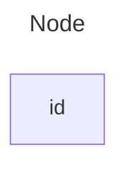

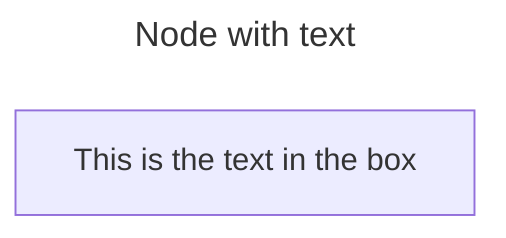

Nếu khai báo text nhiều lần, lần cuối được dùng. Khi khai báo edge sau, có thể bỏ text — text trước đó vẫn giữ.

### Direction

| Code | Hướng |
|------|-------|
| `TB` / `TD` | Top → Bottom |
| `BT` | Bottom → Top |
| `LR` | Left → Right |
| `RL` | Right → Left |

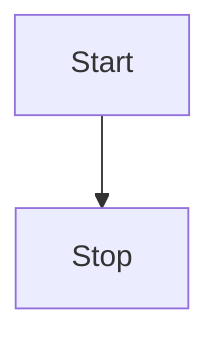

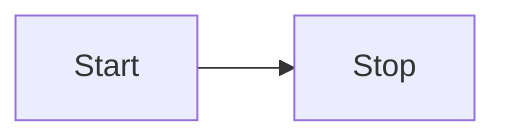

### Unicode text

Dùng `"` bọc text unicode:

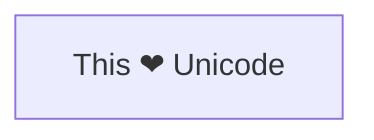

### Markdown formatting

Dùng `"` + backtick `"\`` text `\`"`. Cần `htmlLabels: false` trong config:

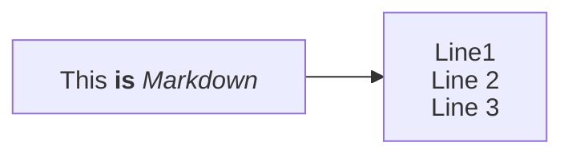

---

## 2. Node shapes

### 2.1 Classic syntax

| Shape | Syntax | Ví dụ |
|-------|--------|-------|
| Rectangle (default) | `id` hoặc `id[text]` | `A[Process]` |
| Round edges | `id(text)` | `A(Start)` |
| Stadium | `id([text])` | `A([Terminal])` |
| Subroutine | `id[[text]]` | `A[[Subprocess]]` |
| Cylinder (DB) | `id[(text)]` | `A[(Database)]` |
| Circle | `id((text))` | `A((Start))` |
| Asymmetric | `id>text]` | `A>Flag]` (chỉ hướng này, chưa có mirror — _might change with future releases_) |
| Rhombus (Diamond) | `id{text}` | `A{Decision}` |
| Hexagon | `id{{text}}` | `A{{Prepare}}` |
| Parallelogram | `id[/text/]` | `A[/Input/]` |
| Parallelogram alt | `id[\text\]` | `A[\Output\]` |
| Trapezoid | `id[/text\]` | `A[/Priority\]` |
| Trapezoid alt | `id[\text/]` | `A[\Manual/]` |
| Double circle | `id(((text)))` | `A(((Stop)))` |

### 2.2 Expanded shapes (v11.3.0+)

Syntax chung:

```
A@{ shape: rect, label: "This is a process" }
A@{ shape: rect }
```

Dạng tối giản (không label) tương đương `A["A"]` hoặc `A`.

Ví dụ tổng hợp:

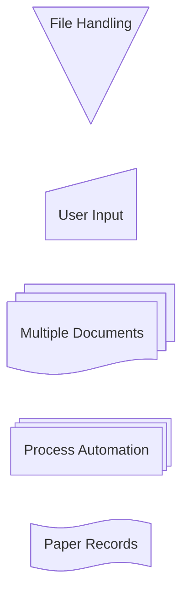

**Bảng toàn bộ expanded shapes:**

| Tên hiển thị | `shape` value | Mô tả |
|-------------|---------------|-------|
| Process | `rect` | Rectangle — tương đương `A["A"]` |
| Event | `rounded` | Rounded rectangle |
| Terminal Point | `stadium` | Stadium shape |
| Subprocess | `subproc` | Subroutine box |
| Database | `cyl` | Cylinder |
| Start | `circle` | Circle |
| Odd | `odd` | Asymmetric shape |
| Decision | `diamond` | Diamond / rhombus |
| Prepare Conditional | `hex` | Hexagon |
| Data Input/Output | `lean-r` | Lean right (parallelogram) |
| Data Output/Input | `lean-l` | Lean left (parallelogram alt) |
| Datastore | `datastore` | Top and bottom border |
| Priority Action | `trap-b` | Trapezoid base bottom |
| Manual Operation | `trap-t` | Trapezoid base top |
| Stop | `dbl-circ` | Double circle |
| Text Block | `text` | Plain text, no border |
| Card | `notch-rect` | Notched rectangle |
| Lined/Shaded Process | `lin-rect` | Lined rectangle |
| Start (Small) | `sm-circ` | Small circle |
| Stop (Framed) | `framed-circle` | Framed circle |
| Fork/Join | `fork` | Long rectangle |
| Collate | `hourglass` | Hourglass shape |
| Comment | `comment` | Curly brace (left) |
| Comment Right | `brace-r` | Curly brace (right) |
| Comment Both | `braces` | Curly braces both sides |
| Com Link | `bolt` | Lightning bolt |
| Document | `doc` | Document (wavy bottom) |
| Delay | `delay` | Half-rounded rectangle |
| Direct Access Storage | `das` | Horizontal cylinder |
| Disk Storage | `lin-cyl` | Lined cylinder |
| Display | `curv-trap` | Curved trapezoid |
| Divided Process | `div-rect` | Divided rectangle |
| Extract | `tri` | Small triangle |
| Internal Storage | `win-pane` | Window pane |
| Junction | `f-circ` | Filled circle |
| Lined Document | `lin-doc` | Document with line |
| Loop Limit | `notch-pent` | Notched pentagon |
| Manual File | `flip-tri` | Flipped triangle |
| Manual Input | `sl-rect` | Sloped rectangle |
| Multi-Document | `docs` | Stacked document |
| Multi-Process | `processes` (alias: `procs`) | Stacked rectangle |
| Paper Tape | `flag` | Flag shape |
| Stored Data | `bow-rect` | Bow tie rectangle |
| Summary | `cross-circ` | Crossed circle |
| Tagged Document | `tag-doc` | Tagged document |
| Tagged Process | `tag-rect` | Tagged rectangle |

### 2.3 Special shapes — Icon & Image (v11.3.0+)

**Icon shape** (cần [register icon pack](../config/icons.md) trước):

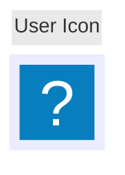

| Param | Mô tả | Giá trị |
|-------|--------|---------|
| `icon` | Tên icon từ registered pack | `"fa:user"` |
| `form` | Background shape (không set = không background) | `square`, `circle`, `rounded` |
| `label` | Text label (không set = không label) | string |
| `pos` | Vị trí label (default: bottom) | `t`, `b` |
| `h` | Chiều cao icon (default: 48, minimum) | number |

**Image shape:**

```
flowchart TD
    A@{ img: "https://example.com/image.png", label: "Image Label", pos: "t", w: 60, h: 60, constraint: "off" }
```

| Param | Mô tả | Giá trị |
|-------|--------|---------|
| `img` | URL ảnh | string |
| `label` | Text label | string |
| `pos` | Vị trí label (default: bottom) | `t`, `b` |
| `w` | Width (default: natural) | number |
| `h` | Height (default: natural) | number |
| `constraint` | Giữ aspect ratio theo `h` (default: `off`) | `on`, `off` |

Giữ aspect ratio: set `h` + `constraint: "on"` — width tự điều chỉnh:

```mermaid
flowchart TD
  %% My image with a constrained aspect ratio
  A@{ img: "https://mermaid.js.org/favicon.svg", label: "My example image label", pos: "t", h: 60, constraint: "on" }
```

---

## 3. Links / Edges

### 3.1 Loại link cơ bản

| Loại | Không text | Có text (cách 1) | Có text (cách 2) |
|------|-----------|-------------------|-------------------|
| Arrow | `A-->B` | `A-->\|text\|B` | `A-- text -->B` |
| Open | `A --- B` | `A---\|text\|B` | `A-- text ---B` |
| Dotted | `A-.->B;` | | `A-. text .-> B` |
| Thick | `A ==> B` | | `A == text ==> B` |
| Invisible | `A ~~~ B` | | |

### 3.2 Arrow types đặc biệt

```mermaid
flowchart LR
    A --o B       %% Circle edge
    C --x D       %% Cross edge
    E o--o F      %% Bi-directional circle
    G <--> H      %% Bi-directional arrow
    I x--x J      %% Bi-directional cross
```

### 3.3 Chaining & multi-node

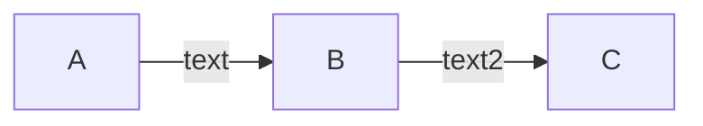

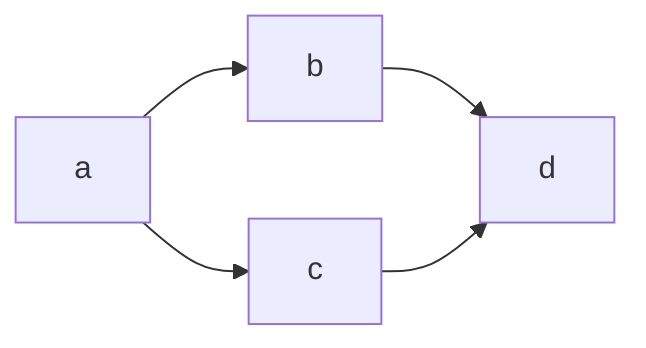

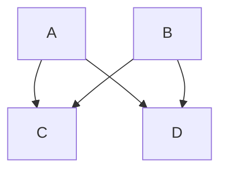

Tương đương 4 link riêng lẻ (cẩn thận không lạm dụng — Swedish word `lagom`: không quá nhiều, không quá ít):


### 3.4 Minimum length

Thêm dash/dot/equal để tăng độ dài link:

| Length | 1 | 2 | 3 |
|--------|:---:|:---:|:---:|
| Normal | `---` | `----` | `-----` |
| Normal + arrow | `-->` | `--->` | `---->` |
| Thick | `===` | `====` | `=====` |
| Thick + arrow | `==>` | `===>` | `====>` |
| Dotted | `-.-` | `-..-` | `-...-` |
| Dotted + arrow | `-.->` | `-..->` | `-...->` |

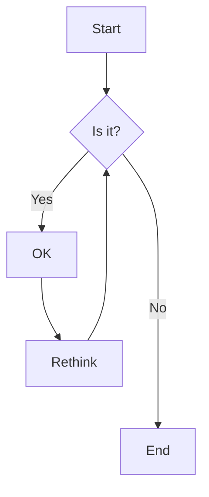

Khi text ở giữa link, thêm dash ở **bên phải**:


> **Note:** Links may still be made longer than the requested number of ranks by the rendering engine to accommodate other requests.

### 3.5 Edge ID, Animation & Curve (v11.10.0+)

**Gán ID cho edge:** thêm ID + `@` trước arrow syntax:

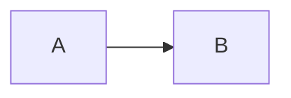

**Animation:**

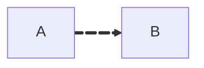

Chọn tốc độ animation (`fast` | `slow`):


Tương đương `{ animate: true, animation: fast }`.

**Animation qua classDef:**

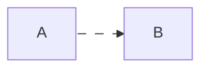

- `e1@-->` tạo edge với ID `e1`
- `classDef animate` định nghĩa class `animate` với styling và animation properties
- `class e1 animate` áp dụng class `animate` cho edge `e1`

Lưu ý: escape comma trong `stroke-dasharray` bằng `\,` (commas là delimiters trong Mermaid style definitions).

**Curve per-edge** (override diagram-level):

```mermaid
flowchart LR
    A e1@==> B
    A e2@--> C
    e1@{ curve: linear }
    e2@{ curve: natural }
```

---

## 4. Subgraphs

```
subgraph title
    graph definition
end

subgraph id [title]    %% explicit id
    ...
end
```

Ví dụ cơ bản:

```mermaid
flowchart TB
    c1-->a2
    subgraph one
    a1-->a2
    end
    subgraph two
    b1-->b2
    end
    subgraph three
    c1-->c2
    end
```

Explicit id cho subgraph:

```mermaid
flowchart TB
    c1-->a2
    subgraph ide1 [one]
    a1-->a2
    end
```

Edges giữa subgraphs:

```mermaid
flowchart TB
    c1-->a2
    subgraph one
    a1-->a2
    end
    subgraph two
    b1-->b2
    end
    subgraph three
    c1-->c2
    end
    one --> two
    three --> two
    two --> c2
```

### Direction trong subgraph

Mỗi subgraph có thể khai báo `direction` riêng:

```mermaid
flowchart LR
  subgraph TOP
    direction TB
    subgraph B1
        direction RL
        i1 -->f1
    end
    subgraph B2
        direction BT
        i2 -->f2
    end
  end
  A --> TOP --> B
  B1 --> B2
```

**Limitation:** Nếu node bên trong subgraph link ra ngoài (không qua subgraph id), `direction` của subgraph bị bỏ qua — kế thừa direction cha.

```mermaid
flowchart LR
    subgraph subgraph1
        direction TB
        top1[top] --> bottom1[bottom]
    end
    subgraph subgraph2
        direction TB
        top2[top] --> bottom2[bottom]
    end
    %% ^ These subgraphs are identical, except for the links to them:

    %% Link *to* subgraph1: subgraph1 direction is maintained
    outside --> subgraph1
    %% Link *within* subgraph2:
    %% subgraph2 inherits the direction of the top-level graph (LR)
    outside ---> top2
```

---

## 5. Text & Formatting

### Markdown Strings

Dùng `"\`` ... `\`"` cho bold/italic/auto-wrap trong node labels, edge labels, subgraph labels:

```mermaid
---
config:
  htmlLabels: false
---
flowchart LR
subgraph "One"
  a("`The **cat**
  in the hat`") -- "edge label" --> b{{"`The **dog** in the hog`"}}
end
subgraph "`**Two**`"
  c("`The **cat**
  in the hat`") -- "`Bold **edge label**`" --> d("The dog in the hog")
end
```

- `**text**` = bold, `*text*` = italic
- Newline tự xuống dòng (không cần `<br>`)
- Tắt auto-wrap:

```
---
config:
  markdownAutoWrap: false
---
graph LR
```

### Special characters & Entity codes

Dùng `"` bọc text có ký tự đặc biệt:

```mermaid-example
flowchart LR
    id1["This is the (text) in the box"]
```

Entity codes:

```mermaid-example
    flowchart LR
        A["A double quote:#quot;"] --> B["A dec char:#9829;"]
```

Numbers base 10: `#` = `#35;`. Hỗ trợ HTML character names.

### Comments

```mermaid
flowchart LR
%% this is a comment A -- text --> B{node}
   A -- text --> B -- text2 --> C
```

Comment phải trên dòng riêng, bắt đầu bằng `%%`.

---

## 6. Interaction

Yêu cầu `securityLevel='loose'` (disabled khi `securityLevel='strict'`).

```
click nodeId callback                         %% JS callback
click nodeId call callback()                  %% JS callback (alt)
click nodeId "URL" "Tooltip"                  %% Link
click nodeId href "URL" "Tooltip"             %% Link (alt)
click nodeId href "URL" "Tooltip" _blank      %% Link mở tab mới
```

- `nodeId`: id của node
- `callback`: tên JavaScript function trên page, được gọi với nodeId làm parameter

```html
<script>
  window.callback = function () {
    alert('A callback was triggered');
  };
</script>
```

Tooltip text bọc trong double quotes. CSS class tooltip: `.mermaidTooltip`.

Targets: `_self` (default), `_blank`, `_parent`, `_top`.

Ví dụ callback + tooltip:

```mermaid
flowchart LR
    A-->B
    B-->C
    C-->D
    click A callback "Tooltip for a callback"
    click B "https://www.github.com" "This is a tooltip for a link"
    click C call callback() "Tooltip for a callback"
    click D href "https://www.github.com" "This is a tooltip for a link"
```

Ví dụ link targets với `_blank`:

```mermaid
flowchart LR
    A-->B
    B-->C
    C-->D
    D-->E
    click A "https://www.github.com" _blank
    click B "https://www.github.com" "Open this in a new tab" _blank
    click C href "https://www.github.com" _blank
    click D href "https://www.github.com" "Open this in a new tab" _blank
```

> **Success** The tooltip functionality and the ability to link to urls are available from version 0.5.2.

?> Do giới hạn Docsify với JS callbacks, xem [demo trên jsfiddle](https://jsfiddle.net/yk4h7qou/2/).

HTML context đầy đủ:

```html
<body>
  <pre class="mermaid">
    flowchart LR
        A-->B
        B-->C
        C-->D
        click A callback "Tooltip"
        click B "https://www.github.com" "This is a link"
        click C call callback() "Tooltip"
        click D href "https://www.github.com" "This is a link"
  </pre>

  <script>
    window.callback = function () {
      alert('A callback was triggered');
    };
    const config = {
      startOnLoad: true,
      htmlLabels: true,
      flowchart: { useMaxWidth: true, curve: 'cardinal' },
      securityLevel: 'loose',
    };
    mermaid.initialize(config);
  </script>
</body>
```

---

## 7. Styling & Classes

### Style node trực tiếp

```mermaid
flowchart LR
    id1(Start)-->id2(Stop)
    style id1 fill:#f9f,stroke:#333,stroke-width:4px
    style id2 fill:#bbf,stroke:#f66,stroke-width:2px,color:#fff,stroke-dasharray: 5 5
```

### classDef & class

```
    classDef className fill:#f9f,stroke:#333,stroke-width:4px;
    classDef firstClassName,secondClassName font-size:12pt;
```

```
    class nodeId1 className;
    class nodeId1,nodeId2 className;
```

Shorthand `:::` khi khai báo node:

```mermaid
flowchart LR
    A:::someclass --> B
    classDef someclass fill:#f96
```

```mermaid
flowchart LR
    A:::foo & B:::bar --> C:::foobar
    classDef foo stroke:#f00
    classDef bar stroke:#0f0
    classDef foobar stroke:#00f
```

### Default class

```
    classDef default fill:#f9f,stroke:#333,stroke-width:4px;
```

Áp dụng cho mọi node không có class riêng.

### CSS classes

External CSS (VD: `.cssClass > rect { fill: ... }`) **không hoạt động tin cậy** — Mermaid inject `!important` + scope theo SVG ID. Nếu bắt buộc dùng external CSS, mọi property phải có `!important`. Khuyến nghị dùng [`classDef`](#classdef--class):

```mermaid
flowchart LR
    A:::myStyle --> B
    classDef myStyle fill:#ff0000,stroke:#ffff00,stroke-width:4px
```

### Styling links

Theo thứ tự khai báo (0-indexed), hoặc `default` cho tất cả:

```
linkStyle 3 stroke:#ff3,stroke-width:4px,color:red;
linkStyle 1,2,7 color:blue;
```

### Styling line curves

Curves: `basis`, `bumpX`, `bumpY`, `cardinal`, `catmullRom`, `linear`, `monotoneX`, `monotoneY`, `natural`, `step`, `stepAfter`, `stepBefore`. Tham khảo: [d3-shape curves](https://d3js.org/d3-shape/curve) ([GitHub](https://github.com/d3/d3-shape/)).

**Diagram-level:**

```yaml
---
config:
  flowchart:
    curve: stepBefore
---
graph LR
```

**Edge-level** (v11.10.0+ — xem [§3.5](#35-edge-id-animation--curve-v11100)).

```info
Any edge curve style modified at the edge level overrides the diagram level style.
```

```info
If the same edge is modified multiple times the last modification will be rendered.
```

---

## 8. FontAwesome & Icons

Syntax: `fa:#icon class name#`

```mermaid
flowchart TD
    B["fa:fa-twitter for peace"]
    B-->C[fa:fa-ban forbidden]
    B-->D(fa:fa-spinner)
    B-->E(A fa:fa-camera-retro perhaps?)
```

### Register icon packs (v11.7.0+)

Register icon pack theo [hướng dẫn](../config/icons.md). Supported prefixes: `fa`, `fab`, `fas`, `far`, `fal`, `fad`. Fallback sang FontAwesome CSS nếu chưa register.

### FontAwesome CSS

Mermaid hỗ trợ FontAwesome nếu CSS được include trên website, không giới hạn version. Xem [Official Font Awesome Documentation](https://fontawesome.com/start). Ví dụ thêm FA v6.5.1 vào `<head>`:

```html
<link
  href="https://cdnjs.cloudflare.com/ajax/libs/font-awesome/6.5.1/css/all.min.css"
  rel="stylesheet"
/>
```

### Custom icons (paid)

Prefix `fak`:

```mermaid
flowchart TD
    B[fa:fa-twitter] %% standard icon
    B-->E(fak:fa-custom-icon-name) %% custom icon
```

Render example với `fab:` prefix:

```mermaid
flowchart TD
    B["fa:fa-twitter for peace"]
    B-->C["fab:fa-truck-bold a custom icon"]
```

---

## 9. Configuration

### Renderer

Default: `dagre`. Alternative: `elk` (v9.4+, experimental, tốt hơn cho diagram lớn/phức tạp).

```yaml
config:
  flowchart:
    defaultRenderer: "elk"
```

> **Note:** Site cần mermaid v9.4+ và bật feature trong lazy-loading configuration.

### Width

Điều chỉnh bằng `mermaid.flowchartConfig` hoặc qua CLI (xem mermaidCLI page):

```javascript
mermaid.flowchartConfig = {
    width: 100%
}
```

---

## 10. Lưu ý cú pháp

- `"end"` viết thường → **break syntax**. Dùng `"End"` hoặc `"END"`. [Workaround](https://github.com/mermaid-js/mermaid/issues/1444#issuecomment-639528897).
- `"o"` hoặc `"x"` đầu node name sau link không có space → tạo circle/cross edge ngoài ý muốn. VD: `A---oB` → [circle edge](#32-arrow-types-đặc-biệt), `A---xB` → [cross edge](#32-arrow-types-đặc-biệt). Fix: thêm space (`"dev--- ops"`) hoặc viết hoa (`"dev---Ops"`).
- Semicolon cuối dòng là optional (từ v0.2.16+).
- Space giữa vertex và link: OK. Space giữa vertex và text hoặc link và text: **KHÔNG**.

Ví dụ tổng hợp:

```mermaid
flowchart LR
    A[Hard edge] -->|Link text| B(Round edge)
    B --> C{Decision}
    C -->|One| D[Result one]
    C -->|Two| E[Result two]
```
