# Sơ đồ Hệ thống — TechStore E-commerce

Tất cả diagram dùng [Mermaid](https://mermaid.js.org/) — render trực tiếp trên GitHub.

## Mục lục

1. [Use Case Diagram](#1-use-case-diagram)
2. [Sequence: Đăng ký & Xác thực Email](#2-sequence-đăng-ký--xác-thực-email)
3. [Sequence: Đăng nhập & Refresh Token](#3-sequence-đăng-nhập--refresh-token)
4. [Sequence: Đặt hàng & Thanh toán VNPay](#4-sequence-đặt-hàng--thanh-toán-vnpay)
5. [Sequence: AI Chatbot — RAG Pipeline](#5-sequence-ai-chatbot--rag-pipeline)
6. [Flowchart: Giỏ hàng Guest → Login → Merge](#6-flowchart-giỏ-hàng-guest--login--merge)
7. [Sequence: Đánh giá Sản phẩm](#7-sequence-đánh-giá-sản-phẩm)
8. [Sequence: Tích & Đổi Điểm Loyalty](#8-sequence-tích--đổi-điểm-loyalty)
9. [Flowchart: Checkout Đầy Đủ](#9-flowchart-checkout-đầy-đủ)
10. [Sequence: Admin Quản lý Sản phẩm](#10-sequence-admin-quản-lý-sản-phẩm)
11. [Entity Relationship Diagram — Simplified](#11-entity-relationship-diagram--simplified)
12. [Entity Relationship Diagram — 35 Models](#12-entity-relationship-diagram--35-models)

---

## 1. Use Case Diagram

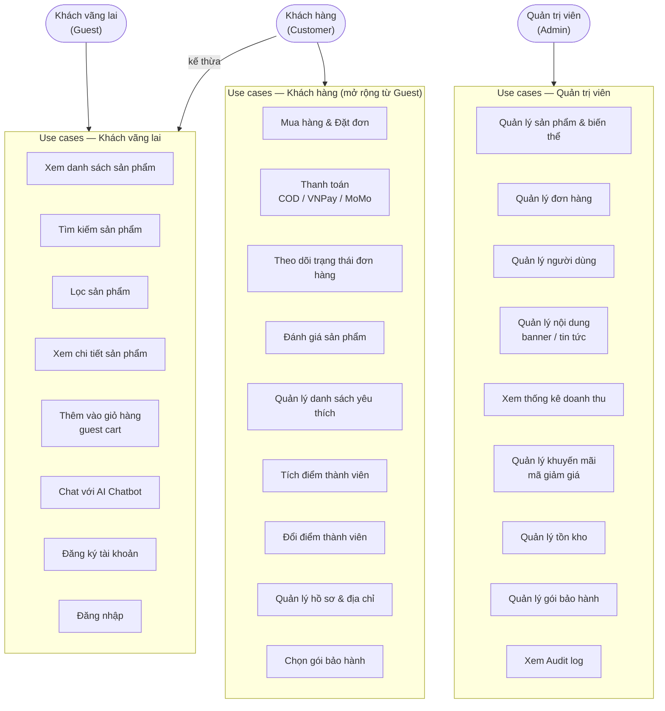

---

## 2. Sequence: Đăng ký & Xác thực Email

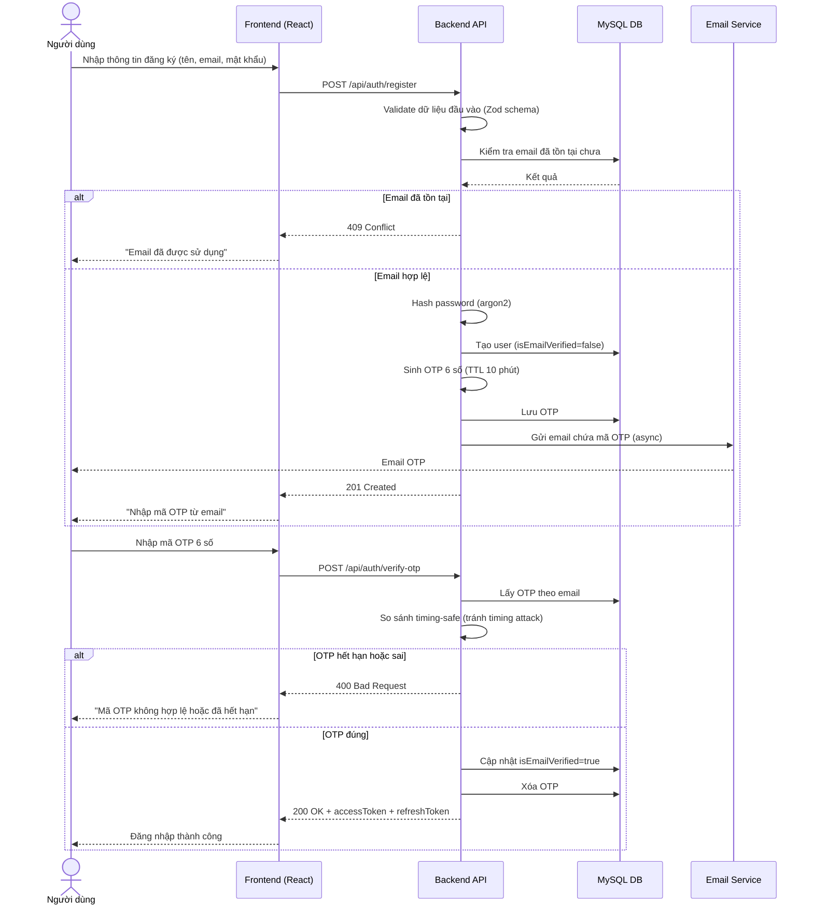

---

## 3. Sequence: Đăng nhập & Refresh Token

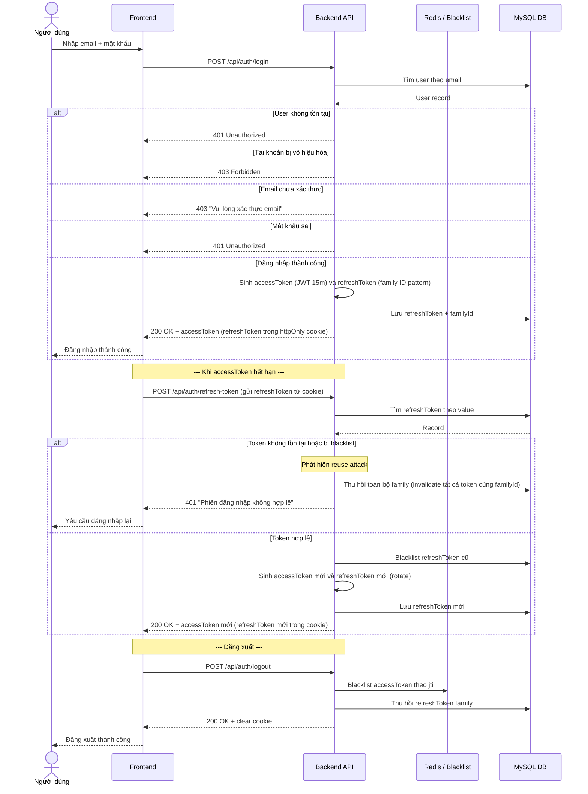

---

## 4. Sequence: Đặt hàng & Thanh toán VNPay

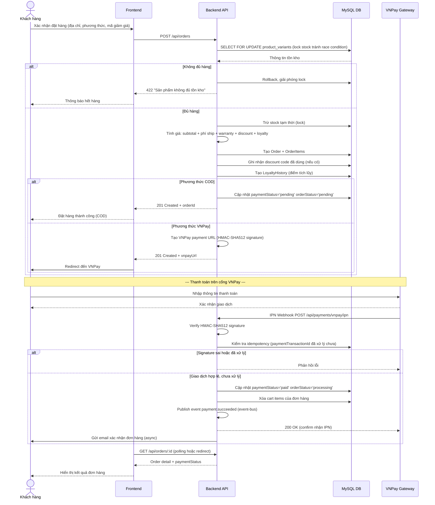

---

## 5. Sequence: AI Chatbot — RAG Pipeline

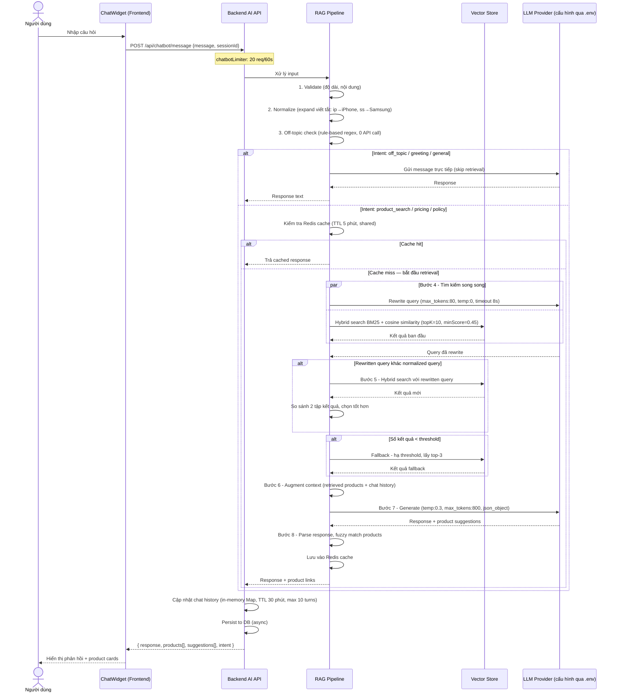

---

## 6. Flowchart: Giỏ hàng Guest → Login → Merge

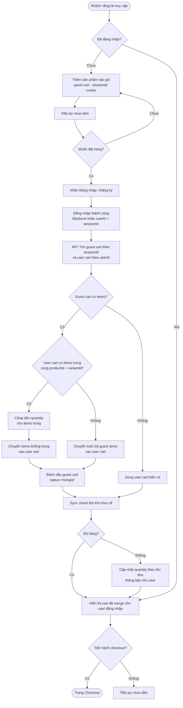

---

## 7. Sequence: Đánh giá Sản phẩm

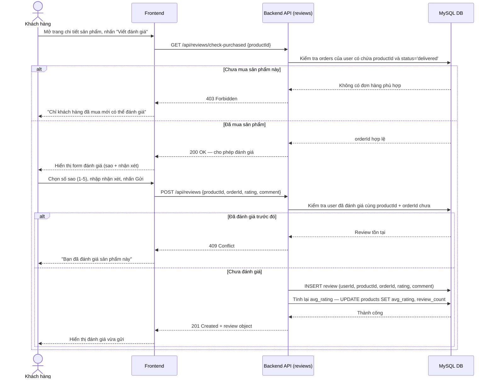

---

## 8. Sequence: Tích & Đổi Điểm Loyalty

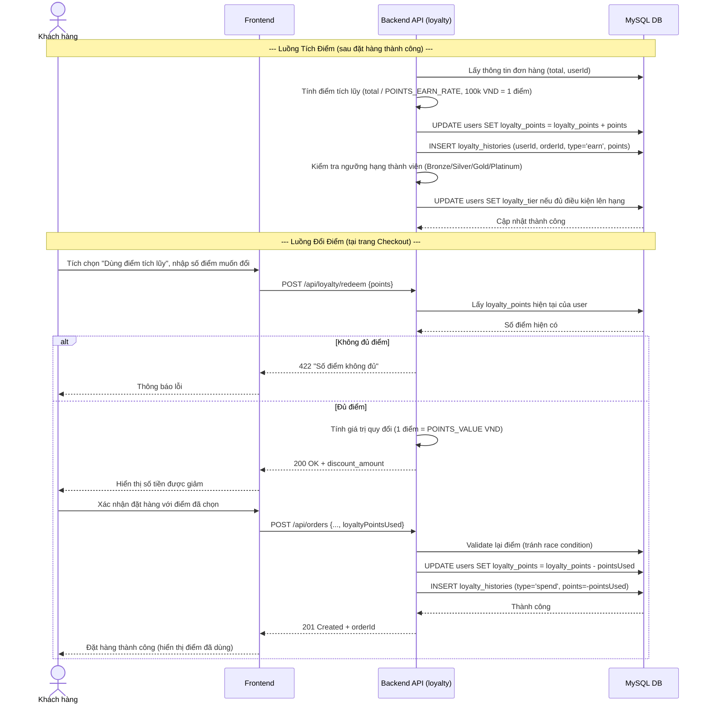

---

## 9. Flowchart: Checkout Đầy Đủ

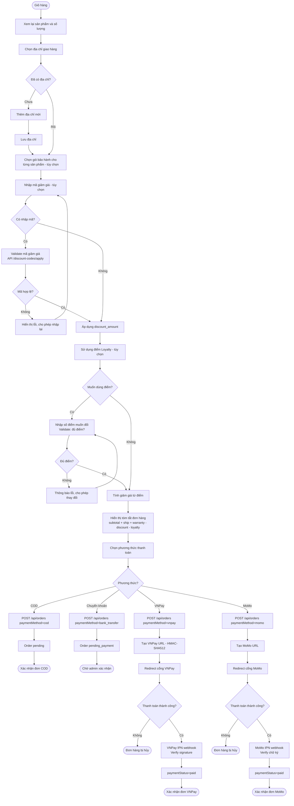

---

## 10. Sequence: Admin Quản lý Sản phẩm

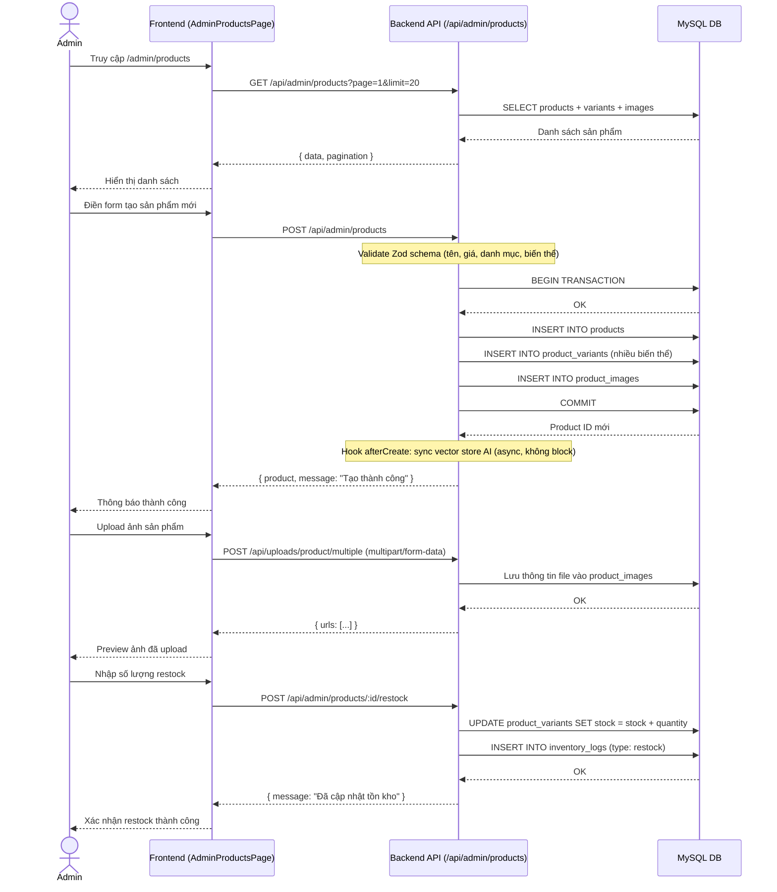

---

## 11. Entity Relationship Diagram — Simplified

```mermaid
erDiagram
    users {
        int id PK
        string email UK
        string password
        string full_name
        string role
        boolean is_email_verified
        boolean is_active
        string loyalty_tier
        int loyalty_points
        datetime deleted_at
    }

    products {
        int id PK
        string name
        string slug UK
        text description
        int brand_id FK
        boolean is_active
        datetime deleted_at
    }

    product_variants {
        int id PK
        int product_id FK
        string sku UK
        decimal price
        decimal original_price
        int stock
        string color
        string storage
        boolean is_active
    }

    product_images {
        int id PK
        int product_id FK
        int variant_id FK
        string url
        boolean is_primary
        int sort_order
    }

    categories {
        int id PK
        string name
        string slug UK
        int parent_id FK
        boolean is_active
    }

    product_categories {
        int product_id FK
        int category_id FK
    }

    brands {
        int id PK
        string name
        string slug UK
        string logo_url
    }

    collections {
        int id PK
        string name
        string slug UK
        boolean is_active
    }

    product_collections {
        int product_id FK
        int collection_id FK
    }

    carts {
        int id PK
        int user_id FK
        string session_id
        string status
    }

    cart_items {
        int id PK
        int cart_id FK
        int product_id FK
        int variant_id FK
        int quantity
    }

    orders {
        int id PK
        int user_id FK
        int address_id FK
        int discount_code_id FK
        string status
        string payment_method
        string payment_status
        decimal subtotal
        decimal shipping_fee
        decimal discount_amount
        decimal warranty_fee
        decimal total
        datetime deleted_at
    }

    order_items {
        int id PK
        int order_id FK
        int product_id FK
        int variant_id FK
        int quantity
        decimal unit_price
        int warranty_package_id FK
    }

    addresses {
        int id PK
        int user_id FK
        string full_name
        string phone
        string province
        string district
        string ward
        string detail
        boolean is_default
    }

    reviews {
        int id PK
        int user_id FK
        int product_id FK
        int order_id FK
        int rating
        text comment
        datetime deleted_at
    }

    wishlists {
        int id PK
        int user_id FK
        int product_id FK
    }

    discount_codes {
        int id PK
        string code UK
        string type
        decimal value
        decimal min_order_value
        int max_uses
        int used_count
        datetime expires_at
        boolean is_active
    }

    warranty_packages {
        int id PK
        string name
        int duration_months
        decimal price
        boolean is_active
    }

    product_warranties {
        int product_id FK
        int warranty_package_id FK
    }

    loyalty_histories {
        int id PK
        int user_id FK
        int order_id FK
        string type
        int points
        string description
    }

    inventory_logs {
        int id PK
        int variant_id FK
        int user_id FK
        string action
        int quantity_change
        int quantity_before
        int quantity_after
    }

    audit_logs {
        int id PK
        int admin_id FK
        string action
        string entity_type
        int entity_id
        json changes
        string ip_address
    }

    %% Relationships
    users ||--o{ orders : "đặt"
    users ||--o{ reviews : "viết"
    users ||--o{ wishlists : "lưu"
    users ||--o{ loyalty_histories : "tích lũy"
    users ||--o{ carts : "có"
    users ||--o{ addresses : "có"
    users ||--o{ audit_logs : "thực hiện"

    products ||--o{ product_variants : "có"
    products ||--o{ product_images : "có"
    products ||--o{ product_categories : "thuộc"
    products ||--o{ product_collections : "thuộc"
    products ||--o{ reviews : "nhận"
    products ||--o{ wishlists : "được lưu"
    products ||--o{ product_warranties : "áp dụng"

    product_variants ||--o{ cart_items : "trong"
    product_variants ||--o{ order_items : "trong"
    product_variants ||--o{ inventory_logs : "theo dõi"

    categories ||--o{ product_categories : "chứa"
    categories ||--o| categories : "danh mục cha"

    brands ||--o{ products : "sản xuất"

    collections ||--o{ product_collections : "chứa"

    carts ||--o{ cart_items : "có"

    orders ||--o{ order_items : "gồm"
    orders ||--o| addresses : "giao tới"
    orders ||--o| discount_codes : "dùng"
    orders ||--o{ loyalty_histories : "tạo"

    warranty_packages ||--o{ product_warranties : "áp dụng"
    warranty_packages ||--o{ order_items : "chọn"

    discount_codes ||--o{ orders : "được dùng trong"
```

---

## 12. Entity Relationship Diagram — 35 Models

```mermaid
erDiagram
    users {
        int id PK
        string email UK
        string password_hash
        string role
        string loyalty_tier
        int loyalty_points
        datetime deleted_at
    }
    addresses {
        int id PK
        int user_id FK
        string full_name
        string phone
        string province
        string district
        string ward
        string address_line
        bool is_default
    }
    categories {
        int id PK
        int parent_id FK
        string name
        string slug UK
        datetime deleted_at
    }
    brands {
        int id PK
        string name
        string slug UK
        datetime deleted_at
    }
    collections {
        int id PK
        string name
        string slug UK
        datetime deleted_at
    }
    products {
        int id PK
        int category_id FK
        int brand_id FK
        string name
        string slug UK
        decimal price
        decimal sale_price
        bool is_active
        datetime deleted_at
    }
    product_variants {
        int id PK
        int product_id FK
        string sku UK
        string color
        string storage
        int stock
        decimal price
        datetime deleted_at
    }
    product_images {
        int id PK
        int product_id FK
        int variant_id FK
        string url
        bool is_primary
        datetime deleted_at
    }
    product_categories {
        int product_id FK
        int category_id FK
    }
    product_collections {
        int product_id FK
        int collection_id FK
    }
    attribute_groups {
        int id PK
        int product_id FK
        string name
    }
    attribute_values {
        int id PK
        int group_id FK
        string name
        string value
    }
    product_attribute_groups {
        int product_id FK
        int group_id FK
    }
    orders {
        int id PK
        int user_id FK
        string order_number UK
        string status
        decimal total_amount
        string payment_method
        string payment_status
        datetime deleted_at
    }
    order_items {
        int id PK
        int order_id FK
        int product_id FK
        int variant_id FK
        int quantity
        decimal unit_price
    }
    carts {
        int id PK
        int user_id FK
        string session_id
    }
    cart_items {
        int id PK
        int cart_id FK
        int variant_id FK
        int quantity
    }
    discount_codes {
        int id PK
        string code UK
        string type
        decimal value
        int usage_limit
        int used_count
        datetime expires_at
        datetime deleted_at
    }
    reviews {
        int id PK
        int user_id FK
        int product_id FK
        int order_id FK
        int rating
        text content
        bool is_verified
        datetime deleted_at
    }
    review_feedbacks {
        int id PK
        int review_id FK
        int user_id FK
        bool is_helpful
    }
    wishlists {
        int id PK
        int user_id FK
        int product_id FK
    }
    warranty_packages {
        int id PK
        string name
        int duration_months
        decimal price
    }
    product_warranties {
        int id PK
        int product_id FK
        int package_id FK
    }
    loyalty_histories {
        int id PK
        int user_id FK
        int points
        string type
        string description
    }
    recently_viewed {
        int id PK
        int user_id FK
        int product_id FK
        datetime viewed_at
    }
    chat_messages {
        int id PK
        int user_id FK
        string session_id
        string role
        text content
    }
    search_histories {
        int id PK
        int user_id FK
        string keyword
        int results_count
    }
    inventory_logs {
        int id PK
        int variant_id FK
        int changed_by FK
        string type
        int quantity_before
        int quantity_after
        string note
    }
    audit_logs {
        int id PK
        int admin_id FK
        string action
        string resource
        int resource_id
        json changes
    }
    import_logs {
        int id PK
        int admin_id FK
        string file_name
        int total_rows
        int success_rows
        int failed_rows
    }
    news {
        int id PK
        int author_id FK
        string title
        string slug UK
        text content
        bool is_published
        datetime deleted_at
    }
    banners {
        int id PK
        string title
        string image_url
        string link_url
        int position
        bool is_active
        datetime deleted_at
    }
    email_campaigns {
        int id PK
        int created_by FK
        string subject
        text content
        string status
        datetime sent_at
    }
    newsletter_subscribers {
        int id PK
        string email UK
        bool is_active
    }
    feedbacks {
        int id PK
        int user_id FK
        string type
        text content
        string status
    }

    users ||--o{ addresses : "có"
    users ||--o{ orders : "đặt"
    users ||--o{ reviews : "viết"
    users ||--o{ wishlists : "lưu"
    users ||--o{ loyalty_histories : "tích điểm"
    users ||--o{ recently_viewed : "xem gần đây"
    users ||--o{ chat_messages : "chat"
    users ||--o{ search_histories : "tìm kiếm"
    users ||--o{ carts : "có giỏ"
    users ||--o{ audit_logs : "ghi nhật ký"

    products ||--o{ product_variants : "có biến thể"
    products ||--o{ product_images : "có ảnh"
    products }o--o{ categories : "thuộc (product_categories)"
    products }o--o{ collections : "thuộc (product_collections)"
    products ||--o{ reviews : "nhận đánh giá"
    products ||--o{ wishlists : "được lưu"
    products ||--o{ recently_viewed : "được xem"
    products ||--o{ product_warranties : "có gói bảo hành"
    products }o--o{ attribute_groups : "có thuộc tính (product_attribute_groups)"
    products ||--o{ order_items : "trong đơn"

    brands ||--o{ products : "sở hữu"
    categories ||--o{ categories : "danh mục con"

    attribute_groups ||--o{ attribute_values : "có giá trị"

    orders ||--o{ order_items : "chứa"
    orders ||--o{ reviews : "cho phép review"

    product_variants ||--o{ order_items : "trong đơn hàng"
    product_variants ||--o{ cart_items : "trong giỏ"
    product_variants ||--o{ inventory_logs : "theo dõi tồn kho"
    product_variants ||--o{ product_images : "có ảnh riêng"

    carts ||--o{ cart_items : "chứa"

    reviews ||--o{ review_feedbacks : "nhận phản hồi"

    warranty_packages ||--o{ product_warranties : "áp dụng cho"

    email_campaigns ||--o{ newsletter_subscribers : "gửi đến"
```
