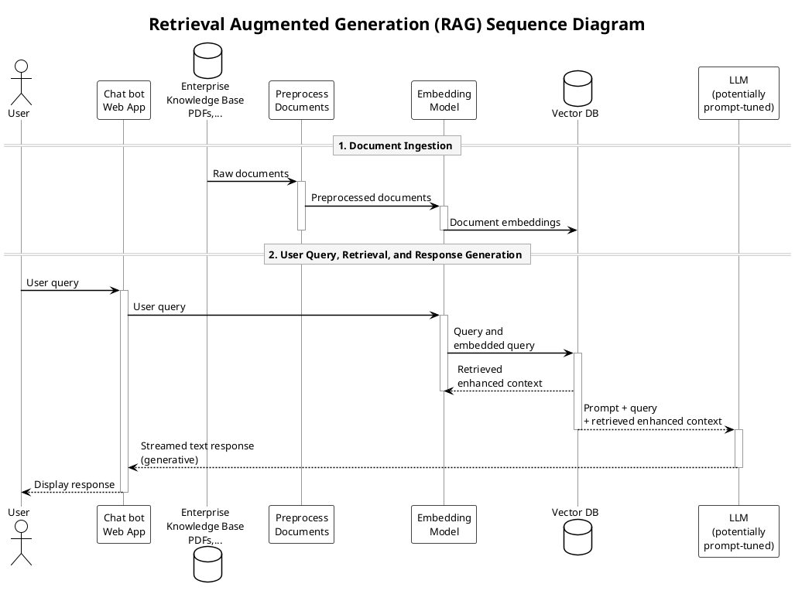
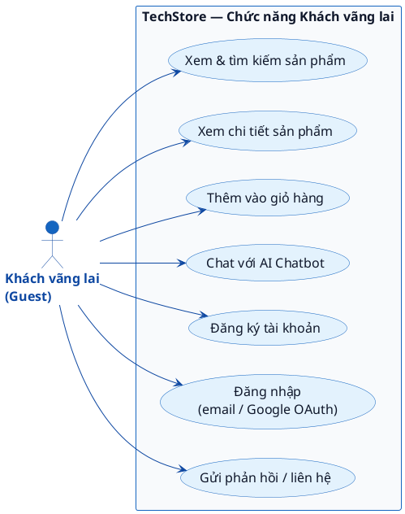
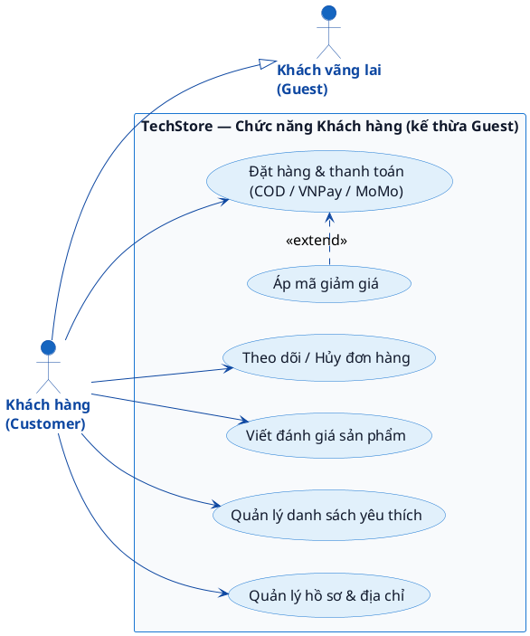
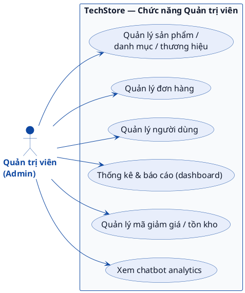
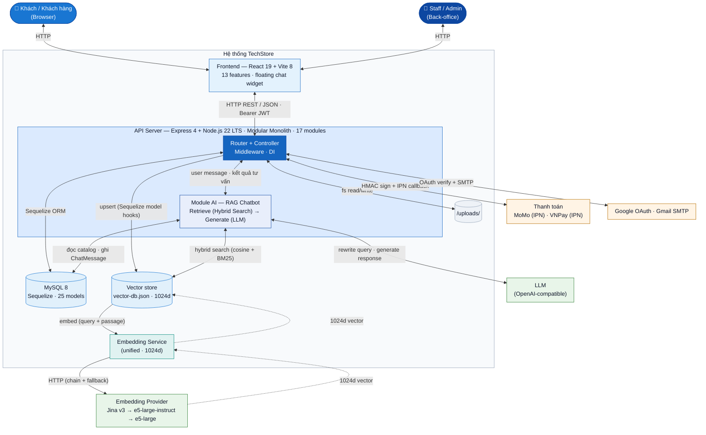
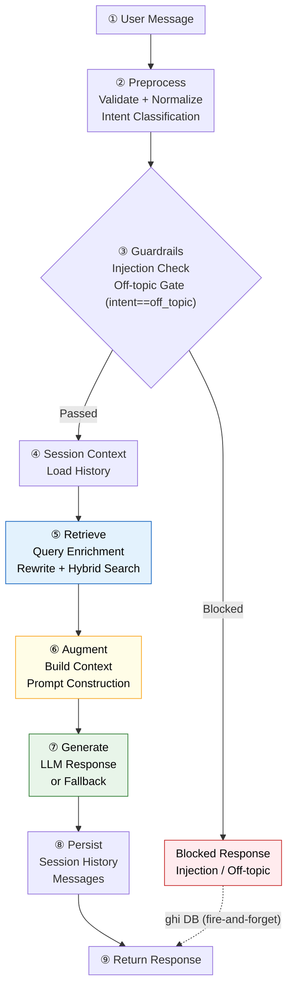

# Slide 1 — Trang bìa

ĐẠI HỌC QUỐC GIA HÀ NỘI – TRƯỜNG ĐẠI HỌC CÔNG NGHỆ

**DỰ ÁN CÔNG NGHỆ**

## XÂY DỰNG WEBSITE E-COMMERCE TÍCH HỢP CHATBOT AI

| | |
|---|---|
| Sinh viên thực hiện | Ngô Văn Minh Thắng |
| Mã số sinh viên | 20020155 |
| Cán bộ hướng dẫn | TS. Lê Thị Hợi |

---

# Slide 2 — Mục lục

1. Giới thiệu
2. Nền tảng lý thuyết
3. Thiết kế và xây dựng hệ thống
4. Kết quả thực nghiệm
5. Kết luận, Hướng phát triển

---

# Slide 3 — Giới thiệu: Bối cảnh

- **Thương mại điện tử bùng nổ:** Thị trường TMĐT Việt Nam đạt 32 tỷ USD năm 2024 (tăng 27%), mảng thiết bị công nghệ chiếm tỷ trọng lớn nhất (~35%).
- **Sản phẩm công nghệ phức tạp:** Mỗi sản phẩm có hàng chục biến thể (cấu hình, dung lượng, màu sắc). Nhu cầu đa tiêu chí nhưng bộ lọc truyền thống chỉ lọc theo tiêu chí rời rạc.
- **Khoảng trống RAG tiếng Việt:** Nghiên cứu RAG hiện có chủ yếu cho tiếng Anh, chưa giải quyết đồng thời: chuẩn hóa viết tắt thương hiệu, đồng bộ vector store, và Hybrid Search.
- **RAG + LLM mở ra hướng mới:** Kết hợp truy xuất dữ liệu sản phẩm thực với sinh văn bản tự nhiên → chatbot trả lời câu hỏi cụ thể theo thời gian thực, vượt giới hạn chatbot lập trình sẵn.

---

# Slide 4 — Thách thức và Hạn chế hiện tại

- **Tìm kiếm kém hiệu quả:** Người dùng phải duyệt qua hàng trăm sản phẩm; bộ lọc thô sơ chỉ khớp từ khóa cứng, không hỗ trợ tìm theo ngữ cảnh hay nhu cầu thực tế (ví dụ "laptop chạy Premiere dưới 20 triệu, pin cả ngày").
- **Ngôn ngữ tiếng Việt:** Viết tắt thương hiệu ("ip", "ss", "mb"), gõ không dấu, pha trộn Việt-Anh → embedding kém chính xác, retrieval bỏ sót sản phẩm phù hợp.
- **Catalog thay đổi liên tục:** Sản phẩm công nghệ ra mắt, ngừng bán, đổi giá liên tục → chatbot cần đồng bộ vector store tự động, không chỉ index 1 lần.
- **Thiếu tư vấn thông minh:** Chatbot rule-based / ML truyền thống không hiểu câu hỏi tự do, không truy xuất được dữ liệu catalog thực tế, không tư vấn đa tiêu chí cùng lúc (ngân sách + nhu cầu + thương hiệu) và không duy trì ngữ cảnh qua nhiều lượt hội thoại.

---

# Slide 5 — Giải pháp: Hệ thống TechStore

- **Hỏi đáp tự nhiên:** Chatbot dùng LLM + RAG, kết hợp Hybrid Search (tìm kiếm ngữ nghĩa cosine + từ khóa BM25) để hiểu câu hỏi tiếng Việt tự do.
- **Dữ liệu thực:** Tư vấn dựa trên catalog sản phẩm thật (MySQL đồng bộ vào vector store 1024 chiều), tự động cập nhật khi danh mục thay đổi.
- **Minh bạch & chính xác:** Chỉ tư vấn sản phẩm có trong catalog, không bịa tên/giá/thông số; trả lời kèm danh sách sản phẩm gợi ý phù hợp.
- **Tư vấn đa lượt:** Nhớ ngữ cảnh hội thoại (LRU 500 phiên, TTL 30 phút), hiểu đại từ ("cái đó", "so sánh 2 cái vừa hỏi"). Chain fallback 3 embedding providers đảm bảo sẵn sàng cao.

---

# Slide 6 — Nền tảng lý thuyết: RAG

**Retrieval-Augmented Generation (RAG)** — Kỹ thuật kết hợp sức mạnh của Mô hình ngôn ngữ lớn (LLM) với dữ liệu riêng (Private Data).

- **Vì sao cần RAG:** Khắc phục 2 hạn chế của LLM thuần — kiến thức bị đóng băng tại thời điểm huấn luyện (knowledge cutoff) và xu hướng "ảo giác" (hallucination) khi thiếu dữ liệu tham chiếu.
- **Indexing (offline):** Vector hóa dữ liệu nguồn (sản phẩm, chính sách, FAQ) → lưu vào vector store trước khi chạy.
- **Retrieval (R):** Tìm văn bản liên quan nhất từ CSDL Vector theo độ tương đồng ngữ nghĩa.
- **Augmentation (A):** Ghép văn bản tìm được vào ngữ cảnh (context) của prompt.
- **Generation (G):** LLM sinh câu trả lời dựa trên ngữ cảnh đó → giảm hallucination.

### Sơ đồ tuần tự RAG

---

# Slide 7 — Biểu đồ ca sử dụng

### Khách vãng lai (Guest)

### Khách hàng (Customer)

### Quản trị viên (Admin)

---

# Slide 8 — Đặc tả ca sử dụng: Trò chuyện với Chatbot

> **Tiền điều kiện:** Không yêu cầu đăng nhập — khách vãng lai vẫn sử dụng được chatbot ngay từ lần truy cập đầu.

**Người dùng:**

| Bước | Hành động |
|---|---|
| 1 | Nhập câu hỏi tự nhiên về sản phẩm (tiếng Việt / Anh) |
| 2 | Gửi yêu cầu tới hệ thống |
| 3 | Nhận câu trả lời kèm **danh sách sản phẩm gợi ý** |

**Hệ thống (RAG pipeline):**

| Bước | Hành động |
|---|---|
| 1 | **Tiền xử lý:** kiểm tra hợp lệ → chuẩn hóa viết tắt (`ip→iPhone`) → phân loại ý định + chặn injection / off-topic |
| 2 | **Mã hóa câu hỏi thành vector** → Hybrid Search (ngữ nghĩa cosine + từ khóa BM25) lấy **sản phẩm** liên quan |
| 3 | Ghép **sản phẩm + lịch sử hội thoại** vào prompt → gửi **LLM (OpenAI-compatible)** |
| 4 | Sinh câu trả lời (JSON: nội dung + sản phẩm), lưu lịch sử; LLM lỗi → **keyword fallback** |

> **Luồng thay thế:** Câu hỏi off-topic hoặc chứa prompt injection → hệ thống từ chối lịch sự, **không** gọi LLM hay retrieval.

---

# Slide 9 — Yêu cầu chức năng

**Người dùng cuối** (Khách vãng lai + Khách hàng):

| Chức năng |
|---|
| Duyệt danh mục + **lọc đa chiều** (giá, hãng, cấu hình) |
| Tìm kiếm sản phẩm theo từ khóa |
| Xem chi tiết sản phẩm kèm biến thể |
| Thêm & quản lý giỏ hàng (**đồng bộ khi đăng nhập**) |
| Đăng ký / đăng nhập (xác thực **email OTP** + **Google OAuth**) |
| Đặt hàng & chọn địa chỉ giao |
| Thanh toán **MoMo / VNPay** / COD |
| Theo dõi, **hủy** đơn hàng |
| Viết đánh giá & xếp hạng sản phẩm |
| Quản lý **danh sách yêu thích** & thông tin cá nhân |
| Tương tác chatbot AI tư vấn |

**Chatbot AI** (Trọng tâm):

| Chức năng |
|---|
| Tiếp nhận câu hỏi ngôn ngữ tự nhiên **tiếng Việt** |
| Hiểu ý định kể cả **viết tắt / sai chính tả / không dấu** |
| Truy xuất sản phẩm liên quan từ **vector store** |
| Sinh phản hồi tiếng Việt **tự nhiên** + danh sách gợi ý |
| Duy trì **ngữ cảnh hội thoại** trong phiên |
| Thêm sản phẩm vào giỏ trực tiếp qua chat |
| Từ chối câu hỏi **ngoài phạm vi** một cách lịch sự |

**Back-office** (Staff CRUD + Admin xem + quản lý users):

| Chức năng |
|---|
| Quản lý sản phẩm, **danh mục, thương hiệu** + biến thể (Staff) |
| Quản lý tồn kho (**nhập kho, theo dõi số lượng**) (Staff) |
| Xử lý đơn hàng + cập nhật trạng thái (Staff) |
| Quản lý mã giảm giá, duyệt đánh giá, hoàn tiền (Staff) |
| Xem dashboard, thống kê doanh thu (Staff + Admin) |
| Quản lý tài khoản người dùng (**Admin** độc quyền) |
| Xem analytics tăng trưởng người dùng (**Admin** độc quyền) |

*Nguồn: c3_chapter.tex §3.1 — Phân tích yêu cầu / 28 UC chia 7 nhóm / RBAC 4 tác nhân (guest, customer, staff, admin).*

---

# Slide 10 — Yêu cầu phi chức năng

| Tiêu chí | Mô tả yêu cầu |
|---|---|
| ⚡ Hiệu năng | API CRUD phản hồi **< 200ms** (dưới 100 CCU); Hybrid Search **< 100ms** (catalog < 10.000 SP); Chatbot **2–5s** do phụ thuộc LLM, có trạng thái loading. |
| 🔒 Bảo mật | Xác thực stateless với token có thời hạn (access **7 ngày**, refresh **30 ngày**); mật khẩu được hash an toàn; bảo vệ chống CSRF. Rate limit theo 4 nhóm: API **100/15min**, auth **10/60min**, OTP **5/15min**, chatbot **20/60s**. Xác thực chữ ký callback từ cổng thanh toán. |
| 🛡️ Độ tin cậy | Giao dịch đặt hàng + trừ tồn kho đảm bảo **nguyên tử** (tránh overselling); IPN callback **idempotent** (chống xử lý trùng); chatbot có cơ chế **dự phòng** khi LLM không khả dụng. |
| 🔧 Khả năng bảo trì | Mỗi module **phát triển và kiểm thử độc lập**; frontend không phụ thuộc chéo giữa các feature; hạ tầng dùng chung có thể thay thế mà không ảnh hưởng module khác. |
| ✅ Khả năng kiểm thử | Coverage tối thiểu statements & branches **≥ 99,7%**; mutation score **≥ 70%** (Stryker); property-based testing với 25 business invariants (fast-check). |

*Nguồn: c3_chapter.tex §3.1 — Yêu cầu phi chức năng (hệ thống TechStore).*

---

# Slide 11 — Kiến trúc hệ thống

---

# Slide 12 — Sơ đồ tổng thể: RAG Chatbot Pipeline

### Pipeline RAG Chatbot — Mô tả node

| STT | Node | Chức năng chính |
|---|---|---|
| ① | 📩 User Message | Nhận tin nhắn user qua **POST /chatbot/message** (kèm sessionId) |
| ② | ⚙️ Preprocess | Validate (**≤500 ký tự**, fail → AppError 400) + chuẩn hóa viết tắt (**ip→iPhone**) + phân loại intent (**6 nhóm**) |
| ③ | 🛡️ Guardrails | Chặn prompt injection (**OWASP LLM01, 15 nhóm**) và câu hỏi **off-topic** |
| ④ | 💬 Session Context | Nạp lịch sử hội thoại từ session memory (**RAM**, tối đa **10 turns**) cho multi-turn |
| ⑤ | 🔍 Retrieve | Bổ sung ngữ cảnh đại từ + song song (**LLM rewrite ∥ hybrid search topK=10**); 0 kết quả → fallback **topK=3** |
| ⑥ | 📋 Augment | Nhồi danh sách sản phẩm + thông tin cửa hàng + lịch sử + quy tắc (**cấm bịa**, output **JSON**) vào prompt |
| ⑦ | 🤖 Generate | LLM sinh câu trả lời (**provider rotation**); timeout / parse fail / hết provider → **keyword fallback** |
| ⑧ | 💾 Persist | Cập nhật session (**LRU**, TTL **30 phút**) + ghi DB analytics (**fire-and-forget**) |
| ⑨ | 📤 Return Response | Trả **{ response, products, suggestions, intent }** về client |
| — | ⚠️ Blocked Response | Phản hồi cố định khi ③ chặn (injection/off-topic) → ghi DB analytics (**fire-and-forget**) → ⑨ |

> **Ghi chú:** ⑤–⑦ là 3 stage RAG (**Retrieve · Augment · Generate**). Path fallback (keyword) bỏ qua ⑥⑦ → "RAG with graceful degradation": chatbot luôn trả lời được dù LLM không khả dụng.

### Sơ đồ luồng

---

# Slide 13 — Kết quả thực nghiệm: Giao diện Trang chủ

*(Hình ảnh: Screenshot trang chủ)*

---

# Slide 14 — Kết quả thực nghiệm: Giao diện Trang admin

*(Hình ảnh: Screenshot trang admin)*

---

# Slide 15 — Kết quả thực nghiệm: Giao diện Trang staff

*(Hình ảnh: Screenshot trang staff)*

---

# Slide 16 — Kết quả thực nghiệm: Giao diện Chatbot AI

*(Hình ảnh: Screenshot chatbot AI)*

---

# Slide 17 — Tổng quan 5 tầng test

| Suite | Suites | Tests | Runtime | Config |
|---|---|---|---|---|
| BE E2E Tests | 5 | 100 | ~22s | `jest.e2e.config.js` |
| BE API HTTP Tests | 39 | 675 | ~160s | `jest.api.config.js` |
| BE Integration Tests | 38 | 210 | ~57s | `jest.integration.config.js` |
| BE Unit Tests | 215 | 5.381 | ~12s | `jest.config.js` |
| FE Component Tests | 28 | 937 | ~14s | `jest.config.cjs` |
| **Tổng** | **325** | **~7.303** | — | — |

---

# Slide 18 — Framework & môi trường 5 tầng test

| Tầng | Framework | Database | Port |
|---|---|---|---|
| BE E2E | Jest 29 + Supertest | MySQL thật (techstore_test) | 9996 |
| BE API HTTP | Jest 29 + Supertest | MySQL thật (techstore_test) | 9997 |
| BE Integration | Jest 29 | MySQL thật (techstore_test) | 9998 |
| BE Unit | Jest 29 | Mock (jest.fn()) | — |
| FE Component | Jest 29 + ts-jest + @testing-library/react | jsdom | — |

---

# Slide 19 — Độ phủ kiểm thử (unit test, local)

| Coverage (unit) | Hiện tại | Threshold |
|---|---|---|
| Statements | **100%** | 99,7% |
| Branches | **99,91%** | 99,7% |
| Functions | **99,91%** | 99,4% |
| Lines | **100%** | 99,7% |

---

# Slide 20 — Kết quả đánh giá chatbot RAG theo nhóm kịch bản

| Nhóm | Số kịch bản | Ví dụ | Đúng | Ghi chú |
|---|---|---|---|---|
| Tìm kiếm ngữ nghĩa | 6 | *"laptop học lập trình dưới 20 triệu"* | 5/6 | Dense retrieval tốt cho query mô tả |
| Tên model cụ thể | 4 | *"iphone 17 pro max bao nhiêu tiền"* | 4/4 | Hybrid Search bắt chính xác tên |
| Viết tắt / sai chính tả | 4 | *"ip17 pm 512gb gia bnh"* | 4/4 | `expandAbbreviations` xử lý đúng |
| Câu hỏi so sánh | 3 | *"so sanh macbook air vs pro"* | 2/3 | Đôi khi thiếu 1 sản phẩm gần ngưỡng |
| Ngoài phạm vi | 3 | *"thời tiết hôm nay thế nào"* | 3/3 | Từ chối đúng 100%, <10ms |
| **Tổng** | **20** | | **18/20** | **Tỷ lệ chính xác 90%** |

---

# Slide 21 — Kết luận và Hướng phát triển

**Kết quả đạt được:**

- Xây dựng thành công website e-commerce tích hợp Chatbot AI
- Kiến trúc Modular Monolith: 17 modules backend, 13 features frontend
- RAG Pipeline 7 bước với Hybrid Search (18/20 kịch bản, 90% chính xác)
- Kiểm thử 5 tầng: ~7.303 test cases, coverage 100% statements

**Hướng phát triển:**

- Cải thiện Retrieval: Re-ranking, Cross-encoder để tăng độ chính xác
- Xử lý tốt hơn các câu hỏi phức tạp (so sánh đa tiêu chí)
- Mở rộng thanh toán quốc tế (Stripe, PayPal)
- Recommendation Engine dựa trên lịch sử mua hàng

---

# Slide 22 — Cảm ơn

## CẢM ƠN THẦY CÔ ĐÃ LẮNG NGHE!

Em xin nhận các câu hỏi và đóng góp ý kiến
